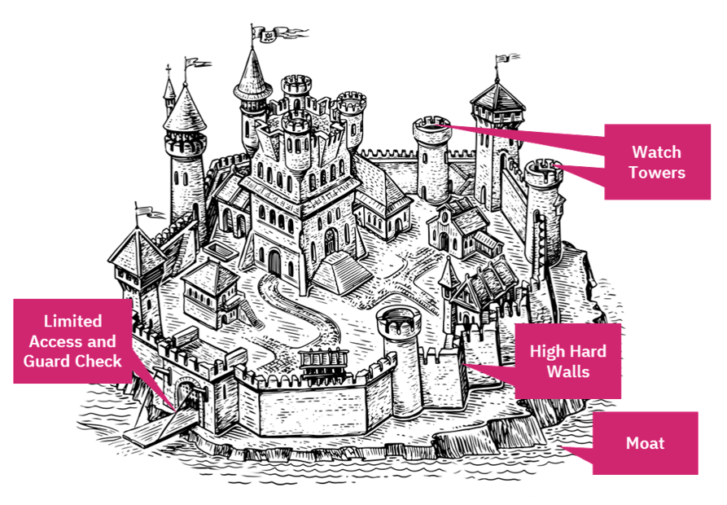
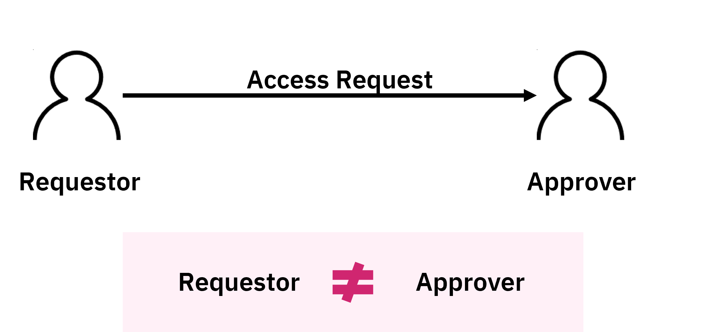
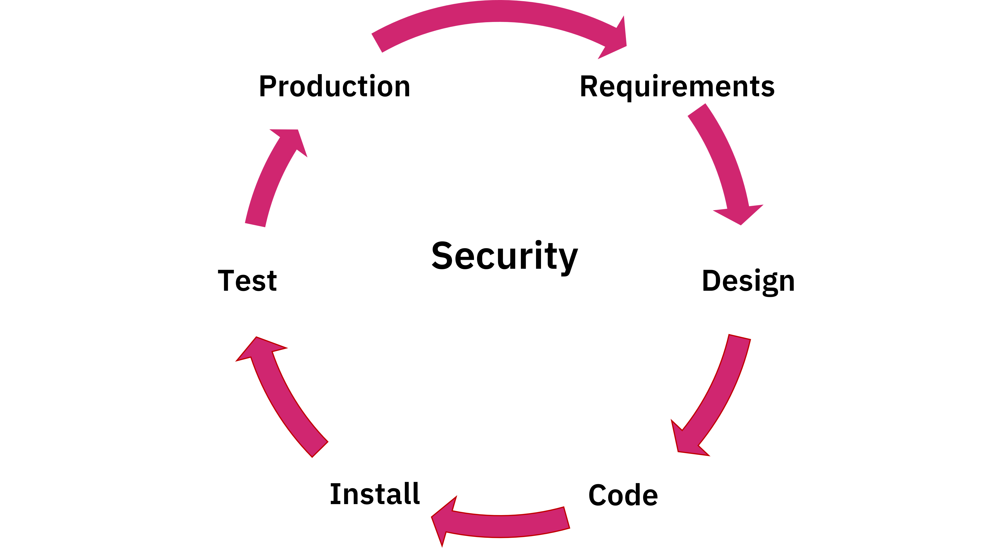
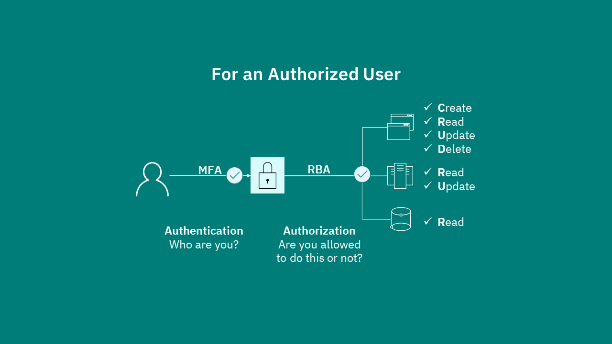
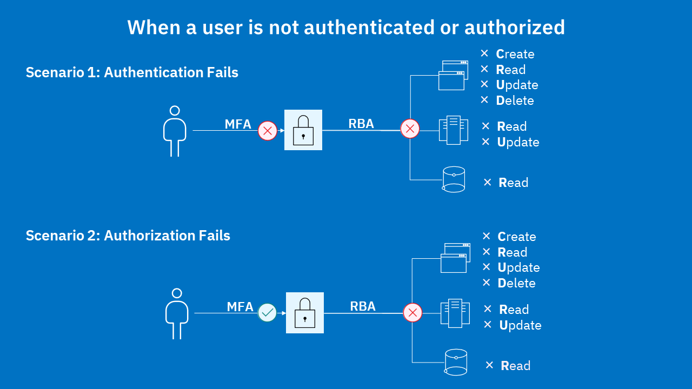
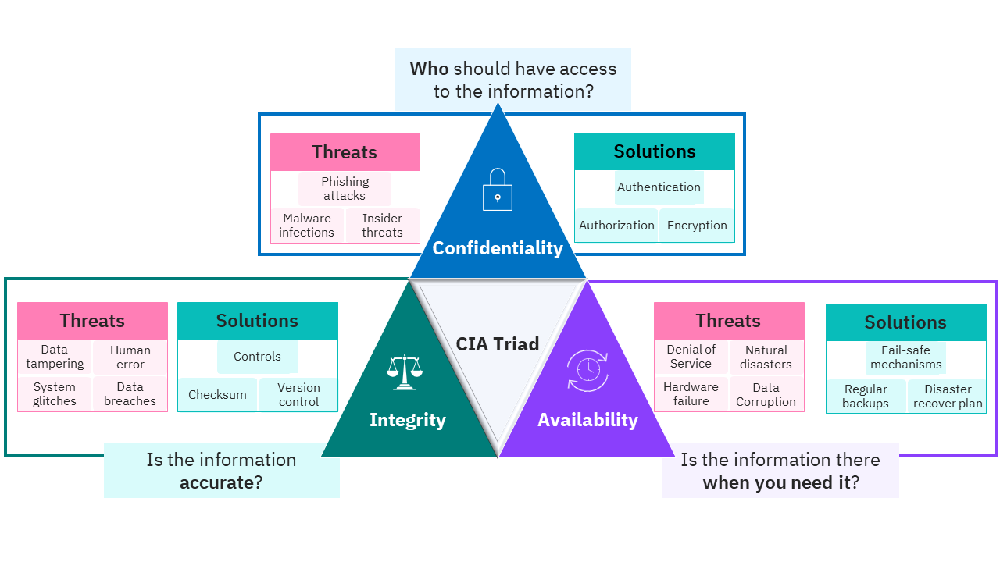
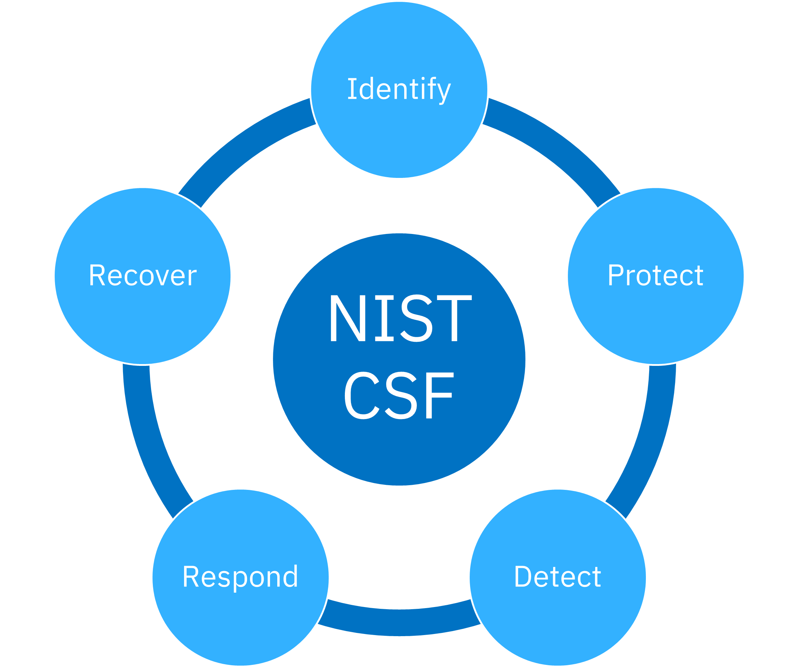

# ملخص مبادئ الأمن السيبراني الأساسية
## Cybersecurity Fundamentals Summary

---

## المقدمة

مع تزايد الهجمات السيبرانية وخروقات البيانات، أصبح من الضروري أكثر من أي وقت مضى التأكد من حماية المؤسسات ضد المتسللين. يتناول هذا الملخص المبادئ الأساسية لبنية الأمن السيبراني (Cybersecurity Architecture) التي يجب تطبيقها في جميع جوانب العمل الأمني.

---

## المبادئ الخمسة الأساسية للأمن السيبراني

### 1. الدفاع في العمق (Defense in Depth)

**المفهوم الأساسي:** خلق مسار عوائق متعددة للمهاجمين من خلال عدم الاعتماد على آلية أمنية واحدة لحماية النظام.

**النموذج التقليدي - القلعة:**
في النموذج القديم، كانت القلاع تُبنى بجدران سميكة وعالية لإبقاء الأشخاص الجيدين بالداخل والسيئين بالخارج. ولكن عندما احتاج الأشخاص الجيدون للخروج، أصبح الباب نقطة ضعف. لذلك تم تعزيز الباب، وإضافة خندق مائي حول القلعة، وجسر متحرك، وحتى كلاب حراسة لخلق نظام من الآليات الأمنية المتعددة.



**النموذج الحديث - بيئة تكنولوجيا المعلومات:**
في بيئة حديثة تتكون من مستخدم على محطة عمل، يصل عبر شبكة إلى خادم ويب، ثم خادم تطبيقات، وأخيراً قاعدة بيانات، يتم تطبيق الدفاع في العمق من خلال:


- **المصادقة متعددة العوامل (Multi-Factor Authentication):** التأكد من هوية المستخدم من خلال شيء يملكه، شيء يعرفه، وشيء يمثله
- **إدارة الأجهزة المحمولة (Mobile Device Management/MDM):** التأكد من اتباع سياسات الأمن على الأجهزة
- **الكشف والاستجابة للنقاط الطرفية (EDR - Endpoint Detection and Response):** برمجيات مكافحة الفيروسات من الجيل التالي
- **جدران الحماية (Firewalls):** للسماح فقط بحركة المرور المصرح بها
- **اختبار الثغرات (Vulnerability Testing):** على خوادم الويب والتطبيقات
- **التشفير (Encryption):** لحماية البيانات في قاعدة البيانات مع ضوابط الوصول

**الهدف الرئيسي:** تجنب نقطة فشل واحدة (No Single Point of Failure) وإنشاء نظام يفشل بشكل آمن (Fail Safe).

---

### 2. مبدأ أقل الامتيازات (Principle of Least Privilege)

**التعريف وفقاً لـ NIST:** 
مبدأ أن البنية الأمنية يجب أن تُصمم بطريقة تمنح كل كيان (مستخدم أو مورد شبكة) الحد الأدنى من موارد النظام والصلاحيات التي يحتاجها الكيان لأداء وظيفته.

المصدر: https://csrc.nist.gov/glossary/term/least_privilege

**المبادئ الأساسية:**

يتم منح حقوق الوصول فقط للأشخاص الذين:
- لديهم حاجة عمل حقيقية
- مصرح لهم بذلك
- يمكنهم تبرير الحاجة
- لفترة محددة وليس إلى الأبد

**أسباب الثغرات الأمنية:**

1. **الخدمات المفعّلة غير المستخدمة:** على سبيل المثال، خادم ويب يحتوي على خدمات FTP وSSH مفعّلة افتراضياً دون حاجة
2. **ترك حسابات المستخدمين الافتراضية كما هي:** مثل اسم المستخدم "Admin"
3. **التراكم التدريجي للامتيازات (Privilege Creep):** عندما يحتفظ المستخدم بصلاحيات قديمة بعد الترقية أو الانتقال لفريق جديد
4. **الوصول الاحترازي (Just-in-Case Access):** عندما يمنح المسؤول صلاحيات إضافية "في حال احتاجها المستخدم مستقبلاً"

**طرق تقليل الثغرات:**

- تشغيل حملة إعادة تصديق سنوية (Annual Recertification Campaign) على الأقل للتحقق من جميع صلاحيات المستخدمين
- تقوية الأنظمة (System Hardening) من خلال إزالة الخدمات غير الضرورية وتغيير أسماء وكلمات المرور الافتراضية
- القضاء على التراكم التدريجي للامتيازات والوصول الاحترازي

---

### 3. الفصل بين الواجبات (Separation of Duties)

**المفهوم:** عدم وجود نقطة تحكم واحدة في النظام، مما يفرض ضرورة التواطؤ بين شخصين أو أكثر لاختراق النظام.

**مثال مادي:**
باب به قفلان، شخص يحمل مفتاح القفل الأول وشخص آخر يحمل مفتاح القفل الثاني. لا يمكن لأي منهما فتح الباب بمفرده، بل يجب عليهما التعاون معاً.

**مثال في تكنولوجيا المعلومات:**

في نظام طلب الوصول إلى قاعدة بيانات:
- **الطالب (Requester):** الشخص الذي يطلب الوصول
- **المُصدّق (Approver):** الشخص الذي يوافق أو يرفض الطلب
- **النتيجة:** منح أو رفض الوصول

**القاعدة الذهبية:** لا يمكن أن يكون الطالب والمُصدّق نفس الشخص، وإلا فلن يكون هناك فصل بين الواجبات.

**الهدف:** خلق حاجة للتواطؤ، وهو أمر صعب لأن من الصعب على أشخاص عديدين العمل معاً والحفاظ على السر.



---

### 4. الأمن بالتصميم (Secure by Design)

**المبدأ الأساسي:** يجب أن يكون الأمن جزءاً أصيلاً من التصميم وليس فكرة لاحقة.

**التشبيه:** 
عند تصميم مبنى في منطقة زلزالية، يجب جعل المبنى قادراً على تحمل الضغط منذ البداية، وليس بناء المبنى أولاً ثم محاولة جعله مقاوماً للزلازل لاحقاً.

**مراحل المشروع وتطبيق الأمن:**

المراحل التقليدية للمشروع:
1. مرحلة المتطلبات (Requirements)
2. مرحلة التصميم (Design)
3. مرحلة البرمجة (Coding)
4. مرحلة التثبيت (Installation)
5. مرحلة الاختبار (Testing)
6. مرحلة الإنتاج (Production)

**الخطأ الشائع:** الانتظار حتى مرحلة الإنتاج للتفكير في الأمن. الأمن لا يمكن أن يكون مجرد إضافة في النهاية.

**الطريقة الصحيحة:** تطبيق الأمن في جميع المراحل:
- النظر في الجوانب الأمنية في المتطلبات
- بناء الأمن في التصميم
- التفكير في مبادئ البرمجة الآمنة
- التثبيت على نظام آمن
- حماية بيانات الاختبار
- الاختبار المستمر في الإنتاج

**المسؤولية:** الأمن هو مسؤولية الجميع - المصمم، المسؤول، والمستخدم - ولكنه يبدأ مع المصمم الذي يجب عليه تصميم الأمن منذ البداية.

**الهدف:** الحصول على نظام آمن جاهز للاستخدام (Secure Out of the Box - OOTB).



---

### 5. مبدأ البساطة - KISS (Keep It Simple, Stupid)

**المفهوم:** التعقيد ليس مرادفاً للأمن. يجب عدم جعل النظام أكثر تعقيداً من اللازم، لأن ذلك سيسهل الأمر على المهاجمين ويصعبه على المستخدمين الشرعيين.

**مثال المتاهة:**
عندما تنشئ قسم الأمن متاهة معقدة يجب على المستخدمين المرور خلالها، سيجدون الأمر صعباً للغاية وفي النهاية سيبحثون عن طرق لتجاوز هذه الإجراءات، مما يخلق ثغرات أمنية.

**القاعدة الأساسية:** 
إذا كان القيام بالشيء الصحيح أصعب من القيام بالشيء الخاطئ، فسيقوم الناس بالشيء الخاطئ.

**مثال كلمات المرور:**

المشكلة: قواعد معقدة لكلمات المرور تتطلب:
- البدء بحرف كبير
- يتبعه حرف صغير
- ثم رمز خاص
- ثم أرقام
- خليط من الأحرف الكبيرة والصغيرة والرموز
- طول معين
- كلمة مرور مختلفة لكل نظام
- تغيير متكرر

النتيجة: المستخدم سيجد كلمة مرور واحدة ويكتبها ويستخدمها في جميع الأنظمة، وهو عكس ما نريده تماماً.

**الدرس المستفاد:** التعقيد عدو الأمن. يجب جعل النظام معقداً بما يكفي لإبعاد المهاجمين، ولكن ليس معقداً لدرجة تصعّب على المستخدمين الشرعيين القيام بعملهم.

**التوازن مع الدفاع في العمق:** 
مبدأ الدفاع في العمق يهدف لخلق مسار عوائق للمهاجم، وليس للمستخدم الشرعي. يجب أن تكون العوائق موجهة للمهاجمين فقط.

---

## المبدأ المضاد للأمن: الأمن بالغموض (Security by Obscurity)

**التعريف:** الاعتماد على المعرفة السرية لجعل النظام آمناً.

**لماذا هو خاطئ؟** السرية والأمن ليسا نفس الشيء.

**مبدأ كيركهوف (Kerckhoff's Principle):**
يجب أن يكون النظام التشفيري آمناً حتى لو كان كل شيء عنه معروفاً باستثناء المفتاح. بمعنى آخر، المفتاح هو السر الوحيد في النظام بأكمله.

**المشكلة مع الأنظمة المغلقة (Black Box Security):**

عندما يدعي شخص أنه اخترع نظام تشفير خاص (Proprietary):
- النص الواضح + المفتاح → الخوارزمية (صندوق أسود) → النص المشفر
- لا يمكن رؤية كيفية عمل الخوارزمية
- حتى لو لم يستطع المخترع كسرها، هذا لا يعني أن العالم كله لن يستطيع
- التاريخ أثبت أن جميع الأنظمة المغلقة تم كسرها في النهاية

**الحل الصحيح (Glass Box Security):**

- النص الواضح → خوارزمية تشفير منشورة ومعروفة → النص المشفر
- الخوارزميات الموثوقة مثل AES (Advanced Encryption Standard) وRSA منشورة ومتاحة للجميع
- السر الوحيد هو المفتاح
- الأمن لا يأتي من سرية الخوارزمية، بل من قوة المفتاح

**التطبيق على الأنظمة الأخرى:**
نفس المبدأ ينطبق على أنظمة التشغيل الآمنة والتطبيقات الآمنة. طالما أن الأمن يعتمد على السرية، فلا يمكن الاعتماد عليه.

---

## أدوات تطبيق مبدأ أقل الامتيازات

### 1. إدارة الهوية والوصول (IAM - Identity and Access Management)

**التعريف:**
تخصص في الأمن السيبراني يدير هويات المستخدمين وأذونات الوصول على الشبكة. تساعد أدوات IAM في إدارة الوصول إلى الموارد، مما يضمن أن المستخدمين المصرح لهم فقط لديهم إمكانية الوصول.

المصدر: https://www.ibm.com/topics/identity-access-management

**كيف تعمل:**
1. **المصادقة (Authentication):** التحقق من هوية المستخدم عند محاولة الوصول
2. **التفويض (Authorization):** التحقق من مستوى وصول المستخدم بناءً على دوره في المؤسسة
3. ضمان وصول الأفراد فقط إلى الموارد التي يحتاجونها لأداء وظائفهم

**مثال تطبيقي - شركة Worldwide Capital:**

**المشكلة:**
- شركة مالية عالمية تعاني من وصول غير مصرح به لبيانات العملاء الحساسة
- خروقات بيانات كبيرة تهدد ثقة العملاء
- عقوبات تنظيمية وخسائر مالية

**الحل:**
- تطبيق نظام IAM
- إنشاء سياسات صارمة تحدد من يمكنه الوصول لأي بيانات وتحت أي ظروف

**النتائج:**
- انخفاض ملحوظ في الخروقات
- التحقق من هوية كل مستخدم والتحكم في وصوله حسب دوره
- تحسين أمن البيانات والامتثال للوائح المالية
- تحسين عمليات إدارة المستخدمين

---

### 2. التحكم في الوصول المبني على الأدوار (RBAC - Role-Based Access Control)

**التعريف:**
طريقة لتقييد وصول النظام للمستخدمين المصرح لهم بناءً على أدوارهم داخل المؤسسة. ليس كل المستخدمين بحاجة للوصول إلى كل مورد.

**المبدأ:**
- يتم تعيين حقوق الوصول لوظائف تنظيمية محددة
- يتم تعيين المستخدمين للأدوار المناسبة
- يحصل المستخدمون على أذونات للمهام التي يؤدونها فقط، لا أكثر

**الفوائد:**
- تعزيز الأمن
- تبسيط العمل الإداري
- تحسين الكفاءة التشغيلية

**مثال تطبيقي - شركة Velocity Tech:**

**المشكلة:**
- شركة تقنية سريعة النمو
- صعوبة في إدارة وصول المستخدمين للمنصات الداخلية
- موظفو IT مشغولون بإدارة حقوق الوصول الفردية
- حوادث وصول موظفين لمعلومات حساسة خارج متطلبات عملهم

**الحل - تطبيق RBAC:**

تصنيف الموظفين إلى أدوار مختلفة:
- **المطورون (Developers):** وصول لمستودعات الأكواد وأدوات التطوير
- **مدراء المشاريع (Project Managers):** وصول لأدوات إدارة المشاريع
- **الموارد البشرية (HR):** وصول لقواعد بيانات الموظفين وأنظمة الرواتب
- **المبيعات (Sales):** وصول لأنظمة إدارة العملاء
- **التسويق (Marketing):** وصول لأدوات التسويق والتحليلات
- **الدعم الفني (IT Support):** وصول لأنظمة الدعم والصيانة

**النتائج:**
- تبسيط عملية إدارة والتحكم في وصول المستخدمين
- التخلص من مهمة تعيين الأذونات بشكل فردي، مما وفر وقت فريق IT
- تقليل خطر الوصول غير المصرح به للبيانات الحساسة
- نظام تحكم وصول آمن وفعال ومنظم

---

### 3. إدارة الوصول المميز (PAM - Privileged Access Management)

**التعريف:**
حل أمني للهوية يساعد في حماية المؤسسات ضد التهديدات السيبرانية من خلال مراقبة واكتشاف ومنع الوصول المميز غير المصرح به إلى الموارد الحيوية.

المصدر: https://www.microsoft.com/en-us/security/business/security-101/what-is-privileged-access-management-pam

**كيف تعمل حلول PAM:**

1. **التعرف:** تحديد جميع الحسابات المميزة داخل الشبكة
2. **التأمين:** تأمين هذه الحسابات من خلال تحديث وعشوائية بيانات الاعتماد بشكل منتظم
3. **التحقق:** عندما يحتاج مستخدم مميز للوصول، يطلب الوصول عبر أداة PAM
4. **المراقبة:** تسجيل ومراقبة أي نشاط يتم تحت الحساب المميز

**الفوائد:**
- منح الرؤية لمن يستخدم الحسابات المميزة وماذا يفعلون
- الحد من عدد المستخدمين الذين يمكنهم الوصول للوظائف الإدارية
- طبقات حماية إضافية للتخفيف من خروقات البيانات

**مثال تطبيقي - مركز Optima Health الصحي:**

**المشكلة:**
- مزود رعاية صحية رائد يدير كميات ضخمة من بيانات المرضى الحساسة
- عدد كبير جداً من الحسابات المميزة
- استغلال الحسابات المميزة من قبل المهاجمين
- وصول غير مصرح به وخروقات بيانات

**الحل - تطبيق PAM:**

مراحل التطبيق:
1. تحديد جميع الحسابات المميزة
2. تأمينها من خلال تحديث وعشوائية بيانات الاعتماد بانتظام
3. أي مستخدم مميز يجب أن يطلب الوصول عبر أداة PAM
4. التحقق من الهوية وحقوق الوصول قبل المنح

**النتائج:**
- انخفاض ملحوظ في الوصول غير المصرح به وخروقات البيانات
- دورة مستمرة من التعرف والتأمين والمنح والمراقبة
- طبقة أمنية قوية
- تحكم صارم في الحسابات المميزة
- تعزيز الوضع الأمني بشكل كبير
- تعزيز ثقة المرضى

---

## مثال تطبيقي شامل لتوزيع الصلاحيات - شركة تقنية متوسطة الحجم

### السيناريو: شركة "التقنية المبتكرة" للحلول البرمجية

**حجم الشركة:** 200 موظف
**المجال:** تطوير وتقديم حلول برمجية سحابية للشركات

### هيكل الأقسام وتوزيع الصلاحيات باستخدام RBAC:

#### 1. قسم التطوير (Development Department)

**الأدوار:**

**أ. مطور مبتدئ (Junior Developer)**
- الوصول للقراءة والكتابة في مستودعات الأكواد الخاصة بمشاريعه فقط
- الوصول لبيئة التطوير (Development Environment)
- الوصول لوثائق التطوير الداخلية
- لا يوجد وصول لبيئة الإنتاج

**ب. مطور أول (Senior Developer)**
- جميع صلاحيات المطور المبتدئ
- الوصول لجميع مستودعات الأكواد
- الوصول لبيئة الاختبار (Testing Environment)
- القدرة على مراجعة الأكواد (Code Review)
- لا يوجد وصول مباشر لبيئة الإنتاج

**ج. قائد فريق التطوير (Team Lead)**
- جميع صلاحيات المطور الأول
- القدرة على إنشاء وحذف الفروع في مستودعات الأكواد
- الوصول للقراءة فقط لبيئة الإنتاج
- القدرة على طلب نشر التحديثات

#### 2. قسم العمليات والبنية التحتية (DevOps/Infrastructure)

**الأدوار:**

**أ. مهندس DevOps**
- الوصول الكامل لبيئات التطوير والاختبار
- القدرة على نشر التطبيقات في بيئة الاختبار
- الوصول للقراءة فقط لبيئة الإنتاج
- إدارة أنظمة المراقبة (Monitoring Systems)

**ب. مهندس DevOps أول (Senior)**
- جميع صلاحيات مهندس DevOps
- القدرة على نشر التطبيقات في بيئة الإنتاج (بعد الموافقة)
- الوصول الكامل لأنظمة النسخ الاحتياطي
- إدارة الخوادم السحابية

**ج. مدير البنية التحتية**
- الوصول الكامل لجميع البيئات
- إدارة حسابات AWS/Azure
- القدرة على منح الصلاحيات المؤقتة
- الوصول لأنظمة الأمان والمراقبة الحيوية

#### 3. قسم الموارد البشرية (Human Resources)

**الأدوار:**

**أ. منسق الموارد البشرية (HR Coordinator)**
- الوصول لقراءة بيانات الموظفين الأساسية
- القدرة على تحديث معلومات الموظفين الشخصية
- الوصول لنظام الحضور والانصراف
- لا يوجد وصول لمعلومات الرواتب

**ب. أخصائي الموارد البشرية (HR Specialist)**
- جميع صلاحيات منسق الموارد البشرية
- الوصول لقراءة معلومات الرواتب
- القدرة على إدارة عمليات التوظيف
- الوصول لتقارير الأداء

**ج. مدير الموارد البشرية**
- الوصول الكامل لجميع بيانات الموظفين
- القدرة على تعديل معلومات الرواتب
- الموافقة على الإجازات والمكافآت
- الوصول للتقارير المالية المتعلقة بالموارد البشرية

#### 4. قسم المبيعات (Sales Department)

**الأدوار:**

**أ. ممثل المبيعات (Sales Representative)**
- الوصول لنظام إدارة علاقات العملاء (CRM)
- القدرة على إضافة عملاء محتملين جدد
- الوصول لمعلومات العملاء المعينين له فقط
- عرض قوائم الأسعار

**ب. مدير حسابات (Account Manager)**
- جميع صلاحيات ممثل المبيعات
- الوصول لجميع حسابات العملاء في منطقته
- القدرة على إعداد عروض أسعار مخصصة
- الوصول لتقارير المبيعات

**ج. مدير المبيعات**
- الوصول لجميع بيانات العملاء
- القدرة على الموافقة على الخصومات الخاصة
- الوصول للتقارير المالية للمبيعات
- إدارة أهداف المبيعات والعمولات

#### 5. قسم خدمة العملاء (Customer Support)

**الأدوار:**

**أ. ممثل خدمة العملاء (Support Agent)**
- الوصول لنظام تذاكر الدعم (Ticketing System)
- القدرة على قراءة معلومات حسابات العملاء الأساسية
- الوصول لقاعدة المعرفة (Knowledge Base)
- لا يوجد وصول لتعديل بيانات العملاء المالية

**ب. أخصائي دعم فني (Technical Support Specialist)**
- جميع صلاحيات ممثل خدمة العملاء
- الوصول للقراءة فقط لسجلات النظام (Logs)
- القدرة على إعادة تعيين كلمات المرور للعملاء
- الوصول لأدوات التشخيص عن بعد

**ج. مدير خدمة العملاء**
- الوصول لجميع تذاكر الدعم
- القدرة على تصعيد المشاكل الحرجة
- الوصول لتقارير رضا العملاء
- القدرة على منح استثناءات خدمة مؤقتة

#### 6. قسم المالية والمحاسبة (Finance & Accounting)

**الأدوار:**

**أ. محاسب (Accountant)**
- الوصول لنظام المحاسبة
- القدرة على إدخال المعاملات المالية اليومية
- عرض التقارير المالية الأساسية
- لا يوجد وصول للموافقة على المدفوعات

**ب. محاسب أول (Senior Accountant)**
- جميع صلاحيات المحاسب
- القدرة على إعداد التقارير المالية الشهرية
- الوصول للحسابات البنكية (للقراءة فقط)
- مراجعة المعاملات المالية

**ج. المدير المالي (CFO)**
- الوصول الكامل لجميع الأنظمة المالية
- الموافقة على المدفوعات الكبيرة
- الوصول لجميع الحسابات البنكية
- القدرة على تغيير السياسات المالية

#### 7. قسم الأمن السيبراني (Cybersecurity Team)

**الأدوار:**

**أ. محلل أمني (Security Analyst)**
- الوصول لأنظمة المراقبة الأمنية (SIEM)
- القدرة على عرض سجلات الأمان
- تحليل التنبيهات الأمنية
- لا يوجد صلاحيات لتغيير السياسات

**ب. مهندس أمني (Security Engineer)**
- جميع صلاحيات المحلل الأمني
- القدرة على تكوين جدران الحماية
- إدارة أنظمة كشف التسلل (IDS/IPS)
- تنفيذ اختبارات الثغرات

**ج. مدير الأمن السيبراني (CISO)**
- الوصول الكامل لجميع أنظمة الأمن
- القدرة على تغيير السياسات الأمنية
- الموافقة على الصلاحيات الاستثنائية
- الوصول لجميع سجلات التدقيق

#### 8. قسم التسويق (Marketing Department)

**الأدوار:**

**أ. منسق تسويق (Marketing Coordinator)**
- الوصول لمنصات التواصل الاجتماعي
- القدرة على جدولة المنشورات
- الوصول لأدوات التحليلات الأساسية
- لا يوجد وصول للميزانيات

**ب. أخصائي تسويق رقمي (Digital Marketing Specialist)**
- جميع صلاحيات منسق التسويق
- الوصول لأدوات الإعلانات المدفوعة
- القدرة على إطلاق حملات صغيرة
- الوصول لتقارير الأداء التفصيلية

**ج. مدير التسويق**
- الوصول لجميع أدوات التسويق
- الموافقة على الحملات الكبيرة
- إدارة ميزانية التسويق
- الوصول لتقارير العائد على الاستثمار (ROI)

### تطبيق المبادئ الأمنية في هذا المثال:

#### 1. تطبيق مبدأ أقل الامتيازات (Least Privilege):
- كل دور يحصل فقط على الصلاحيات اللازمة لأداء مهامه
- لا يوجد وصول دائم للبيئات الحساسة
- الصلاحيات محددة بوقت وتخضع لمراجعة دورية

#### 2. تطبيق الفصل بين الواجبات (Separation of Duties):
- مهندس DevOps يمكنه نشر التطبيقات فقط بعد موافقة مدير البنية التحتية
- المحاسب يدخل المعاملات، لكن المدير المالي هو من يوافق على المدفوعات الكبيرة
- المطور يكتب الكود، لكن لا يمكنه نشره في الإنتاج مباشرة

#### 3. تطبيق الدفاع في العمق (Defense in Depth):
- طبقات متعددة من التحكم في الوصول
- مصادقة متعددة العوامل للحسابات المميزة
- مراقبة مستمرة لجميع الأنشطة
- نسخ احتياطية منتظمة

#### 4. المراجعة الدورية:
- مراجعة ربع سنوية لجميع صلاحيات الموظفين
- إزالة الصلاحيات غير المستخدمة
- تحديث الأدوار عند تغيير المسؤوليات
- التحقق من عدم وجود تراكم تدريجي للامتيازات (Privilege Creep)

---

# أساسيات السرية والنزاهة والتوافرية
## Fundamentals of Confidentiality, Integrity, and Availability (CIA Triad)

---

## مقدمة إلى ثالوث CIA

ثالوث CIA هو حجر الأساس في مجال الأمن السيبراني، ويوجه كل جانب من جوانب الأمن، من تصميم الأنظمة الآمنة إلى تنفيذ السياسات والإجراءات الأمنية. يتكون من ثلاثة عناصر رئيسية:

- **السرية (Confidentiality):** حماية المعلومات من الوصول غير المصرح به
- **النزاهة (Integrity):** ضمان دقة البيانات وعدم تعديلها
- **التوافرية (Availability):** ضمان وصول المستخدمين المصرح لهم إلى الموارد عند الحاجة

---

## 1. السرية (Confidentiality)

### المفهوم الأساسي

السرية تعني أن البيانات الحساسة متاحة فقط للأشخاص المصرح لهم برؤيتها. يتم تحقيق السرية من خلال تقنيتين رئيسيتين:

### أ. التحكم في الوصول (Access Control)

يتكون التحكم في الوصول من عنصرين أساسيين:

**1. المصادقة (Authentication):** "من أنت؟"

المصادقة هي عملية التحقق من هوية المستخدم. يمكن تحقيقها من خلال:

- **شيء تعرفه (Something You Know):** كلمة المرور، رقم التعريف الشخصي (PIN)
- **شيء تملكه (Something You Have):** بطاقة ذكية، رمز مرسل إلى الهاتف
- **شيء أنت عليه (Something You Are):** بصمة الإصبع، التعرف على الوجه

**أفضل الممارسات:** استخدام المصادقة متعددة العوامل (Multi-Factor Authentication - MFA) التي تجمع بين اثنين أو أكثر من هذه العوامل.

**2. التفويض (Authorization):** "هل يُسمح لك بفعل هذا؟"

بعد التحقق من هوية المستخدم، يجب التأكد من أن لديه الصلاحيات المناسبة للوصول إلى المورد المطلوب.

**مثال تطبيقي:**

**سيناريو المستخدم المصرح له:**
```
مستخدم مصرح → مصادقة (MFA) → تفويض (RBAC) → وصول مسموح
                     ✓                  ✓              ✓
```

يمر المستخدم بالخطوات التالية:
1. يقدم بيانات الاعتماد (اسم المستخدم وكلمة المرور)
2. يتم التحقق من هويته باستخدام MFA
3. يتم فحص صلاحياته باستخدام التحكم في الوصول المبني على الأدوار (RBAC)
4. إذا نجحت كلا الفحصين، يُسمح له بالوصول



**سيناريو المستخدم غير المصرح له:**

هناك حالتان محتملتان:
- **الحالة الأولى:** المستخدم غير مصادق وغير مفوّض → الوصول مرفوض
- **الحالة الثانية:** المستخدم مصادق لكن غير مفوّض → الوصول مرفوض

في كلتا الحالتين، يتم منع الوصول إلى الموارد غير المصرح بها.



### ب. التشفير (Encryption)

التشفير هو عملية تحويل البيانات القابلة للقراءة إلى شكل مشفر لا يمكن قراءته بدون المفتاح الصحيح.

**كيف يعمل التشفير المتماثل (Symmetric Encryption):**

```
المرسل                                           المستقبل المصرح له
  |                                                      |
رسالة واضحة                                         رسالة واضحة
  |                                                      ↑
  + مفتاح تشفير                                        |
  |                                            فك التشفير بنفس المفتاح
  ↓                                                      |
رسالة مشفرة ----→ الإرسال عبر الشبكة ----→ رسالة مشفرة
                  (غير قابلة للقراءة)
                         ↓
                  مستقبل غير مصرح
                  (لا يملك المفتاح)
                  = لا يمكنه القراءة
```

**المبدأ:** كلا الطرفين (المرسل والمستقبل) يستخدمان نفس المفتاح المشترك مسبقاً (Pre-Shared Key).

**النتيجة:**
- المستخدم المصرح له الذي يملك المفتاح يمكنه فك التشفير وقراءة الرسالة
- المستخدم غير المصرح له بدون المفتاح يحصل فقط على رسالة مشفرة غير قابلة للقراءة


### حلول ضمان السرية - ملخص

| الحل | الوصف | أمثلة |
|------|--------|-------|
| **المصادقة** | التحقق من هوية المستخدم | كلمات المرور، PIN، MFA |
| **التفويض** | التحقق من صلاحيات الوصول | RBAC، قوائم التحكم في الوصول (ACL) |
| **التشفير** | تحويل البيانات إلى شكل مشفر | AES، RSA، TLS/SSL |

---

## 2. النزاهة (Integrity)

### المفهوم الأساسي

النزاهة هي الجودة التي تضمن أن الرسالة أو المعاملة صادقة وغير محرفة. إذا تم تعديلها، يمكن اكتشاف ذلك واتخاذ الإجراءات المضادة المناسبة.

### سيناريوهات تهديد النزاهة

#### السيناريو الأول: تعديل سجلات النظام (System Logs)

**مثال على الهجوم:**

```
المستخدم الجيد:
تسجيل دخول → تسجيل في syslog ✓
تنفيذ معاملة → تسجيل في syslog ✓
تسجيل خروج → تسجيل في syslog ✓

المهاجم (المستخدم السيئ):
تسجيل دخول → تسجيل في syslog
نسخ قاعدة البيانات → تسجيل في syslog
تسريب البيانات → تسجيل في syslog
رفع الصلاحيات إلى Superuser
حذف سجلات النظام ← محاولة إخفاء الأثر!
```

**المشكلة:** المهاجم يحاول حذف الأدلة على نشاطه الضار.

**الحل:** استخدام التقنيات التشفيرية التي تكشف أي تلاعب في السجلات:
- **التوقيع الرقمي (Digital Signature)**
- **رمز المصادقة للرسالة (MAC - Message Authentication Code)**

هذه التقنيات تسمح بمقارنة مجموعة من السجلات بأخرى واكتشاف أي تغيير حدث.

#### السيناريو الثاني: سلسلة الكتل (Blockchain)

**مفهوم Blockchain:**
سجل موزع (Distributed Ledger) يمكن للجميع الوصول إليه والتحقق من صحة المعلومات فيه.

**الخصائص المطلوبة:**
- **غير قابل للتغيير (Immutable):** لا يمكن تعديل السجلات الموجودة
- **قابل للإضافة فقط (Append-Only):** يمكن إضافة سجلات جديدة فقط
- **لا يمكن الحذف:** لا يمكن حذف السجلات الموجودة

**مثال على محاولة الهجوم:**

```
السلسلة الأصلية:
[سجل 1] → [سجل 2: طلب 100 قطعة] → [سجل 3]

محاولة الهجوم:
محاولة 1: تغيير "100 قطعة" إلى "400,000 قطعة" ✗ محظور
محاولة 2: حذف السجل بالكامل ✗ محظور
```

**الحماية:** التقنيات التشفيرية تكشف أي محاولة لتعديل أو حذف السجلات وتمنعها.

### حلول ضمان النزاهة

| الحل | الوصف | الاستخدام |
|------|--------|----------|
| **الضوابط (Controls)** | حماية البيانات من الإنشاء أو الحذف أو التعديل غير المصرح به | أذونات الملفات، قواعد قاعدة البيانات |
| **المجموع الاختباري (Checksum)** | التحقق من سلامة البيانات باكتشاف الأخطاء | MD5، SHA-256 |
| **التحكم في الإصدارات (Version Control)** | تسجيل التغييرات على الملف بمرور الوقت | Git، SVN |
| **التوقيع الرقمي** | ضمان عدم تغيير الرسالة والتحقق من المرسل | شهادات SSL/TLS |
| **MAC** | التحقق من سلامة الرسالة ومصادقتها | HMAC |

---

## 3. التوافرية (Availability)

### المفهوم الأساسي

التوافرية تعني أن الأنظمة والموارد يجب أن تكون متاحة للمستخدمين المصرح لهم عندما يحتاجون إليها.

### أنواع هجمات حجب الخدمة

#### النوع الأول: هجوم حجب الخدمة الأساسي (DoS - Denial of Service)

**السيناريو الطبيعي:**
```
مستخدم مصرح → طلب معاملة → خادم ويب → استجابة → نجاح ✓
```

**سيناريو الهجوم:**
```
المهاجم → طلب 1 → خادم ويب
         → طلب 2 →
         → طلب 3 →
         → طلب 4 →
         → ... الآلاف من الطلبات

النتيجة: الخادم مثقل ولا يستطيع الاستجابة للمستخدمين الشرعيين
```

**المشكلة:** المهاجم يغمر النظام بطلبات أكثر مما يستطيع التعامل معها، مما يؤدي إلى رفض الخدمة للمستخدمين الشرعيين.

#### النوع الثاني: هجوم حجب الخدمة الموزع (DDoS - Distributed Denial of Service)

**السيناريو:**
```
المهاجم (يتحكم عن بعد)
    |
    ├─→ جهاز 1 (مخترق) ──┐
    ├─→ جهاز 2 (مخترق) ──┤
    ├─→ جهاز 3 (مخترق) ──┼──→ جميعها تهاجم → خادم ويب
    ├─→ جهاز 4 (مخترق) ──┤
    └─→ جهاز N (مخترق) ──┘
    
    شبكة الروبوتات (Botnet)
```

**الخصائص:**
- المهاجم يسيطر على أجهزة متعددة (مستخدمون لا يعرفون أن أجهزتهم مخترقة)
- جميع الأجهزة المخترقة تهاجم الهدف في وقت واحد
- تأثير مضاعف (Force Multiplier) أقوى بكثير من DoS العادي
- يُطلق على الأجهزة المخترقة اسم "شبكة الروبوتات" (Botnet)

#### النوع الثالث: هجوم الفيضان SYN (SYN Flood Attack)

**المصافحة الثلاثية الطبيعية (Three-Way Handshake):**

```
العميل                                    الخادم
  |                                          |
  |-------- SYN --------->                   |
  |                           (حجز موارد)    |
  |                    <-------- SYN-ACK ----|
  |-------- ACK --------->                   |
  |                           (إنشاء جلسة)   |
  ✓ اتصال ناجح
```

**هجوم SYN Flood:**

```
المهاجم                                   الخادم
  |                                          |
  |-------- SYN 1 --------->                 |
  |                           (حجز مورد 1)   |
  |                    <-------- SYN-ACK ----|
  |------- لا رد! صمت ------                 |
  |                                          |
  |-------- SYN 2 --------->                 |
  |                           (حجز مورد 2)   |
  |                    <-------- SYN-ACK ----|
  |------- لا رد! صمت ------                 |
  |                                          |
  |-------- SYN 3 --------->                 |
  |                           (حجز مورد 3)   |
  |------- التكرار حتى...                    |
  |                                          |
  |                           جميع الموارد محجوزة!
  |                           لا أحد آخر يمكنه الاتصال
```

**التشبيه:** مثل شخص يطرق الباب، تفتح الباب وتنتظره، لكنه لا يدخل أبداً. يكرر هذا مئات المرات حتى تستنفد جميع الأبواب.

**الحل:** وضع حد زمني (Timeout) لحجز الموارد. بعد فترة معينة، يتم تحرير المورد إذا لم يكتمل الاتصال.

#### أنواع أخرى من هجمات DoS:

- **هجمات الانعكاس (Reflection Attacks):** إرسال طلبات إلى خوادم أخرى مع انتحال عنوان المصدر ليكون الضحية، فتأتي جميع الردود إلى الضحية
- **هجمات التضخيم (Amplification Attacks):** استخدام بروتوكولات تعطي ردود أكبر من الطلبات الأصلية

### حلول ضمان التوافرية

| الحل | الوصف | أمثلة |
|------|--------|-------|
| **آليات الأمان عند الفشل (Fail-Safe Mechanisms)** | الاستجابة تلقائياً للفشل لمنع المزيد من الضرر | أنظمة التحول التلقائي (Failover) |
| **النسخ الاحتياطي المنتظم (Regular Backups)** | إنشاء نسخ من البيانات بشكل روتيني وتخزينها في موقع منفصل | نسخ احتياطية يومية/أسبوعية، التخزين السحابي |
| **خطة التعافي من الكوارث (Disaster Recovery Plan)** | سياسات لضمان الاستعادة السريعة للأنظمة والبيانات | خطط استمرارية الأعمال، مواقع احتياطية |
| **موازنة الحمل (Load Balancing)** | توزيع الحركة على خوادم متعددة | توزيع الطلبات، منع الحمل الزائد |
| **أنظمة الكشف عن التسلل (IDS/IPS)** | اكتشاف ومنع الهجمات | Snort، Suricata |
| **جدران الحماية (Firewalls)** | تصفية الحركة الضارة | تحديد معدل الطلبات، قوائم IP السوداء |
| **شبكات توصيل المحتوى (CDN)** | توزيع المحتوى جغرافياً | Cloudflare، Akamai |

---

## قائمة التحقق من ثالوث CIA

عند العمل على مشروع تقنية المعلومات، يجب التأكد من تغطية جميع الجوانب باستخدام قائمة التحقق التالية:

### أسئلة السرية (Confidentiality)
- هل استوفيت متطلبات السرية للمشروع؟
- هل البيانات الحساسة متاحة فقط لمن هم مصرح لهم برؤيتها؟
- هل تم تطبيق المصادقة متعددة العوامل؟
- هل تم تشفير البيانات الحساسة أثناء النقل والتخزين؟

### أسئلة النزاهة (Integrity)
- هل هذا النظام صادق مع نفسه؟
- هل لدي آلية للتحقق من النزاهة بحيث إذا قام شخص بتعديل أو التلاعب بالنظام، سأكون على دراية بذلك؟
- هل يمكنني تعديل مستوى ثقتي بناءً على اكتشاف التلاعب؟
- هل تم تطبيق ضوابط حماية البيانات من التغيير غير المصرح به؟

### أسئلة التوافرية (Availability)
- هل النظام متاح طوال الوقت الذي من المفترض أن يكون متاحاً فيه؟
- هل تم تطبيق حماية ضد هجمات حجب الخدمة؟
- هل هناك خطة نسخ احتياطي واستعادة؟
- هل تم اختبار خطة التعافي من الكوارث؟

**إذا كانت إجابتك "نعم" على جميع هذه الأسئلة، فقد أكملت المهمة بنجاح!**



---

## مقارنة شاملة لثالوث CIA

### جدول المقارنة

| العنصر | التعريف | التهديدات الشائعة | آليات الحماية |
|--------|---------|-------------------|----------------|
| **السرية** | حماية المعلومات من الوصول غير المصرح به | التنصت، القرصنة، الهندسة الاجتماعية | MFA، التشفير، RBAC، VPN |
| **النزاهة** | ضمان دقة البيانات وعدم تعديلها دون تفويض | تعديل البيانات، البرمجيات الخبيثة، الخطأ البشري | التوقيع الرقمي، Checksum، Version Control |
| **التوافرية** | ضمان وصول المستخدمين المصرح لهم للموارد عند الحاجة | DoS، DDoS، أعطال الأجهزة، الكوارث الطبيعية | النسخ الاحتياطي، Failover، Load Balancing |

---

## أمثلة تطبيقية من الواقع

### مثال 1: بنك إلكتروني

**السرية:**
- تشفير جميع المعاملات المالية باستخدام SSL/TLS
- مصادقة ثنائية العامل لتسجيل الدخول
- RBAC لموظفي البنك حسب الأدوار

**النزاهة:**
- توقيع رقمي على جميع المعاملات
- سجلات تدقيق غير قابلة للتعديل
- مراجعة دورية للمعاملات

**التوافرية:**
- خوادم متعددة مع موازنة الحمل
- نسخ احتياطية كل ساعة
- مراكز بيانات احتياطية في مواقع جغرافية مختلفة

### مثال 2: سجلات طبية إلكترونية

**السرية:**
- تشفير قاعدة البيانات
- وصول محدود حسب الدور (طبيب، ممرضة، إداري)
- تسجيل جميع عمليات الوصول

**النزاهة:**
- عدم السماح بحذف السجلات الطبية
- تسجيل جميع التعديلات مع تحديد الشخص والوقت
- توقيع إلكتروني للأطباء على الوصفات

**التوافرية:**
- نظام متاح 24/7
- نسخ احتياطية يومية
- خطة استمرارية للطوارئ

### مثال 3: موقع تجارة إلكترونية

**السرية:**
- تشفير معلومات بطاقات الائتمان (PCI-DSS)
- حسابات منفصلة للعملاء
- حماية بيانات التسوق

**النزاهة:**
- حماية أسعار المنتجات من التلاعب
- تأكيد الطلبات برسائل إلكترونية
- سجل تتبع للشحنات

**التوافرية:**
- CDN لتسريع تحميل الموقع
- حماية ضد DDoS
- خوادم سحابية قابلة للتوسع

---

## الربط مع المبادئ السابقة

ثالوث CIA يعمل بشكل متكامل مع المبادئ الخمسة للأمن السيبراني:

### الدفاع في العمق + CIA
- طبقات متعددة تحمي السرية (تشفير + تحكم في الوصول + جدران حماية)
- طبقات متعددة تحمي النزاهة (توقيع رقمي + checksum + version control)
- طبقات متعددة تحمي التوافرية (نسخ احتياطي + failover + load balancing)

### أقل الامتيازات + CIA
- يدعم السرية من خلال تقييد الوصول
- يدعم النزاهة من خلال منع التعديلات غير المصرح بها
- يدعم التوافرية من خلال منع إساءة استخدام الموارد

### الفصل بين الواجبات + CIA
- يحمي النزاهة من خلال عدم السماح لشخص واحد بإكمال عملية حساسة
- يدعم السرية من خلال توزيع المسؤوليات
- يحمي التوافرية من خلال عدم الاعتماد على شخص واحد

### الأمن بالتصميم + CIA
- تضمين متطلبات CIA من بداية التصميم
- اختبار CIA في جميع مراحل التطوير
- التأكد من تحقيق CIA قبل الإنتاج

### KISS + CIA
- حلول CIA يجب أن تكون بسيطة وفعالة
- عدم التضحية بسهولة الاستخدام لتحقيق CIA
- التوازن بين الأمان والبساطة

---

## النقاط الرئيسية للتذكر

### ثالوث CIA هو أساس الأمن السيبراني

1. **السرية (Confidentiality):**
   - تحقق من خلال التحكم في الوصول (المصادقة + التفويض)
   - تحقق من خلال التشفير
   - هدفها: فقط المستخدمون المصرح لهم يمكنهم رؤية البيانات

2. **النزاهة (Integrity):**
   - تحقق من خلال التقنيات التشفيرية (التوقيع الرقمي، MAC)
   - تحقق من خلال ضوابط الوصول وVersion Control
   - هدفها: اكتشاف أي تعديل غير مصرح به على البيانات

3. **التوافرية (Availability):**
   - تحقق من خلال الحماية من DoS وDDoS
   - تحقق من خلال النسخ الاحتياطي وخطط التعافي
   - هدفها: ضمان وصول المستخدمين المصرح لهم للموارد عند الحاجة

### معادلة النجاح

```
أمن سيبراني ناجح = السرية + النزاهة + التوافرية
```

إذا فقدت أي عنصر من الثلاثة، فإن النظام غير آمن بالكامل.

---

## التوصيات العملية للتطبيق

### للمؤسسات الصغيرة

**السرية:**
- استخدم حلول MFA المجانية أو منخفضة التكلفة (Google Authenticator، Microsoft Authenticator)
- طبق تشفير الأقراص الصلبة (BitLocker، FileVault)
- استخدم VPN للوصول عن بعد

**النزاهة:**
- استخدم Git أو أنظمة version control مجانية
- طبق سياسات النسخ الاحتياطي المنتظم
- استخدم checksum للملفات المهمة

**التوافرية:**
- استخدم خدمات السحابة مع النسخ الاحتياطي التلقائي
- اشترك في خدمات حماية DDoS الأساسية (مثل Cloudflare المجاني)
- ضع خطة استعادة بسيطة

### للمؤسسات المتوسطة

**السرية:**
- نظام IAM متكامل
- تشفير على مستوى قاعدة البيانات
- شبكات منفصلة للبيانات الحساسة (Network Segmentation)

**النزاهة:**
- نظام SIEM للمراقبة المستمرة
- توقيعات رقمية لجميع المعاملات الحرجة
- مراجعات أمنية دورية

**التوافرية:**
- خوادم متعددة مع موازنة الحمل
- مركز بيانات احتياطي
- اختبار خطط التعافي نصف سنوياً

### للمؤسسات الكبيرة

**السرية:**
- حلول Enterprise IAM وPAM
- تشفير شامل للبيانات (Data at Rest وData in Transit)
- Zero Trust Architecture

**النزاهة:**
- Blockchain للمعاملات الحرجة
- أنظمة مراقبة متقدمة مع AI
- مراجعات أمنية مستمرة

**التوافرية:**
- مراكز بيانات متعددة في مناطق جغرافية مختلفة
- حلول DDoS متقدمة
- خطط استمرارية أعمال شاملة مع اختبارات ربع سنوية

---

## الأخطاء الشائعة وكيفية تجنبها

### الأخطاء في السرية

**الخطأ:** الاعتماد فقط على كلمات المرور
**الحل:** تطبيق MFA دائماً للحسابات الحساسة

**الخطأ:** تشفير ضعيف أو قديم
**الحل:** استخدام خوارزميات تشفير حديثة ومعتمدة (AES-256، RSA-2048+)

**الخطأ:** عدم تصنيف البيانات
**الحل:** تصنيف البيانات حسب مستوى الحساسية وتطبيق الحماية المناسبة

### الأخطاء في النزاهة

**الخطأ:** عدم وجود سجلات تدقيق
**الحل:** تسجيل جميع العمليات الحرجة مع حماية السجلات من التعديل

**الخطأ:** السماح بحذف البيانات دون أثر
**الحل:** تطبيق "الحذف المنطقي" بدلاً من الحذف الفعلي

**الخطأ:** عدم التحقق من سلامة التحديثات البرمجية
**الحل:** استخدام التوقيعات الرقمية للتحقق من المصدر

### الأخطاء في التوافرية

**الخطأ:** نقطة فشل واحدة (Single Point of Failure)
**الحل:** تطبيق مبدأ الدفاع في العمق مع redundancy

**الخطأ:** عدم اختبار النسخ الاحتياطية
**الحل:** اختبار عمليات الاستعادة بشكل دوري

**الخطأ:** عدم وجود خطة للطوارئ
**الحل:** وضع وتوثيق خطة شاملة للتعافي من الكوارث

---

## قياس نجاح تطبيق CIA

### مؤشرات الأداء الرئيسية (KPIs)

**للسرية:**
- عدد محاولات الوصول غير المصرح بها المكتشفة والمحظورة
- نسبة البيانات الحساسة المشفرة
- معدل نجاح المصادقة متعددة العوامل
- عدد الانتهاكات الأمنية (يجب أن يكون صفراً)

**للنزاهة:**
- عدد محاولات التعديل غير المصرح بها المكتشفة
- نسبة نجاح التحقق من checksum
- الوقت المستغرق لاكتشاف التلاعب
- عدد السجلات المحمية بالتوقيع الرقمي

**للتوافرية:**
- وقت التشغيل (Uptime Percentage) - الهدف: 99.9%+
- متوسط وقت الاستجابة (Response Time)
- وقت التعافي من الحوادث (Recovery Time Objective - RTO)
- نقطة استعادة البيانات (Recovery Point Objective - RPO)

### معادلات القياس

**نسبة وقت التشغيل:**
```
Uptime % = (إجمالي الوقت - وقت التوقف) / إجمالي الوقت × 100
```

**فعالية النسخ الاحتياطي:**
```
فعالية النسخ الاحتياطي = عدد عمليات الاستعادة الناجحة / إجمالي عمليات الاستعادة × 100
```

**معدل كشف التهديدات:**
```
معدل الكشف = التهديدات المكتشفة / إجمالي التهديدات × 100
```

---

## خارطة طريق التطبيق

### المرحلة الأولى (الشهر 1-3): التقييم والتخطيط

- إجراء تقييم أمني شامل للنظام الحالي
- تحديد الأصول الحرجة والبيانات الحساسة
- تقييم المخاطر وتحديد الأولويات
- وضع سياسات الأمن السيبراني
- تحديد الميزانية والموارد المطلوبة

### المرحلة الثانية (الشهر 4-6): تطبيق السرية

- تطبيق نظام IAM
- تفعيل MFA لجميع الحسابات الحساسة
- تشفير البيانات الحساسة
- تطبيق RBAC
- تدريب الموظفين على الأمان

### المرحلة الثالثة (الشهر 7-9): تطبيق النزاهة

- تطبيق أنظمة التوقيع الرقمي
- إنشاء سجلات تدقيق محمية
- تطبيق Version Control
- إنشاء ضوابط التغيير (Change Controls)
- اختبار آليات كشف التلاعب

### المرحلة الرابعة (الشهر 10-12): تطبيق التوافرية

- تطبيق حلول النسخ الاحتياطي
- إنشاء خطة التعافي من الكوارث
- تطبيق موازنة الحمل
- اختبار خطط الطوارئ
- تدريب الفريق على إجراءات الطوارئ

### المرحلة الخامسة (مستمرة): المراقبة والتحسين

- مراقبة مستمرة لجميع الأنظمة
- مراجعات أمنية دورية
- تحديث السياسات حسب التهديدات الجديدة
- تدريب مستمر للموظفين
- اختبار دوري لجميع الإجراءات الأمنية

---

## الخاتمة

ثالوث CIA (السرية والنزاهة والتوافرية) ليس مجرد مفهوم نظري، بل هو الأساس العملي لأي نظام أمن سيبراني فعال. كل عنصر من العناصر الثلاثة مهم بنفس القدر، وفقدان أي عنصر يعني فشل النظام الأمني بأكمله.

تذكر أن:
- **الأمن رحلة مستمرة** وليس وجهة نهائية
- **التوازن مهم** بين الأمن وسهولة الاستخدام
- **التعاون ضروري** بين جميع أقسام المؤسسة
- **التحديث المستمر** للتكيف مع التهديدات المتطورة

عند تطبيق مبادئ الأمن السيبراني الخمسة (الدفاع في العمق، أقل الامتيازات، الفصل بين الواجبات، الأمن بالتصميم، وKISS) جنباً إلى جنب مع ثالوث CIA، ستبني مؤسستك بنية أمنية قوية وشاملة قادرة على مواجهة التحديات الأمنية الحديثة.

1. **الدفاع في العمق:** طبقات متعددة من الأمان، لا توجد نقطة فشل واحدة
2. **أقل الامتيازات:** فقط الصلاحيات الضرورية، لفترة محددة، مع مراجعة دورية
3. **الفصل بين الواجبات:** لا يوجد شخص واحد يتحكم في عملية حساسة كاملة
4. **الأمن بالتصميم:** الأمن جزء من كل مرحلة، وليس إضافة لاحقة
5. **البساطة (KISS):** التعقيد عدو الأمن، اجعلها بسيطة قدر الإمكان

### المبدأ الذي يجب تجنبه:

**الأمن بالغموض (Security by Obscurity):** لا تعتمد على السرية لحماية النظام. استخدم أنظمة مفتوحة ومعروفة مع حماية المفاتيح فقط.

### العلاقة بين التعقيد والأمن:

> **التعقيد ليس مساوياً للأمن!**
> 
> النظام الأمني الجيد هو الذي يصعب على المهاجمين اختراقه، ولكنه سهل الاستخدام للمستخدمين الشرعيين.

---

---

# دور ومهام مهندس الأمن السيبراني
## Cybersecurity Architect: Roles and Tools

---

## مقدمة

بعد مناقشة المبادئ الأساسية للأمن السيبراني وثالوث CIA، ننتقل الآن للتركيز على مهندس الأمن السيبراني (Cybersecurity Architect) نفسه. سنتناول دوره، العقلية التي يجب أن يتبناها، الأدوات التي يستخدمها، والمجالات التي يعمل فيها.

---

## 1. دور مهندس الأمن السيبراني والعقلية المطلوبة
## Role and Mindset

### نقطة البداية: أصحاب المصلحة (Stakeholders)

كل شيء يبدأ مع أصحاب المصلحة - الأشخاص الذين لديهم مصلحة راسخة في إنجاح المشروع. هم من يقدمون المتطلبات والتوقعات للمهندس المعماري.

### مقارنة بين المهندس المعماري للمباني ومهندس أنظمة تكنولوجيا المعلومات

#### المهندس المعماري للمباني

```
أصحاب المصلحة
       ↓
  (المتطلبات والمدخلات)
       ↓
  المهندس المعماري
       ↓
  (تطوير المخططات - Blueprint)
       ↓
   المقاولون
       ↓
  (التنفيذ الفعلي)
```

**عملية التصميم:**

1. أصحاب المصلحة يحددون نوع المبنى (منزل، عمل، سكن متعدد العائلات)
2. يحددون الحجم والميزانية
3. المهندس يطور المخططات التفصيلية
4. المقاولون المتخصصون ينفذون (سباكون، نجارون، كهربائيون)

**الإضافات الأمنية على المخطط:**
- **الأقفال على الأبواب:** لمنع الدخول غير المصرح به
- **كاميرات الأمان:** داخل وخارج الوحدات للمراقبة
- **أنظمة الإنذار:** للكشف عن التسلل
- **كاشفات الدخان:** للكشف عن الحرائق في كل وحدة
- **الجدران المقاومة للحريق (Firewall):** لإبطاء انتشار النار من وحدة إلى أخرى (لا تمنعه تماماً، لكن تبطئه)

#### مهندس أنظمة تكنولوجيا المعلومات

```
أصحاب المصلحة
       ↓
  (المتطلبات والمدخلات)
       ↓
  مهندس الأنظمة
       ↓
  (بنية مرجعية - Reference Architecture)
  (مخططات عامة للنظام)
       ↓
   المهندسون التقنيون
       ↓
  (التنفيذ الفعلي)
```

**مثال على بنية نظام بسيط:**

```
المستخدم → جهاز عمل (Desktop/Mobile)
                ↓
           عبر الشبكة
                ↓
          خادم الويب (Web Server)
                ↓
      خادم التطبيقات (App Server)
                ↓
      قاعدة البيانات (Database)
                ↓
          استرجاع البيانات
```

### القاعدة الذهبية

```
المهندس المعماري = السبورة البيضاء (Whiteboard)
المهندس التقني = لوحة المفاتيح (Keyboard)
```

**المهندس المعماري:** يركز على التخطيط الاستراتيجي والتصميم الشامل
**المهندس التقني:** يركز على التنفيذ الفعلي والبرمجة

**تحذير:** إذا ظهر المهندس المعماري في موقع العمل وهو يحمل مطرقة، فقد تكون في مشكلة! لأن هذا ليس مجال خبرته. كل شخص له دوره المتخصص.

---

## 2. الفرق بين مهندس تكنولوجيا المعلومات العادي ومهندس الأمن السيبراني

### مهندس تكنولوجيا المعلومات العادي (Normal IT Architect)
**يفكر في:** كيف سيعمل النظام (How the system will work)

### مهندس الأمن السيبراني (Cybersecurity Architect)
**يفكر في:** كيف سيفشل النظام (How the system will fail)

**ملاحظة مهمة:** مهندس الأمن السيبراني يجب أولاً أن يفهم كيف يعمل النظام، وإلا فلن يعرف كيف يمكن أن يفشل.

### تحليل نقاط الفشل المحتملة وإضافة التخفيفات

لنأخذ نفس البنية البسيطة ونفكر كمهندس أمن سيبراني:

#### نقطة الفشل 1: المستخدم

**السؤال:** ماذا يمكن أن يحدث خطأ مع المستخدم؟

**السيناريو المحتمل:** سرقة كلمة المرور أو بيانات الاعتماد - لم يعد هذا المستخدم الحقيقي

**التخفيف (Mitigation):**
- تطبيق المصادقة متعددة العوامل (Multi-Factor Authentication - MFA)
- التحقق من الهوية بطرق متعددة

#### نقطة الفشل 2: جهاز العمل (Workstation)

**السؤال:** ماذا يمكن أن يحدث خطأ مع الجهاز؟

**السيناريوهات المحتملة:**
- وجود فيروس على الجهاز
- جهاز محمول مخترق (Jailbroken)

**التخفيفات:**
- **للأجهزة المحمولة:** برامج إدارة الأجهزة المحمولة (Mobile Device Management - MDM)
- **للأجهزة الأخرى:** قدرات الكشف والاستجابة للنقاط الطرفية (Endpoint Detection and Response - EDR)
- برامج مكافحة الفيروسات (Antivirus)

#### نقطة الفشل 3: الشبكة (Network)

**السؤال:** كيف نمنع انتشار الهجوم عبر الشبكة؟

**التخفيف:**
- تطبيق جدران الحماية الشبكية (Network Firewalls)
- مثل الجدران المقاومة للحريق في المبنى، تبطئ انتشار الهجوم من منطقة إلى أخرى
- توفر مستوى من العزل الوقائي (Protective Isolation)

**ملاحظة تاريخية:** هذا هو مصدر مصطلح "Firewall" في عالم الشبكات!

#### نقطة الفشل 4: قاعدة البيانات (Database)

**السؤال:** كيف نحمي البيانات المخزنة؟

**التخفيف:**
- تشفير البيانات في قاعدة البيانات (Database Encryption)
- ضوابط الوصول الصارمة

### توزيع المسؤوليات بين المهندسين المتخصصين

المهندس المعماري يصمم البنية الشاملة، ثم يقوم مهندسون متخصصون بتنفيذ كل جزء:

| المجال | المسؤول عن التنفيذ | المهمة |
|--------|-------------------|--------|
| **قاعدة البيانات** | مسؤول قاعدة البيانات (DBA) | تشفير قاعدة البيانات، إدارة الوصول |
| **الشبكة** | مسؤول الشبكة (Network Admin) | تطبيق جدران الحماية، تكوين الشبكة |
| **سطح المكتب** | مسؤول أجهزة سطح المكتب | تطبيق EDR، MDM، إدارة الأجهزة |
| **الهوية والوصول** | مسؤول IAM | تطبيق MFA، إدارة الصلاحيات |
| **التطبيقات** | مهندس التطبيقات | اختبار الثغرات، الترميز الآمن |

هؤلاء المهندسون يماثلون المقاولين المتخصصين في البناء (السباك، النجار، الكهربائي).

---

## 3. أدوات العمل لمهندس الأمن السيبراني
## Tools of the Trade

### المخططات الشائعة في هندسة تكنولوجيا المعلومات

المهندسون المعماريون في مجال تكنولوجيا المعلومات يستخدمون مخططات معينة كلغة مشتركة. هذه المخططات هي "اللغة المشتركة" (Lingua Franca) للمهندسين.

#### أ. مخطط السياق التجاري (Business Context Diagram)

**الهدف:** تقديم رؤية عالية المستوى لخط الأعمال

**ماذا يُظهر:** العلاقات بين الكيانات المختلفة في النظام

**مثال:**

```
┌─────────┐         ┌──────────────┐
│ البنّاء  │ ←---→  │ فريق التسويق │
│ Builder │         │Marketing Team│
└─────────┘         └──────────────┘
     ↕                      ↕
┌─────────┐         ┌──────────┐
│ الحرفيون│ ←---→  │ المشتري  │
│Tradesmen│         │  Buyer   │
└─────────┘         └──────────┘
```

**الخصائص:**
- مستوى عالٍ جداً
- يركز على العلاقات التجارية
- لا يدخل في التفاصيل التقنية

#### ب. مخطط سياق النظام (System Context Diagram)

**الهدف:** تحليل مخطط السياق التجاري إلى مكونات نظام

**ماذا يُظهر:** كيف تبدو الكيانات التجارية في شكل أنظمة تقنية

**مثال:**

```
┌─────────────────────┐
│ نظام إدارة المشاريع │
│Project Mgmt System  │
└──────────┬──────────┘
           │
     ┌─────┼──────┐
     ↓     ↓      ↓
┌────────┐ ┌──────────┐ ┌────────────┐
│النظام  │ │المخططات  │ │نظام التراخيص│
│المالي  │ │Blueprints│ │Permitting  │
│Finance │ │          │ │System      │
└────────┘ └──────────┘ └────────────┘
           ↓
    ┌──────────────┐
    │واجهة المستخدم│
    │     GUI      │
    └──────────────┘
```

**الخصائص:**
- مستوى متوسط من التفصيل
- يحول المفاهيم التجارية إلى أنظمة تقنية
- يوضح كيف تتفاعل الأنظمة

#### ج. مخطط نظرة عامة على البنية (Architecture Overview Diagram)

**الهدف:** تحليل مخطط سياق النظام إلى أصغر المكونات

**ماذا يُظهر:** كيف تبدو المكونات الأصغر وكيف تتصل ببعضها

**مثال:**

```
┌────────────────┐
│قاعدة بيانات   │
│    المشروع     │
│Project Database│
└───────┬────────┘
        │
        ↓
┌───────────────┐      ┌──────────┐
│   المجدول     │ --→ │ التقارير │
│   Scheduler   │      │ Reports  │
└───────┬───────┘      └──────────┘
        │
        ↓
┌───────────────┐
│   التنبيهات   │
│    Alerts     │
│(تجاوز الميزانية│
│ تأخر الجدول)  │
└───────────────┘
```

**الخصائص:**
- أعلى مستوى من التفصيل
- يوضح المكونات الأصغر والعلاقات الدقيقة
- جاهز للتنفيذ من قبل المهندسين

### التدرج في مستوى التفصيل

```
مخطط السياق التجاري (عام جداً)
         ↓
    (تحليل أكثر)
         ↓
مخطط سياق النظام (متوسط التفصيل)
         ↓
    (تحليل أكثر)
         ↓
مخطط نظرة عامة على البنية (تفصيلي جداً)
```

---

## 4. أدوات مهندس الأمن السيبراني الإضافية

مهندس الأمن السيبراني يدرس المخططات التي أنشأها مهندس تكنولوجيا المعلومات العادي، ثم يحدد كيفية جعل الأنظمة والبنية العامة آمنة ومقاومة للفشل.

### قائمة التحقق الشاملة لمهندس الأمن السيبراني

#### 1. المبادئ الخمسة للأمن السيبراني
- الدفاع في العمق (Defense in Depth)
- مبدأ أقل الامتيازات (Least Privilege)
- الفصل بين الواجبات (Separation of Duties)
- الأمن بالتصميم (Secure by Design)
- البساطة - KISS (Keep It Simple, Stupid)

#### 2. ثالوث CIA
- السرية (Confidentiality)
- النزاهة (Integrity)
- التوافرية (Availability)

#### 3. الأطر المرجعية (Frameworks)

أهمها إطار عمل الأمن السيبراني من المعهد الوطني للمعايير والتقنية الأمريكي (NIST Cybersecurity Framework - NIST CSF).

**القياس:** مثل رموز البناء (Building Codes) للمهندسين المعماريين، تقدم الأطر قائمة شاملة من المتطلبات والمعايير.


---

## 5. إطار عمل NIST للأمن السيبراني
## NIST Cybersecurity Framework (NIST CSF)

### نبذة عن NIST



**المعهد الوطني للمعايير والتقنية (National Institute of Standards and Technology - NIST):**
- وكالة فيدرالية غير تنظيمية في الولايات المتحدة
- تعزز الابتكار والقدرة التنافسية الصناعية
- تطور وتروج للمعايير والإرشادات والتوصيات حول الأمن والخصوصية

المصدر: https://www.nist.gov/cyberframework/getting-started/quick-start-guide

### ما هو إطار عمل NIST CSF؟

إطار يوفر لغة ومنهجية مشتركة للمؤسسات لإدارة وتقليل مخاطر الأمن السيبراني.

**يتكون من:**
1. **النواة (Core):** الأنشطة والنتائج المشتركة عبر القطاعات
2. **مستويات التنفيذ (Implementation Tiers):** تساعد المؤسسات على تحديد أولوياتها (جزئي، مستند على المخاطر، قابل للتكرار، تكيفي)
3. **الملفات الشخصية (Profiles):** تسمح للمؤسسات بمواءمة ممارسات الأمن السيبراني مع متطلبات الأعمال

### الوظائف الخمس الأساسية

```
┌──────────┐   ┌────────┐   ┌────────┐   ┌────────┐   ┌────────┐
│ تحديد   │→│ حماية  │→│ كشف   │→│ استجابة│→│ تعافي  │
│ Identify │  │Protect │  │ Detect │  │ Respond │  │Recover │
└──────────┘   └────────┘   └────────┘   └────────┘   └────────┘
      ↑                                                      ↓
      └──────────────────────────────────────────────────────┘
                    (عملية دورية مستمرة)
```

**ملاحظة مهمة:** هذه الوظائف ليست تسلسلاً خطياً، بل عملية مستمرة تؤثر كل وظيفة على الأخرى.

---

### الوظيفة الأولى: التحديد (Identify)

**الهدف:** فهم أصول المؤسسة، بيئة الأعمال، استراتيجية إدارة المخاطر، وهيكل الحوكمة

**الأنشطة الرئيسية:**

#### 1. تحديد الأصول الحيوية
- جرد شامل لجميع الأجهزة والأنظمة
- تحديد البيانات الحساسة
- تصنيف الأصول حسب الأهمية

#### 2. تقييم الأثر المحتمل
- تحليل تأثير الهجوم السيبراني على كل أصل
- تحديد الأصول الأكثر أهمية للعمليات التجارية
- تقدير الخسائر المحتملة

#### 3. تحديد مستوى تحمل المخاطر
- ما مقدار المخاطر التي يمكن للمؤسسة تحملها؟
- أي الأصول يمكن أن تتعرض لبعض المخاطر؟
- أي الأصول لا يمكن المساس بها؟

#### 4. تطوير خطط الاستجابة للحوادث
- إنشاء إجراءات للتعامل مع الحوادث الأمنية
- تحديد فريق الاستجابة ومسؤولياتهم
- وضع قنوات الاتصال في حالات الطوارئ

#### 5. إنشاء السياسات والإجراءات
- سياسات إدارة المخاطر السيبرانية
- إجراءات الأمن والخصوصية
- معايير الامتثال التنظيمي

#### 6. إجراء تقييمات منتظمة
- مراجعة دورية للأصول الجديدة
- تحديث ملف المخاطر عند حدوث تغييرات
- مراقبة التغيرات في بيئة التهديدات

**أمثلة على الأنشطة:**
- إدارة الأصول (Asset Management)
- بيئة الأعمال (Business Environment)
- الحوكمة (Governance)
- تقييم المخاطر (Risk Assessment)
- استراتيجية إدارة المخاطر (Risk Management Strategy)

---

### الوظيفة الثانية: الحماية (Protect)

**الهدف:** تنفيذ تدابير لحماية أصول المؤسسة وضمان استمرار توافريتها ونزاهتها وسريتها

**الأنشطة الرئيسية:**

#### 1. ضوابط الأمن المادي
- أمن المباني والمرافق
- التحكم في الوصول المادي
- كاميرات المراقبة
- أنظمة الإنذار

#### 2. ضوابط التحكم في الوصول
- المصادقة متعددة العوامل (MFA)
- إدارة الهوية والوصول (IAM)
- التحكم في الوصول المبني على الأدوار (RBAC)
- مراجعة الصلاحيات بانتظام

#### 3. حماية البيانات

**البيانات أثناء النقل (Data in Transit):**
- تشفير SSL/TLS
- VPN للاتصالات عن بعد
- بروتوكولات آمنة

**البيانات أثناء التخزين (Data at Rest):**
- تشفير الأقراص الصلبة
- تشفير قواعد البيانات
- إدارة المفاتيح الآمنة

#### 4. برامج تدريب الموظفين
- التوعية بالأمن السيبراني
- التعرف على هجمات التصيد (Phishing)
- أفضل ممارسات كلمات المرور
- التعامل الآمن مع البيانات الحساسة

#### 5. عمليات إدارة الثغرات
- فحص دوري للثغرات
- تصحيح النظم بانتظام (Patching)
- اختبار الاختراق
- إدارة التكوينات الآمنة

#### 6. إدارة مخاطر سلسلة التوريد
- التحقق من الموردين والشركاء الخارجيين
- اتفاقيات مستوى الخدمة (SLA) الأمنية
- مراجعة أمن الطرف الثالث
- ضمان حماية البيانات المشتركة

**أمثلة على الفئات:**
- التحكم في الوصول (Access Control)
- التوعية والتدريب (Awareness and Training)
- أمن البيانات (Data Security)
- الصيانة (Maintenance)
- التكنولوجيا الوقائية (Protective Technology)

---

### الوظيفة الثالثة: الكشف (Detect)

**الهدف:** تحديد أحداث وحوادث الأمن السيبراني عند حدوثها

**الأهمية:** الكشف السريع والاستجابة للهجمات السيبرانية ضروري لتقليل تأثيرها على عمليات المؤسسة وسمعتها.

**الأنشطة الرئيسية:**

#### 1. تطبيق أنظمة المراقبة
- نظام معلومات وإدارة الأحداث الأمنية (SIEM - Security Information and Event Management)
- أنظمة كشف التسلل (IDS - Intrusion Detection System)
- أنظمة منع التسلل (IPS - Intrusion Prevention System)
- مراقبة سجلات النظام في الوقت الفعلي

#### 2. إنشاء قدرات استخبارات التهديدات
- الاشتراك في خدمات استخبارات التهديدات
- تحليل أنماط الهجمات الحالية
- مشاركة المعلومات مع المجتمع الأمني
- تحديث قاعدة بيانات التهديدات بانتظام

#### 3. إجراء تقييمات روتينية للوضع الأمني
- مراجعة أمنية ربع سنوية
- اختبارات اختراق دورية
- تقييم الثغرات
- مراجعة الامتثال

#### 4. تطوير خطط الاستجابة للحوادث
- إجراءات واضحة لكل نوع من الحوادث
- تحديد الأدوار والمسؤوليات
- قنوات التصعيد
- نقاط الاتصال

#### 5. إجراء تمارين منتظمة
- محاكاة الهجمات (Red Team/Blue Team)
- اختبار خطط الاستجابة
- تدريب الفريق على السيناريوهات المختلفة
- تحسين الإجراءات بناءً على النتائج

**أمثلة على الفئات:**
- الشذوذات والأحداث (Anomalies and Events)
- المراقبة الأمنية المستمرة (Security Continuous Monitoring)
- عمليات الكشف (Detection Processes)

**مؤشرات الكشف الناجح:**
- الوقت المستغرق لاكتشاف الحادث (Mean Time to Detect - MTTD)
- دقة التنبيهات (قلة الإيجابيات الكاذبة)
- تغطية المراقبة لجميع الأصول الحيوية

---

### الوظيفة الرابعة: الاستجابة (Respond)

**الهدف:** اتخاذ إجراءات مناسبة استجابة لحادث أمن سيبراني

**الأنشطة الرئيسية:**

#### 1. احتواء الحادث (Containment)
- عزل الأنظمة المصابة فوراً
- منع انتشار الهجوم
- الحفاظ على الأدلة
- تقييم نطاق الاختراق

**مثال:**
```
نظام مصاب → عزل فوري من الشبكة
              ↓
         منع الانتشار
              ↓
      الحفاظ على الأدلة الرقمية
              ↓
         التحليل الجنائي
```

#### 2. القضاء على التهديد (Eradication)
- إزالة البرمجيات الخبيثة
- سد الثغرات المستغلة
- تغيير جميع كلمات المرور المعرضة للخطر
- التأكد من عدم وجود أبواب خلفية (Backdoors)

#### 3. استعادة الأنظمة والبيانات المتأثرة
- استعادة من النسخ الاحتياطية النظيفة
- إعادة بناء الأنظمة المتضررة
- التحقق من سلامة البيانات المستعادة
- اختبار الأنظمة قبل إعادتها للخدمة

#### 4. الإخطار
- **إخطار أصحاب المصلحة الداخليين:** الإدارة، فريق تكنولوجيا المعلومات
- **إخطار العملاء:** عند تأثر بياناتهم
- **إخطار السلطات التنظيمية:** حسب القوانين المحلية (GDPR، قوانين# ملخص مبادئ الأمن السيبراني الأساسية


## المراجع والمصادر

1. **NIST - National Institute of Standards and Technology**
   - تعريف مبدأ أقل الامتيازات
   - https://csrc.nist.gov/glossary/term/least_privilege

2. **IBM - Identity and Access Management**
   - شرح IAM وأهميته
   - https://www.ibm.com/topics/identity-access-management

3. **Microsoft Security**
   - شرح PAM ووظائفه
   - https://www.microsoft.com/en-us/security/business/security-101/what-is-privileged-access-management-pam

---

## التوصيات النهائية للمؤسسات

### لتطبيق هذه المبادئ بنجاح:

1. **ابدأ بتقييم شامل:** راجع جميع الصلاحيات الحالية وحدد الثغرات
2. **ضع سياسات واضحة:** اكتب سياسات أمنية مفصلة وقابلة للتطبيق
3. **استخدم الأدوات المناسبة:** استثمر في IAM وRBAC وPAM حسب حجم المؤسسة
4. **دَرّب الموظفين:** الأمن مسؤولية الجميع، وليس قسم IT فقط
5. **راجع وحدّث باستمرار:** الأمن عملية مستمرة وليست مشروعاً لمرة واحدة
6. **وثّق كل شيء:** احتفظ بسجلات واضحة لجميع الصلاحيات والتغييرات
7. **اختبر بانتظام:** قم بعمليات اختبار اختراق واختبارات أمنية دورية

### تذكر دائماً:

- **الأمن رحلة وليس وجهة** - يتطلب تحسيناً وتطويراً مستمراً
- **الأمن توازن** - بين الحماية القوية وسهولة الاستخدام
- **الأمن استثمار** - وليس مجرد تكلفة، فتكلفة الخرق الأمني أعلى بكثير
- **الأمن ثقافة** - يجب أن تكون جزءاً من ثقافة المؤسسة بأكملها

---

## الخاتمة

مبادئ الأمن السيبراني الخمسة ليست مجرد نظريات، بل هي ممارسات عملية يمكن تطبيقها في أي مؤسسة بغض النظر عن حجمها أو مجالها. من خلال تطبيق هذه المبادئ بشكل صحيح واستخدام الأدوات المناسبة مثل IAM وRBAC وPAM، يمكن للمؤسسات بناء بنية أمنية قوية تحمي أصولها الرقمية وبيانات عملائها.

تذكر أن الأمن السيبراني ليس مشروعاً ينتهي، بل هو عملية مستمرة تتطلب اليقظة والتحديث المستمر للتكيف مع التهديدات المتطورة. ابدأ بالأساسيات، وطبّق المبادئ بشكل تدريجي، وحافظ على التحسين المستمر لضمان بيئة آمنة لمؤسستك.