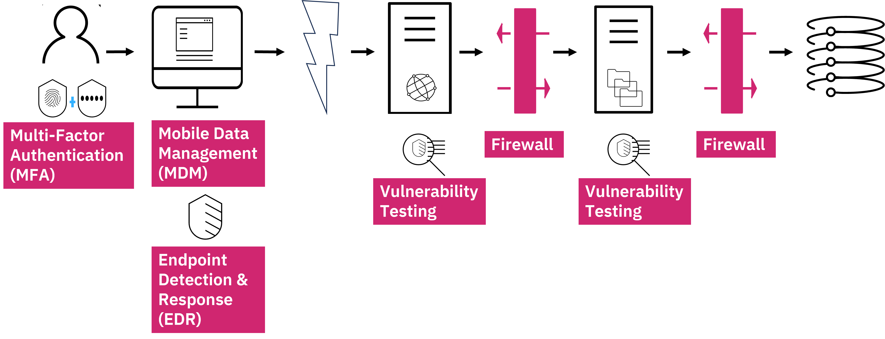

# إدارة الهوية والوصول (Identity and Access Management - IAM)

## نظرة عامة
الهوية أصبحت المحيط الأمني الجديد (Identity is the new perimeter)، حيث لم يعد بالإمكان الاعتماد فقط على التدابير الأمنية التقليدية. نحتاج لتحديد هوية المستخدم في أقرب وقت ممكن لضمان الأمان.

## الأركان الأربعة لإدارة الهوية والوصول (The Four A's)

### 1. الإدارة (Administration)
تتضمن تحديد وإنشاء حقوق الوصول:
- إنشاء الحسابات (Account Creation)
- تحديث الحسابات (Account Updates)
- حذف الحسابات (Account Deletion)
- تعديل مستويات الصلاحيات (Privilege Level Changes)

**إدارة الأدوار (Role Management):**
- تصنيف المستخدمين إلى مجموعات كبرى: الموظفون، الموردون، العملاء
- تقسيم كل مجموعة إلى أدوار فرعية (مثل: موظفو الإدارة، التصنيع، المبيعات)
- ربط كل دور بحقوق وصول محددة مسبقاً
- في السيناريو المثالي: 80% من حقوق الوصول تُحدد تلقائياً بناءً على الدور، و20% تُعالج كحالات فردية

**سيناريوهات الاستخدام:**
1. موظف جديد: يُضاف إلى نظام الموارد البشرية → يُولد طلب تلقائي → يُحول إلى أدوار IT → تُنشأ الحسابات بعد الموافقة
2. موظف حالي يطلب صلاحيات إضافية: طلب عبر واجهة ويب → عملية موافقة → منح الصلاحيات
3. موظف يغادر المنظمة: إلغاء تفعيل في نظام الموارد البشرية → حذف تلقائي لجميع الحسابات والصلاحيات (De-provisioning)

### 2. المصادقة (Authentication)
الإجابة على السؤال: "من أنت؟"

**العوامل الثلاثة للمصادقة:**
- **شيء تعرفه (Something You Know):** كلمة المرور، رقم PIN
- **شيء تملكه (Something You Have):** الهاتف المحمول، بطاقة ذكية، رمز أمان (Security Token)
- **شيء أنت عليه (Something You Are):** بصمة الإصبع، التعرف على الوجه، بصمة الصوت

**المصادقة متعددة العوامل (Multi-Factor Authentication - MFA):**
الاعتماد على عاملين أو أكثر من العوامل الثلاثة لتعزيز الأمان. الاتجاه الحديث نحو المصادقة بدون كلمة مرور (Passwordless Authentication) باستخدام الهاتف المحمول والبيانات البيومترية.

**تسجيل الدخول الموحد (Single Sign-On - SSO):**
- المستخدم يسجل دخوله مرة واحدة في نظام SSO
- النظام يوفر تلقائياً بيانات الاعتماد للأنظمة الأخرى
- يحسن تجربة المستخدم ويعزز الأمان عند دمجه مع MFA
- يقلل من احتمالية استخدام المستخدم لنفس كلمة المرور في أنظمة متعددة

### 3. التفويض (Authorization)
الإجابة على السؤال: "ما الذي يُسمح لك بفعله؟"

**التفويض القائم على المخاطر (Risk-Based Authorization / Adaptive Access):**
يأخذ بعين الاعتبار عدة عوامل:
- الموقع الجغرافي (Location): رفض العمليات من مواقع غير معروفة
- نوع الطلب (Request Type): قراءة رصيد بنكي مقابل تحويل أموال
- المبلغ (Amount): تحويل حتى 1000 دولار دون قيود إضافية، أكثر من ذلك يتطلب ضوابط إضافية
- التكرار (Frequency): 30 عملية في يوم واحد عندما يكون المعتاد عملية واحدة شهرياً

### 4. التدقيق (Audit)
التحقق من تنفيذ الأركان الثلاثة السابقة بشكل صحيح.

**تحليل سلوك المستخدم (User Behavior Analytics - UBA / User Entity Behavior Analytics - UEBA):**
- تسجيل جميع الأنشطة والوصول (Logging)
- استخدام التعلم الآلي (Machine Learning) لاكتشاف الأنماط الشاذة
- مثال: إنشاء حساب → نسخ قاعدة البيانات → حذف الحساب في تسلسل سريع قد يشير إلى نشاط خبيث

## البنية التحتية الأساسية (Foundation Layer)

### الأدلة (Directories)
أي مكان يُخزن فيه معلومات المستخدم يُعتبر دليلاً، ويتكون من:
- **قاعدة بيانات (Database):** لتخزين الحسابات
- **مخطط (Schema):** لتنظيم المعلومات
- **بروتوكول (Protocol):** للاتصال بالدليل، والأكثر شيوعاً هو LDAP (Lightweight Directory Access Protocol)

**Active Directory:** هو نسخة مايكروسوفت من هذا المفهوم، ويستخدم أيضاً بروتوكول LDAP.

### المزامنة (Synchronization)
في الواقع العملي، المنظمات تمتلك أدلة متعددة، وهناك طريقتان للمزامنة:

1. **الدليل الافتراضي (Virtual Directory):**
   - يعمل كفهرس يشير إلى مواقع المعلومات
   - يسترجع البيانات عند الطلب
   - قد يتم تخزين البيانات مؤقتاً (Caching) لتحسين الأداء

2. **الدليل الوصفي (Meta Directory):**
   - يجلب المعلومات مسبقاً من الأدلة الفرعية
   - يخزنها في دليل مؤسسي موحد (Enterprise Directory)
   - لا يُنسخ كل شيء، فقط المعلومات الضرورية

## إدارة الوصول المميز (Privileged Access Management - PAM)

### المشكلة التقليدية:
- مستخدمون مميزون متعددون يستخدمون نفس الحساب وكلمة المرور
- صعوبة تتبع من قام بماذا
- صعوبة تغيير كلمات المرور عند مغادرة أحد المستخدمين
- مخاطر أمنية عالية لأن هؤلاء المستخدمين لديهم "مفاتيح المملكة"

### الحل باستخدام PAM:
- المستخدمون يسجلون دخولهم إلى نظام PAM بمصادقة فريدة وقوية (MFA)
- النظام يمنحهم وصولاً مؤقتاً بكلمة مرور فريدة
- عند الانتهاء، يتم تغيير كلمة المرور تلقائياً
- تسجيل الجلسات (Session Recording) لتتبع كل ضغطة مفتاح
- إمكانية تحديد من قام بأي نشاط بدقة

## التكامل والتوسع

### الاتحاد (Federation)
يسمح للموظفين بتسجيل الدخول إلى:
- أنظمة سحابية خارجية (Cloud Providers)
- أنظمة SaaS
- أنظمة الشركاء التجاريين

يتم ذلك عبر:
- **مزود الهوية (Identity Provider):** نظام المنظمة
- **مزود الخدمة (Service Provider):** الأنظمة الخارجية
- استخدام بروتوكولات صناعية موحدة

### أنواع إدارة الهوية:

**إدارة هوية القوى العاملة (Workforce Identity Management):**
تركز على موظفي المنظمة وقد تمتد للشركاء.

**إدارة هوية المستهلك (Consumer Identity and Access Management - CIAM):**
- نفس القدرات الأساسية ولكن بتركيز مختلف
- التركيز على تقليل الاحتكاك قدر الإمكان
- عدم وضع حواجز دخول صارمة للحسابات غير الحساسة
- تقليل أو إلغاء عمليات الموافقة
- التركيز على حماية الخصوصية

## الخلاصة
معمارية IAM الشاملة تجمع كل هذه المكونات:
- طبقة التخزين والمزامنة (Store & Sync)
- إدارة الهوية والحوكمة (Identity Management/Governance)
- إدارة الوصول (Access Management)
- إدارة الوصول المميز (PAM)
- القدرة على الاتحاد (Federation)
- التدقيق والتحليل (Audit & Analytics)

هذه البنية تنطبق على جميع حالات الاستخدام سواء للموظفين أو المستهلكين، مع تعديلات بسيطة حسب الاحتياجات المحددة.

# أمن نقاط النهاية (Endpoint Security)

## العلاقة مع إدارة الهوية والوصول
المصادقة متعددة العوامل (MFA) وجميع آليات IAM تعتمد على **منصة موثوقة (Trusted Platform)**. لا يهم قوة البيانات البيومترية إذا كانت قادمة من جهاز مخترق (Jailbroken Device). لذلك، أمن نقاط النهاية هو الأساس الذي تُبنى عليه IAM.



## تعريف نقاط النهاية (Endpoints)

### من منظور الأجهزة (Hardware Perspective):
- **الخوادم (Servers)**
- **أنظمة المكتب (Desktop Systems)**
- **الحواسيب المحمولة (Laptop Systems)**
- **الأجهزة المحمولة (Mobile Devices)**
- **إنترنت الأشياء (IoT - Internet of Things):** الأجهزة التي أصبحت تمتلك قدرات حوسبية مثل الكاميرات، الأجهزة المنزلية، وغيرها

### الطيف بين الاستخدام المؤسسي والشخصي:
الحدود بين الاستخدام المؤسسي والشخصي أصبحت **وهمية (Fiction)**. المستخدمون يستخدمون نفس الأجهزة لكلا الغرضين، مما يزيد من التعقيد الأمني.

### من منظور البرمجيات (Software Perspective):
أنظمة تشغيل متعددة عبر هذه الأجهزة:
- Windows
- MacOS
- Linux
- Unix
- Mainframes
- Mobile Operating Systems
- IoT Operating Systems (غالباً غير معروفة)

**التعقيد هو عدو الأمن (Complexity is the Enemy of Security)**، وكل نظام تشغيل إضافي يزيد من التعقيد.

## سطح الهجوم (Attack Surface)
كل جهاز من نقاط النهاية يُمثل:
- نقطة دخول محتملة للمهاجمين
- ثغرات أمنية مختلفة (Different Vulnerabilities)
- توسع في محيط الأمان (Expanding Perimeter)
- زيادة في حجم سطح الهجوم

الأجهزة الشخصية (مثل أجهزة الأطفال) تُشكل خطراً أكبر لأنها قد لا تخضع لنفس معايير الأمان.

## أنظمة إدارة نقاط النهاية (Endpoint Management Systems)

### الممارسة التقليدية (Typical Practice):
نظام مجزأ وغير فعال:
- مسؤول منفصل للخوادم عبر console خاص
- مسؤول آخر لأجهزة المكتب والحواسيب المحمولة عبر نظام مختلف
- مسؤول ثالث للأجهزة المحمولة عبر نظام MDM (Mobile Device Management)
- **لا يوجد إدارة على الإطلاق** لأجهزة IoT

**المشاكل:**
- تعدد المسؤولين وعدم التنسيق
- تعقيد في تطبيق سياسات أمنية موحدة
- عدم الكفاءة

### الممارسة المثلى (Best Practice):
**نظام إدارة نقاط النهاية الشامل (Holistic Endpoint Security Management System):**

المزايا:
- console واحد لإدارة جميع الأجهزة
- مسؤول واحد منطقياً يمكنه إدارة كل المنصات
- القدرة على دفع السياسات والتحديثات (Policies & Patches) عبر البنية التحتية بأكملها
- الحصول على معلومات وتنبيهات من جميع الأنظمة في مكان واحد
- **الرؤية والتحكم (Visibility and Control) هما مفتاح الأمن**

## الضوابط والسياسات الأمنية (Security Controls & Policies)

### 1. الجرد والاكتشاف (Inventory & Discovery):
- اكتشاف جميع الأجهزة الموجودة على الشبكة (المعروفة وغير المعروفة)
- معرفة مستوى الأجهزة (Hardware Level)
- معرفة مستوى البرمجيات (Software Level)

### 2. سياسات الأجهزة والبرمجيات المسموحة:
**مثال على السياسة:**
- السماح بالإصدار الحالي (N) والإصدار السابق مباشرة (N-1)
- الإصدار (N-2) يُعتبر قديماً جداً وينقصه تحديثات أمنية مهمة
- فصل الأجهزة القديمة عن البيانات الحساسة (Sensitive Data)

### 3. سياسات كلمات المرور (Password Policies):
تطبيق معايير موحدة عبر جميع الأجهزة:
- الطول (Length)
- القوة (Strength)
- تاريخ الانتهاء (Expiry Date)

### 4. التحديثات والترقيعات (Patching):
- تطبيق جميع التحديثات الأمنية فور صدورها
- الأنظمة بجودة أحدث برمجياتها
- عدم تطبيق الترقيعات يعني ترك ثغرات يمكن للمهاجمين استغلالها

### 5. سياسة التشفير (Encryption Policy):
- تشفير جميع البيانات على الأجهزة التي يمكنها تخزين البيانات
- حماية البيانات في حالة فقدان أو سرقة الجهاز
- ضمان عدم إمكانية الوصول للبيانات بدون مفاتيح التشفير

### 6. المسح عن بُعد (Remote Wipe):
- القدرة على مسح البيانات تلقائياً عند فقدان أو سرقة الجهاز
- المسح الانتقائي (Selective Wipe): إزالة البيانات المؤسسية فقط مع الاحتفاظ بالبيانات الشخصية
- تطبيق المسح عند مغادرة الموظف للمنظمة

### 7. تتبع الموقع (Location Tracking):
- إمكانية تحديد موقع الأجهزة المفقودة
- قد لا يتم تفعيلها للأجهزة الشخصية لحماية الخصوصية
- مفيدة للأجهزة المؤسسية

### 8. مكافحة الفيروسات / الكشف والاستجابة (Antivirus / Endpoint Detection and Response - EDR):
- التأكد من عدم وجود برمجيات خبيثة (Malware)
- حماية استباقية واستجابة للتهديدات

### 9. سياسة التخلص من الأجهزة (Disposal Policy):
- إجراءات آمنة للتخلص من الأجهزة القديمة
- ضمان عدم تسريب المعلومات عند استبدال الأجهزة

## إحضر جهازك الخاص (BYOD - Bring Your Own Device)

### التوسع في المفهوم:
- **BYOD:** Bring Your Own Device
- **BYOIT:** Bring Your Own IT
- **BYOC:** Bring Your Own Cloud

### أنواع المنظمات:
لا يوجد سوى نوعين فعلياً:
1. **برنامج محدد جيداً (Well-Defined Program)**
2. **برنامج محدد بشكل سيئ (Poorly-Defined Program)**

المنظمات التي تدعي "هذا غير مسموح" لديها في الواقع **برنامج غير مُصرح به (Unsanctioned Program)**، وهو مجرد برنامج محدد بشكل سيئ.

**المبدأ الأساسي:** إذا قالت منظمة الأمن "لا"، المستخدم النهائي سيقول "كيف؟" ويفعلها على أي حال. من الأفضل تحديد القواعد مسبقاً.

### عناصر البرنامج المحدد جيداً:

#### 1. الموافقة (Consent):
- توضيح القواعد للمستخدم الذي يملك الجهاز
- شرح ما سيتم تثبيته على الجهاز
- شرح الإجراءات التي قد تُطبق على الجهاز

#### 2. سياسة المراقبة (Monitoring Policy):
- هل سيتم مراقبة استخدام الجهاز؟
- تحت أي ظروف تتم المراقبة؟
- قد تقتصر المراقبة على الاستخدام المؤسسي فقط

#### 3. المسح عن بُعد (Remote Wipe):
- الاحتفاظ بحق المسح عن بُعد
- المسح الانتقائي: إزالة البيانات المؤسسية فقط
- الصور العائلية والبيانات الشخصية تبقى سليمة
- التطبيق عند الإبلاغ عن فقدان/سرقة أو مغادرة الموظف

#### 4. مستويات البرمجيات المطلوبة (Required Software Levels):
**التطبيقات الإلزامية:**
- الإصدار الحالي (N) أو السابق (N-1)
- تطبيقات محددة يجب تثبيتها
- مثال: برنامج مكافحة الفيروسات على الحواسيب المكتبية

**التطبيقات المحظورة:**
- تطبيقات يُحظر تماماً وجودها على الجهاز
- قد تجعل البيانات عرضة للخطر
- قد تُعرض المنظمة لتهديدات معينة
- يتم الكشف عنها والإبلاغ عنها أو إزالة البيانات المؤسسية

#### 5. تكوينات الأجهزة المدعومة (Supported Hardware Configurations):
- لا يمكن دعم كل جهاز محتمل
- تحديد أنواع محددة من الأجهزة المدعومة
- تحديد Desktop، Laptop، Mobile Devices المسموح بها

#### 6. الخدمات المصرح بها (Authorized Services):
**مثال: خدمات السحابة:**
- استخدام خدمات مصرح بها فقط
- برنامج محدد لمشاركة الملفات (Cloud-Based File Sharing)
- عدم استخدام خدمات بديلة
- المراقبة للتأكد من الامتثال

### المبدأ الذهبي في BYOD:
**"من الأفضل أن نقول كيف بدلاً من لا"**

إذا جعلنا فعل الشيء الخاطئ أسهل من فعل الشيء الصحيح، المستخدمون سيفعلون الشيء الخاطئ. يجب **تسهيل وتمكين (Enable)** الطريقة الصحيحة.

## أدوات إدارة نقاط النهاية - مثال IBM MaaS360

### الوظائف الأساسية:
- تثبيت وتحديث البرمجيات
- تعيين إعدادات الأمان (Security Configurations)
- مراقبة حالة النظام (System Status Monitoring)
- المسح عن بُعد للأجهزة المفقودة

### مزايا IBM MaaS360 with Watson:

#### 1. إدارة نقاط النهاية (Endpoint Management):
- تسجيل وتكوين الأجهزة بسرعة
- إدارة الأمن بغض النظر عن نظام التشغيل أو نوع الجهاز
- دعم نماذج العمل من أي مكان (Work-Anywhere Models)

#### 2. أمن الأصول (Asset Security):
- اكتشاف ومعالجة التهديدات (Threat Detection and Remediation)
- حماية الأصول الرقمية عبر جميع الأجهزة
- المسح عن بُعد لحماية المعلومات الحساسة

#### 3. تحليلات الذكاء الاصطناعي (AI Analytics):
- Watson AI لتفسير البيانات المعقدة
- التنبؤ بالاتجاهات المستقبلية
- المساعدة في اتخاذ قرارات مستنيرة
- تحسين الإنتاجية والكفاءة

#### 4. أمن البيانات (Data Security):
- التشفير وتقنيات متقدمة
- حماية البيانات أثناء النقل والتخزين
- Watson AI يحدد التهديدات على الأجهزة المحمولة
- توفير رؤى لتحسين إنتاجية المستخدم

#### 5. إدارة الهوية (Identity Management):
تكامل IAM مع UEM:
- **IAM:** إطار عمل للسياسات والتقنيات لضمان وصول الأفراد المناسبين للموارد المناسبة في الأوقات المناسبة
- **UEM (Unified Endpoint Management):** نهج استراتيجي للتحكم وتأمين جميع نقاط النهاية من console واحد

#### 6. المساعدة الذكية:
- Chatbot والمساعدة الصوتية (Voice Assistance)
- دعم الموظفين في المساعدة العامة

## الربط بين IAM و Endpoint Security

```
أمن نقاط النهاية (Foundation)
         ↓
   منصة موثوقة
         ↓
   IAM فعّال وآمن
```

بدون نقاط نهاية آمنة، جميع آليات IAM (بما في ذلك MFA) تصبح غير فعالة. الأمن الشامل يتطلب:
1. نقاط نهاية مُدارة وآمنة
2. نظام IAM قوي
3. تكامل سلس بين الاثنين
4. رؤية شاملة عبر جميع الأجهزة والمستخدمين