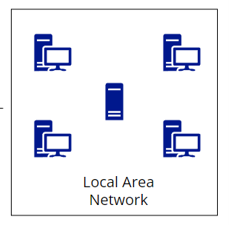
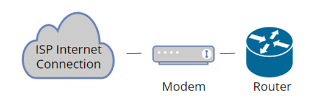
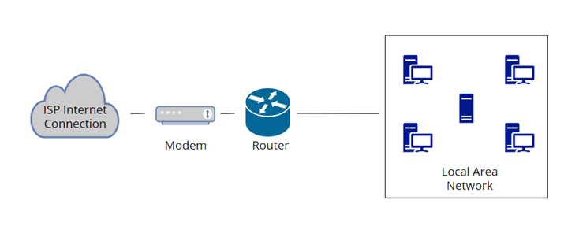
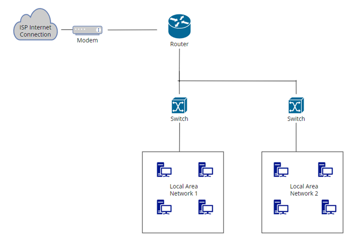
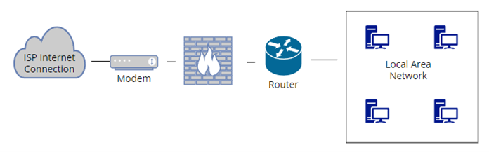
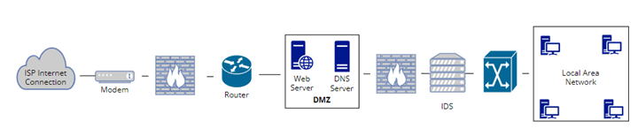
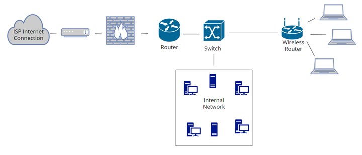

# ملخص أمن الشبكات - Network Security

## نظرة عامة
يتناول هذا المحتوى العناصر الأساسية لأمن الشبكات ضمن سلسلة هندسة الأمن السيبراني، مع التركيز على الجدران النارية، التقسيم الشبكي، الشبكات الخاصة الافتراضية، وتقنيات SASE الحديثة.

---


## 1. الجدران النارية - Firewalls

### المفهوم الأساسي
الجدار الناري مستوحى من الجدران الفيزيائية المانعة للحرائق، حيث يعمل على عزل وحماية الشبكات من الأحداث الخطرة والوصول غير المصرح به.

### أنواع تقنيات الجدران النارية

#### تصفية الحزم - Packet Filtering
- فحص معلومات رأس الحزمة **Header** فقط دون المحتوى
- المعلومات المفحوصة:
  - عنوان المصدر **Source Address**
  - عنوان الوجهة **Destination Address**
  - المنفذ **Port** (مثل Port 80 لـ HTTP، Port 443 لـ HTTPS)
- يشبه فحص الظرف الخارجي للرسالة دون قراءة المحتوى

#### الفحص الحالاتي للحزم - Stateful Packet Inspection
- فحص أعمق يشمل المحتوى **Payload** بالإضافة للرأس
- تحليل سياق الحزم وتسلسلها لاكتشاف الأنماط الشاذة
- أكثر تطوراً من التصفية البسيطة
- جيل أحدث من تقنيات الجدران النارية

#### جدران التطبيقات - Application Firewalls
- فحص متخصص للطبقة التطبيقية
- مراقبة وتحكم دقيق بحركة المرور حسب قواعد محددة مسبقاً

#### الوكيل - Proxy
- يعمل كوسيط بين العميل والخادم
- يقسم الاتصال المباشر إلى جلستين منفصلتين
- المزايا:
  - فحص الحركة قبل السماح بمرورها
  - تطبيق سياسات الأمان
  - الحماية من الفيروسات
  - توفير الخصوصية بإخفاء هوية المستخدمين

#### ترجمة عناوين الشبكة - Network Address Translation (NAT)
موجود في معظم أجهزة الراوتر المنزلية، يعمل على:
- ترجمة العناوين الداخلية غير القابلة للتوجيه (مثل 10.x.x.x أو 192.168.x.x) إلى عنوان خارجي واحد
- توفير عناوين IP
- الحماية: يمنع الوصول المباشر من الإنترنت للأجهزة الداخلية
- يسمح بمرور حركة البيانات من الداخل للخارج فقط

---

## 2. تقسيم الشبكة - Network Segmentation

### معمارية Bastion Host (غير موصى بها)
- وضع الخادم مباشرة على الإنترنت
- معمارية بدائية وخطرة
- كانت مستخدمة في الأيام الأولى للإنترنت

### شبكة ثلاثية الاتصال - Tri-homed Network
- جدار ناري واحد بثلاث واجهات شبكية **Network Interface Cards**
- المناطق:
  - **Red Zone**: الإنترنت (غير موثوق)
  - **Yellow Zone**: منطقة DMZ (شبه موثوق)
  - **Green Zone**: الشبكة الداخلية (أكثر موثوقية)
- المزايا: قليل التكلفة، قابل للتوسع
- العيوب: نقطة فشل واحدة **Single Point of Failure**

### المنطقة منزوعة السلاح الأساسية - Basic DMZ
استخدام جدارين ناريين لإنشاء ثلاث مناطق:
1. الشبكة الخارجية (الإنترنت)
2. منطقة DMZ (خوادم الويب)
3. الشبكة الداخلية

**المزايا:**
- الدفاع المتعمق **Defense in Depth**: طبقتا حماية بدلاً من طبقة واحدة
- عدم وجود نقطة فشل واحدة
- قابلية أكبر للتوسع

**العيوب:**
- تكلفة أعلى (جداران ناريان)
- تعقيد إداري أكبر

### المنطقة منزوعة السلاح متعددة المستويات - Multi-tiered DMZ
- استخدام ثلاثة جدران نارية أو أكثر
- فصل خوادم الويب عن خوادم التطبيقات عن قواعد البيانات
- **المزايا:**
  - دفاع متعمق معزز
  - دقة أكبر في التحكم **Granularity**
  - أمان أعلى عند التطبيق الصحيح
- **العيوب:**
  - تكلفة وتعقيد أعلى بكثير
  - إدارة ثلاثة جدران نارية منفصلة

---

## 3. الشبكات الخاصة الافتراضية - Virtual Private Networks (VPNs)

### الهدف الأساسي
توفير قناة آمنة **Secure Channel** عبر شبكة غير موثوقة (مثل الإنترنت) باستخدام التشفير.

### المزايا والعيوب

**المزايا:**
- السرية **Confidentiality**: لا يمكن قراءة محتوى الحزم المشفرة
- أمان الاتصال عبر الإنترنت

**العيوب:**
- قدرة فحص محدودة **Limited Inspection Capability**
- يمكن للمهاجمين استخدامها لإخفاء الهجمات أو البرمجيات الخبيثة

### أنواع VPN حسب طبقة OSI

#### طبقة التطبيق - Application Layer
- **Secure Shell (SSH)**: للاتصال الآمن بالأجهزة
- **Secure FTP**: لنقل الملفات المشفر
- VPN خاص بتطبيق محدد

#### طبقة النقل - Transport Layer
- **TLS/SSL (Transport Layer Security/Secure Sockets Layer)**
- الأكثر شيوعاً للمتصفحات (رمز القفل في شريط العنوان)
- تشفير الاتصال بين المتصفح والخادم

#### طبقة الشبكة - Network Layer
- **IPsec**: تشفير كل الاتصالات بين عنواني شبكة
- VPN واسع النطاق

#### طبقات أدنى
- **PPTP (Point-to-Point Tunneling Protocol)**
- **L2TP (Layer 2 Tunneling Protocol)**

### المقارنة: VPN واسع النطاق vs VPN خاص بالتطبيق

| VPN واسع النطاق (Network-based) | VPN خاص بالتطبيق (Application-specific) |
|---|---|
| بسيط في الإعداد | يتطلب إعداد منفصل لكل تطبيق |
| Catch-all: يشمل كل التطبيقات | تحكم دقيق لكل تطبيق |
| أقل دقة في التحكم | دقة عالية **Granularity** |
| لا يمكن إيقاف خدمة معينة بشكل منفصل | إمكانية إيقاف خدمة أو مستخدم محدد |

**الاتجاه الحالي:** الانتقال نحو VPN خاصة بالتطبيقات للحصول على تحكم أفضل.

---

## 4. حافة الخدمة الآمنة - Secure Access Service Edge (SASE)

### التعريف
تقنية حديثة تجمع أمن الشبكات والشبكات الواسعة وتقدمها كخدمة سحابية موحدة.

### المعادلة الرياضية لـ SASE
```
SASE = (Network Security + SD-WAN) delivered from Cloud
```

### مكونات SASE

#### أمن الشبكات - Network Security
- الجدران النارية **Firewalls**
- بوابات الويب الآمنة **Secure Web Gateways**
- منع فقدان البيانات **Data Loss Prevention (DLP)**
- إدارة الهوية والصلاحيات **Identity Management & Access Control**

#### الشبكة الواسعة المعرفة برمجياً - Software-Defined WAN (SD-WAN)
- إنشاء شبكة ديناميكية
- تغيير حدود الشبكة في الوقت الفعلي
- مرونة وسرعة عالية

#### الحوسبة السحابية - Cloud Delivery
- قابلية التوسع **Scalability**
- المرونة **Elasticity**
- السرعة **Agility**

### المزايا
- دمج وظائف متعددة في مكون منطقي واحد
- بدلاً من أجهزة منفصلة متعددة
- إدارة موحدة بدلاً من إدارات منفصلة
- عمل متكامل **Holistic Operation**

### السياق: Zero Trust
SASE جزء من مفهوم الثقة المعدومة **Zero Trust** الذي يشمل أيضاً:
- التقسيم الدقيق **Micro-segmentation**: تقسيم الشبكة لمناطق صغيرة متعددة

---

## 5. مواضيع لم يتم تغطيتها بالتفصيل
- شبكات الجيل الخامس **5G**
- أمن شبكات Wi-Fi
- الجوانب الفيزيائية للشبكات

---

## تأمين البنية التحتية للشبكة - Securing Network Infrastructure

### الشبكة المحلية - Local Area Network (LAN)
- مجموعة أجهزة متصلة (حواسيب، طابعات، خوادم)
- تقع في قلب مخطط الشبكة



### المودم - Modem
- يقع على حافة الشبكة
- بوابة بين الشبكة المحلية والإنترنت
- يتصل مباشرة بخط مزود الخدمة



### الموجه - Router
- دور مركزي في ربط الشبكات المختلفة
- يربط بين الشبكات الداخلية (LANs) والشبكات الخارجية (الإنترنت)
- يوجه حركة البيانات بكفاءة



### المبدل - Switch
- قلب البنية التحتية للشبكة
- يربط الأجهزة داخل LAN
- يدير تدفق البيانات بين الأجهزة المتصلة



### الجدار الناري - Firewall
- يوضع على الخط الأمامي للشبكة
- نقطة تحكم أمنية بين الشبكة الداخلية والخارجية
- يوضع عادة بعد الموجه مباشرة
- يفحص كل حزم البيانات حسب السياسات الأمنية



### المنطقة منزوعة السلاح - DMZ
- توضع بين الشبكة الداخلية والإنترنت
- منطقة عازلة إضافية
- تستضيف الخدمات التي تتواصل مع الشبكات الخارجية:
  - خوادم الويب **Web Servers**
  - خوادم البريد الإلكتروني **Email Servers**
  - خوادم DNS
  - خوادم FTP
  - خوادم VPN


### نظام كشف التسلل - Intrusion Detection System (IDS)
- يوضع في نقاط حرجة لمراقبة الحركة
- عادة خلف الجدار الناري وقبل المبدل
- يفحص الحركة الداخلية للكشف عن الشذوذات
- طبقة إضافية للكشف تتجاوز الجدار الناري وDMZ



### الموجه اللاسلكي - Wireless Router
- يعمل كموجه ونقطة وصول لاسلكية
- يربط الشبكات السلكية بالأجهزة اللاسلكية
- يسهل الاتصال بين الأجهزة السلكية واللاسلكية



---

## المفاهيم الرئيسية المستفادة

1. **الدفاع المتعمق - Defense in Depth**: استخدام طبقات حماية متعددة بدلاً من الاعتماد على آلية واحدة
2. **التقسيم الشبكي - Segmentation**: عزل المناطق المختلفة بمستويات ثقة متفاوتة
3. **التشفير - Encryption**: أساس أمن VPN لحماية البيانات أثناء النقل
4. **التكامل - Integration**: اتجاه SASE نحو دمج الوظائف الأمنية في خدمة موحدة
5. **التوازن**: بين التكلفة والتعقيد والأمان في اختيار المعمارية المناسبة

# ملخص أمن التطبيقات - Application Security

## نظرة عامة
يركز هذا المحتوى على أمن التطبيقات كأحد المجالات الأساسية في الأمن السيبراني، مع التركيز على دورة حياة تطوير البرمجيات الآمنة، ممارسات البرمجة الآمنة، وأدوات اختبار الثغرات.

---

## 1. لماذا نهتم بأمن التطبيقات؟

### الحقيقة الأساسية
جميع البرمجيات المعقدة تحتوي على أخطاء **Bugs**، ونسبة من هذه الأخطاء ستكون ثغرات أمنية **Security Vulnerabilities**. لذلك، منطقياً، كل البرمجيات تحتوي على ثغرات أمنية محتملة.

### دورة حياة الثغرات ومعادلة التكلفة

**مراحل إدخال واكتشاف الثغرات:**
- معظم الثغرات تُدخل في مرحلة البرمجة **Coding Phase**
- يتم اكتشافها تدريجياً في مراحل الاختبار **Testing Phases**
- أقل عدد يُكتشف بعد الإطلاق **Release**

**معادلة التكلفة الحرجة:**
```
تكلفة إصلاح ثغرة في مرحلة البرمجة = 1X
تكلفة إصلاحها بعد الإطلاق = 640X
```

الدرس الأساسي: اكتشاف الثغرات مبكراً يوفر تكاليف هائلة ويقلل المخاطر بشكل كبير.

---

## 2. دورة حياة تطوير البرمجيات الآمنة - Secure SDLC

### النهج التقليدي (غير موصى به)

المراحل الخطية:
```
التصميم → البرمجة → الاختبار → الإطلاق
(Design → Coding → Testing → Release)
```

**المشاكل:**
- عملية خطية **Linear Process**
- معزولة **Siloed**: خط فاصل سميك بين التطوير والعمليات
- عقلية "رمي الكود فوق الحائط" **Over the Wall Mentality**
- بطيئة وغير مرنة
- الأمن يُضاف في النهاية فقط

### نهج DevOps (تحسن لكن غير كافٍ)

عملية دورية متكاملة:
```
البناء → الإطلاق → النشر → التشغيل → التغذية الراجعة → [تكرار]
(Build → Release → Deploy → Operate → Feedback → [Loop])
```

**المزايا:**
- عملية دورية **Cyclical** مع حلقة تحسين مستمر
- لا فصل بين الفرق
- سريعة ومرنة
- مصممة للسرعة **Agility**

**المشكلة:** الأمن لا يزال غير مدمج بشكل كافٍ في كل المراحل.

### نهج DevSecOps (الحل الأمثل)

دمج الأمن في كل مرحلة من مراحل DevOps:

```
        ┌─────── Security ───────┐
        │                        │
   Build → Release → Deploy → Operate → Feedback
        │                        │
        └────────────────────────┘
```

**المبادئ الأساسية:**

#### التحول نحو اليسار - Shift Left
إدخال الأمن في أقرب مرحلة ممكنة من دورة التطوير، بدلاً من انتظار النهاية.

#### الأمن بالتصميم - Security by Design
- تصميم النظام ليكون مقاوماً للهجمات من البداية
- الأمن ليس إضافة خارجية **Bolt-on** بل مدمج **Built-in**

#### التعاون - Collaboration
دمج ثلاث مجموعات كانت تقليدياً منفصلة:
- التطوير **Development**
- الأمن **Security**
- العمليات **Operations**

#### الأتمتة - Automation
استخدام الأدوات الآلية لتسريع اكتشاف الثغرات وإصلاحها.

---

## 3. ممارسات البرمجة الآمنة - Secure Coding Practices

### المتطلبات الأساسية للبرمجة الآمنة

#### قائمة ممارسات البرمجة الآمنة - Secure Coding Practices Checklist

**التحقق من المدخلات - Input Validation:**
- منع هجمات تجاوز الذاكرة **Buffer Overflow**
- التأكد من أن حجم البيانات المدخلة لا يتجاوز حجم المخزن المؤقت المخصص
- مثال: استخدام CAPTCHA للتحقق من أن المستخدم إنسان وليس بوت

**المصادقة والتفويض - Authentication & Authorization:**
- **المصادقة**: التحقق من هوية المستخدم (كلمات المرور، المصادقة الثنائية، البيانات البيومترية)
- **التفويض**: تحديد الصلاحيات والموارد التي يمكن للمستخدم الوصول إليها
- تطبيق مبدأ الحد الأدنى من الامتيازات

**التشفير - Encryption:**
- تحويل النص الواضح **Plaintext** إلى نص مشفر **Ciphertext**
- حماية البيانات الحساسة أثناء التخزين والنقل
- ضروري لحماية كلمات المرور والمعاملات المالية

**معالجة الأخطاء - Error Handling:**
- التعامل مع الأخطاء دون كشف معلومات حساسة
- عدم عرض معلومات التصحيح **Debugging Info** أو تتبع المكدس **Stack Trace** للمستخدمين
- السجلات يجب أن تكون متاحة فقط للمستخدمين المصرح لهم

**نمذجة التهديدات - Threat Modeling:**
عملية منهجية لتحديد التهديدات المحتملة:
1. إنشاء نظرة عامة مفصلة على النظام وتدفق البيانات
2. تحديد التهديدات باستخدام نموذج **STRIDE**:
   - انتحال الشخصية **Spoofing**
   - التلاعب **Tampering**
   - الإنكار **Repudiation**
   - كشف المعلومات **Information Disclosure**
   - رفض الخدمة **Denial of Service**
   - رفع الامتيازات **Elevation of Privilege**
3. تحليل التأثير واحتمالية حدوث كل تهديد
4. تصميم استراتيجيات التخفيف المناسبة
5. المراجعة والتحديث المستمر

**مراجعة الكود الآمن - Secure Code Review:**
- فحص منهجي لكود المصدر للكشف عن نقاط الضعف الأمنية
- يمكن إجراؤها يدوياً أو آلياً
- تسمح باكتشاف العيوب مبكراً في التطوير

#### المكتبات الموثوقة - Trusted Libraries

**الحاجة:** لا يكتب المطورون كل شيء من الصفر، بل يعتمدون على مكتبات خارجية (مفتوحة المصدر أو خاصة).

**المخاطر:**
- ليست كل المكتبات جديرة بالثقة
- حتى المكتبات الموثوقة قد تحتوي على ثغرات

**مثال تحذيري: Log4J**
- مكتبة موثوقة ومستخدمة على نطاق واسع
- اكتُشفت فيها ثغرة خطيرة أثرت على آلاف الأنظمة
- الثغرة اكتُشفت بعد الإطلاق (أغلى مرحلة للإصلاح)
- الدرس: استخدام مصادر موثوقة يقلل المخاطر لكن لا يلغيها

#### المعماريات القياسية - Standard Architectures

- توثيق واضح لكيفية تصميم الأنظمة
- مراجع معمارية (مثل مرجع IBM لمعمارية أمن التطبيقات)
- توحيد الممارسات في المؤسسة

#### الأخطاء التي يجب تجنبها - Mistakes to Avoid

**قائمة OWASP العشرة الأولى - OWASP Top 10:**
- قائمة سنوية بأكثر 10 ثغرات شيوعاً
- المشكلة: القائمة تتكرر عاماً بعد عام مع تغييرات طفيفة
- يعني أننا لا نتعلم من أخطائنا كمجتمع تقني
- أمثلة مستمرة: Buffer Overflows، أخطاء التحقق من المدخلات
- مورد تعليمي ممتاز في OWASP.ORG

#### فاتورة مواد البرمجيات - Software Bill of Materials (SBOM)

مفهوم حديث يكتسب زخماً، يشبه سلسلة التوريد **Supply Chain** للبرمجيات.

**المعلومات المطلوبة:**
- **المكونات - Components**: جميع العناصر المستخدمة في التطبيق
- **المكتبات ومصادرها - Libraries & Sources**: من أين جاءت كل مكتبة
- **التبعيات - Dependencies**: العلاقات بين المكونات المختلفة
- **الإصدارات - Versions**: أرقام إصدارات جميع المكونات عبر الأنظمة
- **الثغرات المعروفة - Known Vulnerabilities**: الثغرات في كل إصدار

**الفوائد:**
- عند اكتشاف ثغرة (مثل Log4J)، نعرف فوراً جميع الأنظمة المتأثرة
- استرجاع أسرع وأكثر شمولاً
- تقليل التكاليف والمخاطر

---

## 4. اختبار الثغرات - Vulnerability Testing

### الأدوات الآلية - Automated Tools

#### الاختبار الثابت لأمن التطبيقات - Static Application Security Testing (SAST)

**الخصائص:**
- يُسمى أيضاً اختبار الصندوق الأبيض **White Box Testing**
- يفحص الكود المصدري **Source Code** مباشرة
- يمكن استخدامه مباشرة بعد مرحلة البرمجة

**المزايا:**
- يكتشف الثغرات في أقرب وقت ممكن
- تحقيق مبدأ "التحول نحو اليسار" **Shift Left**
- تقليل التكاليف بشكل كبير (1X بدلاً من 640X)

**الاستخدام:**
- تغذية الأداة بالكود المصدري
- تحليل آلي للثغرات المحتملة
- تقرير بالثغرات المكتشفة

#### الاختبار الديناميكي لأمن التطبيقات - Dynamic Application Security Testing (DAST)

**الخصائص:**
- يُسمى أيضاً اختبار الصندوق الأسود **Black Box Testing**
- يفحص النظام القابل للتنفيذ **Executable System**
- لا يحتاج للوصول إلى الكود المصدري

**المزايا:**
- يكتشف ثغرات وقت التشغيل **Runtime Vulnerabilities**
- يختبر النظام كما يراه المهاجم
- يمكن استخدامه في مراحل الاختبار المتأخرة

**الاستخدام:**
- تشغيل الأداة ضد التطبيق العامل
- محاكاة هجمات حقيقية
- اكتشاف ثغرات لا تظهر في الكود الثابت

### الاستراتيجية المثلى

**استخدام كلا النهجين معاً - Both SAST and DAST:**
- ليس اختياراً بين أحدهما **Not Either/Or**
- بل استخدام كليهما **Both And**
- كل أداة تكتشف أنواعاً مختلفة من الثغرات
- التكامل بينهما يوفر تغطية شاملة
- استخدامهما عبر دورة DevSecOps الكاملة

---

## 5. روبوتات الدردشة وأمن التطبيقات - Chatbots in Application Security

### استخدامات مفيدة

**توليد الكود - Code Generation:**
- إنشاء كود بسرعة (مثال: "اكتب لي دالة بايثون لإيجاد طرق تبديل دولار")
- توفير الوقت في المهام البرمجية الروتينية

**تصحيح الأخطاء - Debugging:**
- إرسال الكود للـ chatbot لإيجاد الأخطاء
- المساعدة في حل المشاكل البرمجية

### المخاطر الأمنية الحرجة

#### حقن الثغرات - Vulnerability Injection

**المشكلة:**
- الكود المولد قد يحتوي على ثغرات أمنية
- قد تكون أخطاء غير مقصودة من النموذج
- قد تكون هندسة متعمدة من مهاجمين
- إمكانية حقن أبواب خلفية **Backdoors** أو برمجيات خبيثة **Malware**

**السبب:**
- ليست مصدراً موثوقاً مثل المكتبات مفتوحة المصدر
- لم يفحصها آلاف المطورين
- الكود يأتي مباشرة ويُدمج في النظام

**التحدي:**
- عادة نستخدم chatbot لكتابة كمية كبيرة من الكود
- صعوبة فحص كل الكود المولد يدوياً
- يتطلب أدوات إضافية للفحص الأمني

#### تسريب الملكية الفكرية - Intellectual Property Exposure

**المشكلة:**
- عند استخدام chatbot للتصحيح، نرسل كودنا المصدري له
- الكود قد يكون سرياً أو ملكية خاصة **Proprietary**
- قد يكون سراً تجارياً **Trade Secret** أو محمياً بحقوق نشر

**المخاطر:**
- النظام يتعلم من الكود المرسل
- قد يعيد استخدام الكود لمستخدمين آخرين
- تسريب الملكية الفكرية إلى "الإنترنت"

**مثال واقعي:**
- شركة كبرى اكتشفت أن مطوريها يستخدمون chatbot للتصحيح
- أدركوا أنهم يسربون كودهم الخاص
- قرروا إيقاف هذه الممارسة

**التوصية:**
- الحذر الشديد عند استخدام chatbots
- وضع سياسات واضحة للشركة
- استخدام أدوات SAST/DAST لفحص الكود المولد
- عدم إرسال كود حساس للأنظمة الخارجية

---

## 6. موارد أساسية - Essential Resources

### OWASP (Open Web Application Security Project)
**الموقع:** OWASP.ORG

**الموارد المتاحة:**
- دليل ممارسات البرمجة الآمنة **Secure Coding Practices Guide**
- قائمة العشرة الأوائل **OWASP Top 10**: أكثر الثغرات شيوعاً
- معيار صناعي معترف به عالمياً
- تحديثات دورية (مثل 2017، 2021)
- موارد تعليمية مجانية

### IBM Application Security Architecture
مرجع معماري لأمن التطبيقات يوفر معماريات قياسية وأفضل الممارسات.

---

## المفاهيم الرئيسية المستفادة

### القاعدة الذهبية
الاكتشاف المبكر للثغرات = توفير هائل في التكلفة (1X مقابل 640X)

### مبادئ DevSecOps الأساسية
1. **التحول نحو اليسار - Shift Left**: الأمن من البداية وليس في النهاية
2. **الأمن بالتصميم - Security by Design**: مدمج وليس ملحق
3. **الأتمتة - Automation**: استخدام الأدوات لتسريع الاكتشاف
4. **التعاون - Collaboration**: دمج فرق التطوير والأمن والعمليات

### استراتيجية الاختبار الشاملة
- استخدام SAST لفحص الكود المصدري مبكراً
- استخدام DAST لاختبار النظام العامل
- التكامل بينهما للتغطية الكاملة
- التطبيق المستمر عبر دورة DevSecOps

### التعلم المستمر
- الاستفادة من موارد OWASP
- دراسة الأخطاء الشائعة وتجنبها
- عدم تكرار نفس الثغرات (كسر حلقة Groundhog Day)
- متابعة الثغرات الجديدة والمستجدة

### إدارة المخاطر
- فهم مخاطر المكتبات الخارجية (Log4J كمثال)
- إنشاء SBOM لتتبع المكونات والثغرات
- الحذر من استخدام Chatbots دون فحص
- حماية الملكية الفكرية

### الهدف النهائي
حماية البيانات **Data Security** - الجوهر الحقيقي الذي نحميه في معظم الحالات.

# ملخص أمن البيانات - Data Security

## نظرة عامة
يتناول هذا المحتوى أمن البيانات كأحد أهم مجالات الأمن السيبراني، مع التركيز على النظام البيئي الشامل لحماية البيانات من الحوكمة والاكتشاف إلى الحماية والاستجابة للحوادث.

---

## لماذا نهتم بأمن البيانات؟ - أرقام حرجة

### إحصائيات مقلقة من معهد Ponemon

**متوسط تكلفة اختراق البيانات عالمياً - Global Data Breach Cost:**
- 4.35 مليون دولار لكل اختراق
- هذا الرقم بعد استبعاد الحالات الاستثنائية الضخمة

**تكلفة اختراق البيانات في الولايات المتحدة - US Data Breach Cost:**
- 9.44 مليون دولار لكل اختراق
- ضعف المتوسط العالمي تقريباً

**نسبة المؤسسات المتكررة الاختراق - Multiple Breaches:**
- 83% من المؤسسات تعرضت لأكثر من اختراق واحد
- يعني أن الاختراق الأول ليس النهاية

### التأثيرات على الأفراد والمؤسسات

**على الأفراد:**
- خسائر مالية
- سرقة الهوية **Identity Theft**
- أشكال أخرى من الاحتيال
- ضغوط نفسية **Emotional Distress**
- ضرر محتمل للسمعة

**على المؤسسات:**
- تكاليف مباشرة للاستجابة والإصلاح
- غرامات تنظيمية ضخمة
- فقدان الملكية الفكرية
- تدمير السمعة والثقة
- فشل التدقيق وعدم الامتثال

---

## 1. النظام البيئي لأمن البيانات - Data Security Ecosystem

النظام البيئي لأمن البيانات يتكون من ست مكونات رئيسية مترابطة:

```
الحوكمة → الاكتشاف → الحماية → الامتثال → الكشف → الاستجابة
(Governance → Discovery → Protection → Compliance → Detection → Response)
                              ↓
                    [التغذية الراجعة للسياسات]
```

---

## 2. الحوكمة - Governance

### سياسة أمن البيانات - Data Security Policy

الحوكمة هي نقطة البداية الحاسمة - بدون تحديد خط النهاية، لا يمكن توقع الوصول إليه.

**مكونات السياسة الأساسية:**

#### معايير التصنيف - Classification Criteria
تحديد مستويات حساسية البيانات بوضوح:
- **سري للغاية - Top Secret / Highly Confidential**: مفاتيح المملكة
- **سري - Confidential**: بيانات حساسة تحتاج حماية قوية
- **داخلي - Internal**: استخدام داخلي فقط
- **عام - Public/Unclassified**: قائمة طعام الكافتيريا - لا تحتاج حماية

يجب توثيق هذه المعايير بوضوح لأن المستخدمين لا يمكنهم حماية البيانات إذا لم نحدد إرشادات واضحة.

#### الحمايات المطلوبة لكل مستوى - Protection Requirements
ربط كل مستوى تصنيف بمتطلبات حماية محددة:
- التشفير المطلوب
- ضوابط الوصول
- متطلبات التخزين
- قواعد المشاركة والنقل

#### فهرس البيانات - Data Catalog
- توثيق مواقع البيانات الحساسة
- تحديث مستمر للفهرس
- معرفة مكان "الأشياء الحساسة حقاً" في جميع الأوقات
- تتبع حركة البيانات عبر المؤسسة

#### خطة المرونة - Resilience Plan
استراتيجية واضحة للاسترداد في حالة فقدان البيانات:
- إجراءات النسخ الاحتياطي
- خطط استرداد البيانات
- سيناريوهات الكوارث المحتملة
- أطر زمنية للاستعادة

---

## 3. الاكتشاف - Discovery

بعد تحديد السياسات، يجب إيجاد البيانات فعلياً في جميع أنحاء المؤسسة.

### أنواع البيانات ومواقعها

#### بيانات منظمة - Structured Data
**قواعد البيانات - Databases:**
- البيانات المتوقعة والمنظمة
- غالباً تحتوي على "مفاتيح المملكة"
- سهلة نسبياً في التتبع والحماية

#### بيانات غير منظمة - Unstructured Data
**الملفات والوثائق:**
- ملفات عادية **Files**
- رسائل البريد الإلكتروني **Emails**
- جداول البيانات **Spreadsheets**
- مستندات مكتبية

**التحدي الأكبر:**
- ماذا لو نسخ شخص ما بيانات حساسة من القاعدة؟
- ماذا لو استخرج جزءاً وأرسله عبر البريد الإلكتروني؟
- البيانات الحساسة تنتشر في أماكن غير متوقعة
- يجب البحث عنها في الأماكن "غير المتوقعة"

#### البيانات على الشبكة - Data in Transit
- مراقبة حركة البيانات عبر الشبكة
- اكتشاف المشاكل في الوقت الفعلي
- تحديد أنماط نقل البيانات الشاذة

### تقنية منع فقدان البيانات - Data Loss Prevention (DLP)

تقنية حاسمة تمكن من:
- اكتشاف البيانات الحساسة في الوقت الفعلي
- المراقبة عبر أنظمة متعددة
- رصد تدفق البيانات عبر الشبكات
- منع التسريب غير المصرح به
- تطبيق سياسات الأمن تلقائياً

---

## 4. الحماية - Protection

### التشفير - Encryption

التشفير هو الحماية الأساسية - تشويش البيانات بحيث يمكن فقط للمصرح لهم قراءتها.

#### أنواع التشفير حسب حالة البيانات

**البيانات في وضع الراحة - Data at Rest:**
- البيانات المخزنة في قواعد البيانات
- ملفات على أقراص التخزين
- نسخ احتياطية
- أرشيفات

**البيانات في الحركة - Data in Motion (in Transit):**
- البيانات المنقولة بين المستخدمين
- حركة البيانات عبر الإنترنت
- الاتصالات بين الخوادم
- بيانات تُعرض على متصفح الويب

### إدارة المفاتيح - Key Management

**قاعدة ذهبية: إذا فقدت المفاتيح، فقدت البيانات.**

#### متطلبات إدارة المفاتيح الآمنة

**التوليد العشوائي - Random Generation:**
- يجب توليد المفاتيح بطريقة عشوائية حقيقية
- إذا كان يمكن التنبؤ بالمفاتيح، فكل الحماية بلا معنى
- المهاجم يمكنه قراءة جميع البيانات

**دورة حياة المفتاح - Key Lifecycle:**
- ليس "شفّر وانسَ" **Not Encrypt and Forget**
- بل "شفّر وتابع المفتاح باستمرار" **Encrypt and Continuously Follow**
- إعادة التشفير في الأوقات المناسبة
- تدوير المفاتيح **Key Rotation**: إدخال مفاتيح جديدة وإخراج القديمة

### التشفير الآمن كمياً - Quantum-Safe Cryptography

**التهديد القادم:**
الحواسيب الكمومية **Quantum Computers** ستتمكن من كسر جميع أنظمة التشفير الحالية في السنوات القادمة.

**المخاطر:**
- لا نعرف بالضبط متى، لكنه ليس بعيداً
- المهاجمون قد يسرقون البيانات المشفرة الآن لفكها لاحقاً **Steal Now, Decrypt Later**
- جميع أنظمة RSA-2048 الحالية معرضة للخطر

**التوقعات الزمنية:**
- **Y2Q (Years to Quantum)** أو **Q-Day**: التاريخ المتوقع لقدرة الكم على كسر التشفير
- تقرير Quantum Threat Timeline: خلال 15 سنة قد يُكسر RSA-2048
- Cloud Security Alliance (CSA): قد يحدث في 14 أبريل 2030

**الحل: خوارزميات ما بعد الكم - Post-Quantum Cryptography**

خمس عائلات من خوارزميات التشفير الآمنة كمياً:

1. **التشفير القائم على الشبكات - Lattice-based Encryption**
   - يستخدم هياكل هندسية متعددة الأبعاد
   - يخلق لغزاً تشفيرياً صعب الحل للحواسيب الكمومية

2. **التشفير القائم على الهاش - Hash-based Encryption**
   - يعتمد على دالات الهاش
   - تحويل البيانات لسلسلة محارف يصعب عكسها حتى كمياً

3. **التشفير القائم على الشيفرات - Code-based Encryption**
   - تحويل البيانات لرسائل مشفرة صعبة الفك بدون الخوارزمية الصحيحة

4. **التشفير متعدد المتغيرات - Multivariate Encryption**
   - استخدام معادلات رياضية متعددة ومتغيرات متزامنة
   - تعقيد عالٍ يصعب على الحواسيب الكمومية

5. **المفاتيح الخاصة - Private/Secret Keys**
   - مفاتيح سرية معروفة فقط للأطراف المشاركة
   - ضمن خوارزميات التشفير المتماثل

**التوصية:** البدء الآن في تحديث الأنظمة للخوارزميات الآمنة كمياً.

### ضوابط الوصول - Access Control

رغم أنها جزء من إدارة الهوية والوصول **IAM** (المجال الأول)، فهي حاسمة لأمن البيانات.

**الحقيقة المرّة:**
- لا يهم قوة التشفير إذا كانت كلمة مرور المستخدم هي "password"
- بدون مصادقة وتفويض قوي، التشفير القوي بلا فائدة
- **المصادقة - Authentication**: التحقق من الهوية
- **التفويض - Authorization**: تحديد الصلاحيات والموارد المتاحة

### النسخ الاحتياطي - Backup

**السيناريوهات الحرجة:**
- كوارث استرداد البيانات **Disaster Recovery**
- هجمات الفدية **Ransomware**: "لدينا بياناتك ولن نعيدها"

**الدفاع الأفضل ضد الفدية:**
```
المهاجم: "لدي بياناتك ولن أعيدها"
المدافع: "لدي أيضاً نسخة، سأستردها وأنت لن تحصل على شيء"
```

**أهمية النسخ الاحتياطي:**
- ليس فقط لحماية البيانات من المتطفلين
- بل للمرونة **Resilience** في حالة الهجوم أو الكارثة
- القدرة على الاستمرار دون دفع الفدية

---

## 5. الامتثال - Compliance

### اللوائح التنظيمية الرئيسية

#### اللائحة العامة لحماية البيانات - GDPR (General Data Protection Regulation)
**نطاق التطبيق:**
- تنظيم أوروبي لكنه عالمي التأثير
- ينطبق على أي منظمة تحتفظ ببيانات مواطنين أوروبيين
- حتى لو لم تكن تعمل في الاتحاد الأوروبي

**الغرامات:**
- حتى 4% من الإيرادات السنوية العالمية
- أو 20 مليون يورو
- **أيهما أعلى** - وهذا هو الجزء المخيف

**مثال توضيحي:**
```
شركة إيراداتها 1 مليار دولار
غرامة GDPR المحتملة: 40 مليون دولار (4%)
شركة إيراداتها 100 مليون دولار
غرامة GDPR: 20 مليون يورو (الحد الأدنى)
```

#### قانون نقل وحماية المعلومات الصحية - HIPAA (Health Insurance Portability and Accountability Act)
**التطبيق:** بيانات الرعاية الصحية في الولايات المتحدة

**الغرامات:**
- من 1,000 إلى 50,000 دولار لكل انتهاك
- الانتهاكات المتكررة تتراكم بسرعة

#### قوانين أخرى مهمة

**قانون حماية خصوصية الأطفال على الإنترنت - COPPA (Children's Online Privacy Protection Act):**
- غرامات تصل إلى 40,000 دولار لكل انتهاك من FTC
- كل يوم من عدم الامتثال = انتهاك منفصل = غرامة إضافية

**قاعدة عامة:**
إذا كانت لديك أي معلومات عن شخص ما، فمن المحتمل أن تخضع لأحد اللوائح التنظيمية.

### متطلبات الامتثال

#### التقارير والمراقبة
- القدرة على إثبات الامتثال
- **الأهم:** معرفة متى لا نمتثل
- إذا لم نعرف عن عدم الامتثال، ستأتي الغرامات كمفاجأة

#### سياسة الاحتفاظ بالسجلات - Records Retention Policy

**المبدأ:**
الاحتفاظ بالسجلات فقط للمدة اللازمة قانونياً وليس أكثر.

**الأسباب:**
- الاحتفاظ بكل شيء إلى الأبد فكرة سيئة
- كلما احتفظنا بالبيانات لفترة أطول، زادت التكلفة
- كلما زادت البيانات، زادت المسؤولية في حالة الاختراق
- **الأفضل:** عدم الاحتفاظ بالبيانات إذا لم نكن بحاجتها فعلاً

**التوازن المطلوب:**
```
الحد الأدنى القانوني ≤ فترة الاحتفاظ ≤ الحد الأقصى العملي
```

---

## 6. الكشف - Detection

الأمن = الوقاية + الكشف + الاستجابة. المراحل السابقة كانت عن الوقاية، الآن ننتقل للكشف.

### مراقبة النظام - System Monitoring

**الأسئلة الأساسية:**
- كيف تُستخدم البيانات؟
- كيف تتحرك في المؤسسة؟
- من يستخدمها؟
- تحت أي ظروف؟

**الأدوات:**
- أنظمة المراقبة المركزية
- تتبع الوصول والنشاط
- تحليل أنماط الاستخدام

### تحليلات سلوك المستخدم - User Behavior Analytics (UBA)

تقنية متقدمة لمراقبة الأنماط السلوكية واكتشاف الشذوذ.

**أمثلة على السلوك الشاذ:**

**التغيير الكمي:**
```
السلوك الطبيعي: 1,000 ملف يومياً
السلوك الشاذ: 1,000,000 ملف في يوم واحد
→ مشبوه جداً
```

**التغيير النوعي:**
```
مستخدم لا يصل عادة لبيانات مالية
فجأة: اهتمام كبير بالبيانات المالية
→ يتطلب التحقيق
```

**المقارنة مع الأقران - Peer Group Comparison:**
```
مجموعة العمل: نشاط طبيعي
مستخدم واحد: نشاط مختلف جذرياً
→ قد يكون مشكلة
```

**الهدف:** اكتشاف إساءة استخدام البيانات **Misuse** والتعسف **Abuse**.

### التنبيهات - Alerts

- توليد تنبيهات آلية
- إرسالها إلى لوحة تحكم مركزية **Console**
- تمكين فريق الأمن من اتخاذ إجراءات فورية
- تصنيف حسب مستوى الخطورة

---

## 7. الاستجابة - Response

### إدارة الحوادث - Incident Management

#### فتح الحالات - Opening Cases
- إنشاء حالة **Case** لكل تنبيه
- تعيين الحالة لمحلل **Assign to Investigator**
- بدء التحقيق المنهجي

#### كتيب اللعب الديناميكي - Dynamic Playbook

بدلاً من سكريبت ثابت، نستخدم دليلاً ديناميكياً يتكيف مع الموقف.

**كيف يعمل:**
```
1. حدث X وقع
2. قم بالخطوات A, B, C
3. بناءً على نتائج C:
   - إذا النتيجة Y → اتبع الخطوات D, E
   - إذا النتيجة Z → اتبع الخطوات F, G
4. استمر حتى الحل
```

**المزايا:**
- إرشاد مفصل للمحققين
- مرونة في التعامل مع السيناريوهات المختلفة
- تسريع الاستجابة
- توحيد الإجراءات

### الأتمتة مقابل التنسيق - Automation vs Orchestration

#### الأتمتة - Automation
**المفهوم:** استجابة آلية كاملة بدون تدخل بشري.

**متى نستخدمها:**
- للحوادث المعروفة والمتكررة
- عندما نعرف بالضبط ما يجب فعله
- للإجراءات المعيارية

**القيد:**
لا يمكن أتمتة كل شيء لأن العديد من الحوادث "أول مرة" **First of a Kind** - لم نراها من قبل، لذا لا نعرف ما يجب أتمتته.

#### التنسيق - Orchestration
**التشبيه:** قائد الأوركسترا **Orchestra Conductor**

**كيف يعمل:**
- القائد لا يعزف، بل ينسق
- "متى تدخل الأبواق؟" **When do the trumpets come in?**
- "متى تدخل الساكسفونات؟" **When do the saxophones come in?**
- توجيه وتنسيق الإجراءات

**الاستخدام:**
- للحوادث المعقدة أو الجديدة
- عندما نحتاج حكماً بشرياً
- توفير إرشادات وليس أوامر صارمة
- مرونة في الاستجابة

**العالم المثالي مقابل الواقع:**
```
العالم المثالي: أتمتة كل شيء
الواقع: تنسيق الكثير، أتمتة ما يمكن
```

### التغذية الراجعة للسياسات - Policy Feedback Loop

**إغلاق الدائرة:**
- نتائج الاستجابة تُغذى مرة أخرى للحوكمة
- تحديث السياسات بناءً على الخبرات
- التحسين المستمر للنظام البيئي
- التعلم من كل حادث

```
الاستجابة → الدروس المستفادة → تحديث السياسات → تحسين الحماية
```

---

## 8. أفضل خمس طرق لتقليل تكلفة اختراق البيانات

وفقاً لمسح تكلفة اختراق البيانات **Cost of Data Breach Survey**، هذه أفضل خمس استثمارات:

### 1. الذكاء الاصطناعي - Artificial Intelligence (AI)

**الأولوية الأولى في القائمة**

**الاستخدامات:**
- مدمج بشكل كبير في مرحلة الكشف
- تحليل أنماط الاستخدام
- اكتشاف الشذوذ تلقائياً
- توقع التهديدات
- تسريع الاستجابة

**التوجه المستقبلي:**
توقع رؤية AI مدمجاً في جميع مراحل النظام البيئي لأمن البيانات:
- الحوكمة: تحليل السياسات وتحسينها
- الاكتشاف: البحث الذكي عن البيانات الحساسة
- الحماية: تشفير ذكي وإدارة مفاتيح
- الامتثال: مراقبة آلية للامتثال
- الكشف: UBA المتقدم
- الاستجابة: توصيات ذكية للإجراءات

### 2. DevSecOps

**التكامل الأمني في دورة التطوير**

ذُكر بالتفصيل في فيديو أمن التطبيقات، المبادئ الأساسية:
- هدم الجدران بين التطوير والأمن والعمليات
- موقع "التحول نحو اليسار" **Shift Left** للأمن
- الأمن مدمج من البداية وليس ملحقاً
- تقليل تكلفة إصلاح الثغرات (1X بدلاً من 640X)

**التأثير على أمن البيانات:**
- تطبيقات أكثر أماناً = بيانات أكثر أماناً
- ثغرات أقل = نقاط دخول أقل للمهاجمين

### 3. الاستجابة للحوادث - Incident Response (IR)

**القدرة السريعة على الاستجابة**

**الإحصائيات الحرجة:**
- متوسط وقت اكتشاف وإصلاح الاختراق: 277 يوم (2022)
- تقليله إلى 200 يوم أو أقل = توفير 1.12 مليون دولار

**المكونات الأساسية:**
- خطة استجابة محكمة
- فريق مدرب ومستعد
- كتيب اللعب الديناميكي **Dynamic Playbook**
- الأتمتة والتنسيق **Automation & Orchestration**
- التواصل الفعال

### 4. التشفير - Cryptography

**القاعدة الذهبية: إذا لم تستطع تشفير البيانات، لا يمكنك حمايتها.**

**الأساسيات:**
- تشفير البيانات في الراحة والحركة
- إدارة قوية للمفاتيح
- التحضير للتهديد الكمي
- استخدام خوارزميات قياسية معتمدة

**الاستثمار:**
- بنية تحتية للتشفير
- أنظمة إدارة المفاتيح **Key Management Systems**
- التحديث للتشفير الآمن كمياً

### 5. تدريب الموظفين - Employee Training

**الحقيقة المرة: الإنسان هو الحلقة الأضعف دائماً تقريباً في أي نظام أمني.**

**لماذا هذا حاسم:**
- أفضل تقنية تفشل بسبب خطأ بشري
- كلمة مرور ضعيفة تلغي أقوى تشفير
- نقرة واحدة على رابط تصيد = اختراق
- الهندسة الاجتماعية **Social Engineering** فعالة جداً

**مجالات التدريب الأساسية:**
- التعرف على التصيد **Phishing Recognition**
- أفضل ممارسات كلمات المرور
- التعامل الآمن مع البيانات الحساسة
- الإبلاغ عن الحوادث
- الوعي بالهندسة الاجتماعية
- فهم سياسات الأمن

**التحذير:**
إهمال تدريب الموظفين = مخاطرة على مسؤوليتك الخاصة. لا تقنية يمكن أن تعوض عن موظفين غير مدربين.

---

## الأوقات الحرجة لاكتشاف الاختراقات - Critical Detection Times

### أنواع الاختراقات وأوقات الاكتشاف

**الاختراق عبر بيانات الاعتماد المسروقة - Stolen/Compromised Credentials:**
- النوع الأكثر شيوعاً
- متوسط وقت الاكتشاف: **327 يوم**
- تكلفة إضافية: **150,000 دولار** مقارنة بأنواع أخرى
- الأخطر والأطول في الاكتشاف

**المتوسط العام:**
- وقت الاكتشاف والإصلاح: **277 يوم**
- الهدف: تقليله لـ **200 يوم أو أقل**
- التوفير المحتمل: **1.12 مليون دولار**

---

## النهج الاستباقي - Proactive Stance

### لماذا الاستباقية ضرورية؟

**الدروس من الإحصائيات:**
- الاكتشاف المبكر = توفير مالي ضخم
- كل يوم تأخير = تكلفة إضافية
- الانتظار حتى الحادث = الخيار الأغلى

**الفوائد الاستراتيجية:**
- **تعزيز الامتثال - Enhanced Compliance**: استراتيجية واضحة للبيانات
- **قرارات أفضل - Better Decisions**: عملية قرار قائمة على البيانات
- **حماية أفضل - Better Protection**: معرفة أكبر بالبيانات الحساسة
- **ابتكار أعلى - More Innovation**: استخدام آمن للبيانات في مشاريع جديدة
- **ميزة تنافسية - Competitive Advantage**: قدرة أفضل على الاستفادة من البيانات

---

## المفاهيم الرئيسية المستفادة

### النظام البيئي المتكامل
أمن البيانات ليس تقنية واحدة، بل نظام بيئي متكامل من السياسات والتقنيات والعمليات والأشخاص.

### ثالوث CIA
حماية البيانات تعني ضمان:
- **السرية - Confidentiality**: فقط المصرح لهم يمكنهم الوصول
- **النزاهة - Integrity**: البيانات دقيقة وغير معدلة
- **التوفر - Availability**: البيانات متاحة عند الحاجة

### التكلفة الحقيقية للإهمال
```
عدم الاستثمار في أمن البيانات الآن
= دفع 4.35 - 9.44 مليون دولار لاحقاً
+ غرامات تنظيمية (قد تصل لـ 4% من الإيرادات)
+ تدمير السمعة
```

### الموازنة الصحيحة
```
الاستثمار الوقائي << تكلفة الاختراق
```

### دورة التحسين المستمر
```
الحوكمة → الاكتشاف → الحماية → الامتثال → الكشف → الاستجابة
    ↑                                                            ↓
    └──────────────────── التغذية الراجعة ───────────────────────┘
```

### الاستعداد للتهديدات المستقبلية
التهديد الكمي قادم (2030-2045)، والاستعداد يجب أن يبدأ الآن.

### التوازن بين الأمن وسهولة الاستخدام
الأمن المفرط يعيق العمل، والأمن الضعيف يدعو للكوارث. المفتاح هو الموازنة الذكية بناءً على تصنيف البيانات.

---

## الخلاصة النهائية

**القاعدة الأساسية:**
البيانات هي "الجواهر الملكية" **Crown Jewels** - الشيء الذي نحميه في النهاية في معظم الحالات. كل مجالات الأمن السيبراني الأخرى (الهوية، نقاط النهاية، الشبكات، التطبيقات) تخدم هدفاً واحداً: حماية البيانات.

**النجاح يتطلب:**
- استراتيجية شاملة ومتكاملة
- استثمار في التقنية والناس
- نهج استباقي وليس تفاعلي
- تحسين مستمر بناءً على التعلم
- توازن بين الأمن والإنتاجية