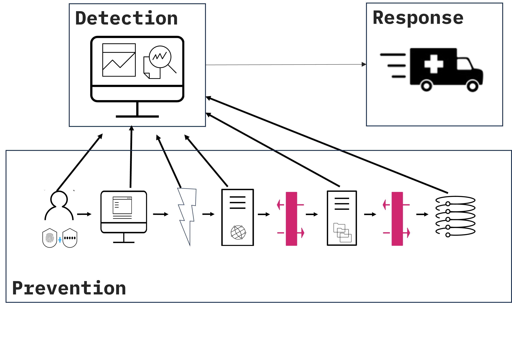
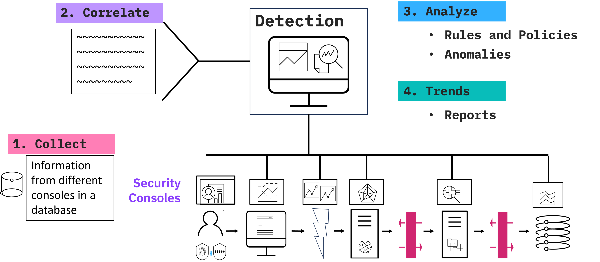
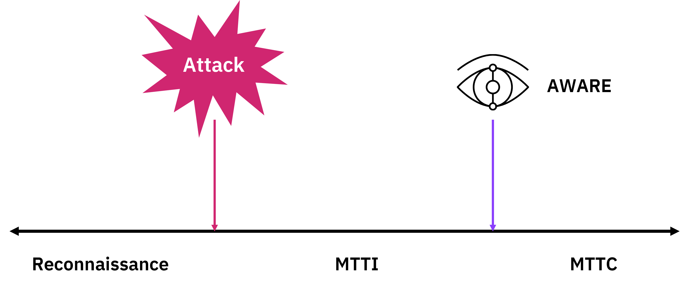
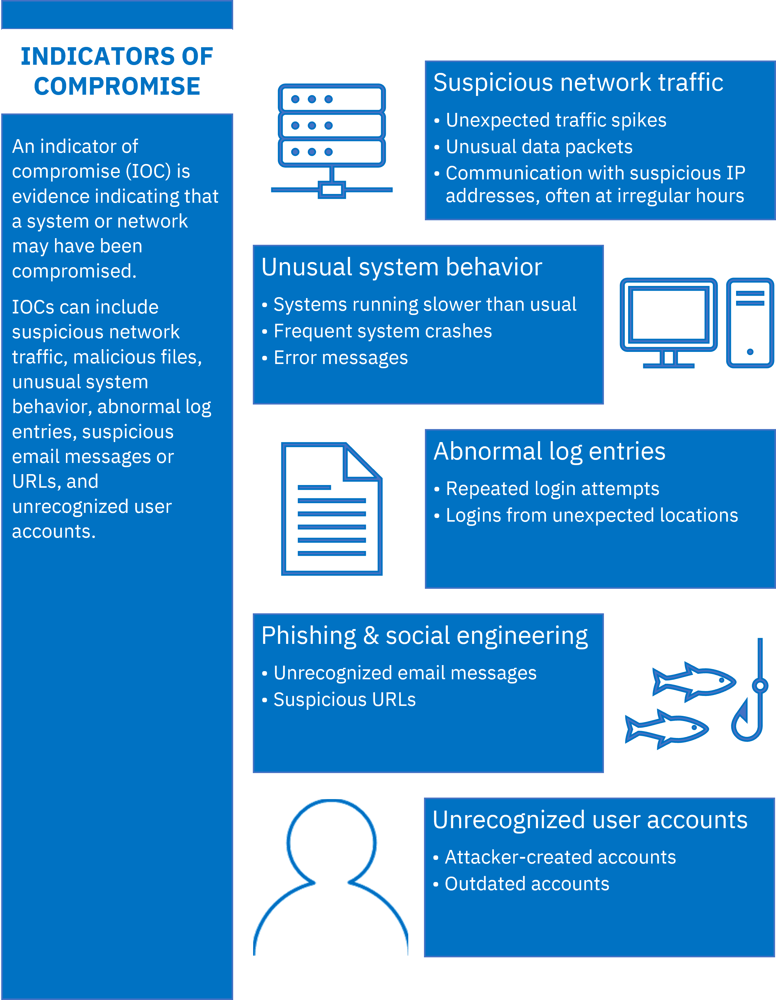
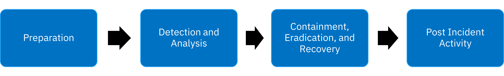
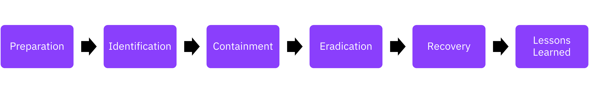

# ملخص الكشف عن التهديدات - Detection

## نظرة عامة
يتناول هذا المحتوى الكشف عن التهديدات كأحد الركائز الأساسية للأمن السيبراني، مع التركيز على أنظمة SIEM و XDR، وتقنيات الصيد الاستباقي للتهديدات، ومؤشرات الاختراق.

---

## المعادلة الأساسية للأمن السيبراني

### معادلة الأمن - Security Equation

```
S = P + D + R
Security = Prevention + Detection + Response
الأمن = الوقاية + الكشف + الاستجابة
```


### العلاقة مع ثالوث CIA

**ثالوث CIA يمثل "ماذا" - The What:**
- السرية **Confidentiality**
- النزاهة **Integrity**
- التوفر **Availability**
- كل ما نفعله في الأمن يهدف لتحقيق واحد أو أكثر من هذه

**معادلة الأمن تمثل "كيف" - The How:**
- كيف نحقق أهداف CIA؟
- من خلال الوقاية والكشف والاستجابة

### توزيع المجالات على المعادلة

**المجالات السابقة كانت في الأساس عن الوقاية - Prevention:**
- إدارة الهوية والوصول **Identity and Access Management (IAM)**
- أمن نقاط النهاية **Endpoint Security**
- أمن الشبكات **Network Security**
- أمن التطبيقات **Application Security**
- أمن البيانات **Data Security**

ليست 100% وقاية، لكن معظم الضوابط والتحكمات تهدف لمنع الهجمات والاختراقات.

**التركيز الحالي:**
- **D - Detection (الكشف)**: موضوع هذا الملخص
- **R - Response (الاستجابة)**: الفيديو التالي

---

## 1. مركز عمليات الأمن - Security Operations Center (SOC)

### الدور والمسؤوليات

المنظمة المسؤولة عن تنفيذ وظائف الكشف والاستجابة في المؤسسة.

**الوظائف الأساسية للـ SOC:**
- المراقبة المستمرة **Monitoring**
- التحليل **Analysis**
- إعداد التقارير **Reporting**
- الصيد الاستباقي للتهديدات **Threat Hunting**
- الاستجابة للحوادث **Incident Response**

**التقنيات الأساسية المستخدمة:**
- نظام إدارة المعلومات والأحداث الأمنية **SIEM (Security Information and Event Management)**
- نظام الكشف والاستجابة الموسع **XDR (Extended Detection and Response)**

---

## 2. نظام SIEM - Security Information and Event Management

### المشكلة التي يحلها SIEM

#### البيئة التقليدية - Traditional Environment

**الوضع الحالي (غير مثالي):**
```
IAM Console → IAM Analyst
Endpoint Console → Endpoint Analyst
Network Console → Network Analyst
Application Console → Application Analyst
Data Console → Data Analyst
```

**المشاكل الأساسية:**

1. **التكلفة العالية - High Cost:**
   - لوحات تحكم منفصلة لكل مجال **Multiple Consoles**
   - محللون متخصصون لكل مجال **Specialized Analysts**
   - معرفة متخصصة مطلوبة لكل مجال

2. **عدم وجود رؤية موحدة - No Single View:**
   - "اليد اليسرى لا تعرف ما تفعله اليد اليمنى"
   - لا يوجد منظور شامل لحالة الأمن

3. **عدم الكفاءة - Inefficiency:**
   - هجوم واحد = تنبيهات في أنظمة متعددة
   - عدة أشخاص يطاردون نفس المشكلة
   - جهود مكررة ومهدرة

### حل SIEM - The SIEM Solution

**المفهوم الأساسي:**
إنشاء طبقة موحدة فوق جميع الأنظمة لجمع وتحليل المعلومات الأمنية من جميع المجالات.

```
                    ┌─────── SIEM ───────┐
                    │   Single Console   │
                    │   Unified Analysis │
                    └──────────┬─────────┘
                               │
        ┌──────────┬───────────┼───────────┬──────────┐
        │          │           │           │          │
      IAM    Endpoint    Network    Application    Data
```


### مكونات ووظائف SIEM


#### 1. الجمع - Collection

**أنواع البيانات المجمعة:**

**السجلات - Logs:**
- سجلات أنظمة التشغيل
- سجلات قواعد البيانات
- سجلات التطبيقات
- سجلات الأجهزة الأمنية

**التنبيهات والأحداث - Alarms and Events:**
- تنبيهات الجدران النارية
- إنذارات IDS/IPS
- أحداث المصادقة
- محاولات الوصول الفاشلة

**بيانات التدفق - Flow Data:**
- حركة المرور عبر الشبكة **Network Traffic**
- أنماط الاتصال
- استخدام النطاق الترددي

**قاعدة البيانات المركزية:**
جميع هذه البيانات تُخزن في قاعدة بيانات كبيرة موحدة للتحليل.

#### 2. الارتباط - Correlation

**المشكلة:**
هجوم واحد قد يولد تنبيهات في 4-5 أنظمة مختلفة.

**الحل:**
```
قبل الارتباط: 4 تنبيهات منفصلة
بعد الارتباط: 1 حادثة موحدة
```

**الفوائد:**
- تقليل عدد التنبيهات إلى مجموعة أصغر قابلة للإدارة
- فهم أفضل لنطاق الهجوم
- تجنب التكرار في التحقيقات

#### 3. التحليل - Analysis

##### أ. التحليل القائم على القواعد - Rule-Based Analysis

**بناء القواعد المعقدة:**
```
IF (الحالة 1) AND (الحالة 2) AND (الحالة 3)
THEN (الإجراء)

مثال:
IF (حركة المرور من دولة X) 
   AND (محاولات تسجيل دخول متعددة فاشلة > 5)
   AND (الوقت خارج ساعات العمل)
THEN (توليد تنبيه ذو أولوية عالية + إسناد للمحلل الأول)
```

**مصادر القواعد:**
- قواعد جاهزة **Out-of-the-Box Rules**: يأتي SIEM الجيد بمكتبة قواعد كبيرة
- قواعد مخصصة **Custom Rules**: بناء قواعد خاصة بالمؤسسة
- ربط بسياسات الأمن **Policy-Based Rules**: قواعد تعكس سياسات المؤسسة

**تحديد الأولويات:**
- **عالية - High**: تهديدات حرجة تتطلب استجابة فورية
- **متوسطة - Medium**: مشاكل مهمة تحتاج تحقيق
- **منخفضة - Low**: أحداث للمراقبة

**طرق تحديد الأولوية:**
- يدوياً من خلال القواعد
- تلقائياً بناءً على مستوى ثقة النظام
- بناءً على حسابات ومعادلات النظام

##### ب. كشف الشذوذ - Anomaly Detection

**الفرق بين النهجين:**

| التحليل القائم على القواعد | كشف الشذوذ |
|---------------------------|------------|
| "هذا ما أبحث عنه" | "أخبرني عن أي شيء غريب" |
| حالات استخدام محددة | أنماط غير معروفة |
| مؤشرات اختراق معروفة | سلوك غير طبيعي |

**التقنيات المستخدمة:**

**الذكاء الاصطناعي - Artificial Intelligence (AI):**
- التعلم الآلي **Machine Learning (ML)** بشكل خاص
- القدرة على إيجاد أنماط لم نكن نبحث عنها
- التعلم من كميات ضخمة من البيانات

**تحليلات سلوك المستخدم - User Behavior Analytics (UBA):**

تقنية متخصصة تستخدم AI/ML للإجابة على أسئلة مثل:

```
السؤال 1: لماذا يفعل هذا المستخدم شيئاً مختلفاً عن أقرانه؟
مثال: قسم المحاسبة كلهم يصلون للملفات المالية، لكن واحد فقط يحاول الوصول لقاعدة بيانات الرواتب

السؤال 2: لماذا تحدث أشياء معينة في أوقات غير متوقعة؟
مثال: نقل كميات كبيرة من البيانات في الساعة 3 صباحاً

السؤال 3: ما هو السلوك الذي لا ينتمي؟
مثال: مستخدم عادة يحمل 50 ملف يومياً، فجأة يحمل 10,000 ملف
```

**أمثلة على الشذوذ:**
- سلوك مستخدم مختلف عن المجموعة **Peer Group Deviation**
- نشاط في أوقات غير عادية
- حجم غير طبيعي من النشاط
- أنماط وصول شاذة

#### 4. إعداد التقارير - Reporting

**الغرض:** توفير رؤية للإدارة والـ SOC لتقييم الأداء الأمني.

**الأسئلة التي تجيب عنها التقارير:**
- هل نحن أفضل هذا الشهر من الشهر الماضي؟
- هل نكتشف تنبيهات أكثر أم أقل؟
- هل نحل المشاكل بسرعة أكبر؟
- ما هي الاتجاهات العامة **Trends**؟

**أنواع التقارير:**
- تقارير أداء SOC
- تقارير الامتثال **Compliance Reports**
- تقارير الاتجاهات والأنماط
- تقارير المقاييس الأمنية **Security Metrics**

### فوائد SIEM الإجمالية

```
✓ تقليل البصمة التشغيلية
✓ نقطة واحدة للرؤية الشاملة
✓ جمع معلومات من جميع الأنظمة
✓ تحليل متقدم وذكي
✓ كفاءة أعلى وتكلفة أقل
```

---

## 3. نظام XDR - Extended Detection and Response

### أصل XDR - The Origin

**البداية: EDR (Endpoint Detection and Response):**
- تثبيت وكيل **Agent** على كل نقطة نهاية
- الكشف والاستجابة محلياً على الجهاز
- نهج "من أسفل لأعلى" **Bottom-Up Approach**

**التطور إلى XDR:**
- الحاجة لجمع معلومات من جميع أنظمة EDR
- رؤية شاملة لجميع نقاط النهاية
- إضافة قدرات متقدمة للبحث والتحليل

### المقارنة: SIEM vs XDR

#### الأصول والتطور

| الجانب | SIEM | XDR |
|--------|------|-----|
| الأصل | إدارة السجلات أو كشف شذوذ الشبكة | كشف واستجابة نقطة النهاية (EDR) |
| التوجه | من أسفل لأعلى **Bottom-Up** | من أعلى لأسفل **Top-Down** |
| الفلسفة | جمع كل شيء وتحليله مركزياً | دفع القدرات للأجهزة والبحث عند الحاجة |
| التركيز الأساسي | السجلات وحركة الشبكة | نقاط النهاية (خوادم، أجهزة مكتبية، لابتوبات) |

#### نهج معالجة البيانات

**SIEM - Bottom-Up:**
```
نقاط النهاية → جمع كل البيانات → قاعدة بيانات مركزية → تحليل → تنبيهات
```

**XDR - Top-Down:**
```
وكلاء على نقاط النهاية → كشف محلي → استجابة محلية → تقرير للمركز عند الحاجة
```

**الفلسفة الأساسية:**
- SIEM: "أحضر كل شيء إلى المركز"
- XDR: "نفذ ما تستطيع محلياً، أقرب ما يكون من مصدر الهجوم"

### البحث الموحد - Federated Search

**المفهوم الثوري:**
بدلاً من جمع كل البيانات مسبقاً، ابحث عنها عند الحاجة فقط.

**كيف يعمل:**

```
1. XDR يرسل استعلام للجميع:
   "هل لديك مؤشرات الاختراق X, Y, Z؟"

2. كل نظام يبحث في قاعدة بياناته المحلية

3. الأنظمة ترد فقط بالنتائج الإيجابية

4. XDR يجمع النتائج ويحلل
```

**تشبيه لعبة Go Fish:**
```
اللاعب: "هل لدى أحد أي ثلاثات؟"
الجميع يبحثون في أوراقهم
من لديه ثلاثات يسلمها
→ نفس الفكرة مع البحث الموحد
```

**المزايا:**
- لا حاجة لتخزين جميع البيانات مسبقاً **No Pre-Fetching**
- جلب البيانات في الوقت المناسب **Just-In-Time**
- تقليل متطلبات التخزين
- كفاءة أعلى في استخدام الموارد
- تكلفة أقل

### التكامل: SIEM + XDR

**ليس SIEM مقابل XDR، بل SIEM + XDR**

#### نقاط القوة لكل نظام

**SIEM يتميز في:**
- توليد تنبيهات عالية الجودة
- الارتباط عبر مجالات متعددة
- التحليل التاريخي
- التقارير الشاملة

**XDR يتميز في:**
- الاستجابة السريعة على نقاط النهاية
- البحث الموحد الفعال
- تجنب تكاليف تخزين البيانات الضخمة
- الأتمتة المحلية

#### كيف يكملان بعضهما؟

**سيناريو التكامل المثالي:**
```
1. SIEM يكتشف نمطاً مشبوهاً
   ↓
2. SIEM يولد تنبيه عالي الأولوية
   ↓
3. التنبيه يحفز XDR لبدء التحقيق
   ↓
4. XDR يستخدم البحث الموحد لجمع التفاصيل
   ↓
5. XDR ينفذ استجابة محلية على الأجهزة المتأثرة
   ↓
6. النتائج تُرسل لـ SIEM للتوثيق والتحليل
```

**التوصية:**
استخدام كلا النظامين معاً لاستجابة أمنية أقوى وأكثر فعالية.

---

## 4. الصيد الاستباقي للتهديدات - Threat Hunting

### المشكلة: الجدول الزمني للهجوم

#### مراحل الهجوم النموذجية

```
الاستطلاع → الهجوم → [MTTI] → الكشف → [MTTC] → الاحتواء
```



**1. الاستطلاع - Reconnaissance:**
- المهاجم يستكشف الموقع المستهدف
- "يفحص المكان" مثل لص يخطط للسرقة
- تحديد نقاط الضعف
- جمع المعلومات عن الشبكة والأنظمة

**2. متوسط الوقت للتعريف - Mean Time to Identify (MTTI):**
- الوقت من الهجوم الفعلي حتى اكتشافه
- حسب Ponemon Institute: **~200 يوم**
- مشكلة ضخمة: تخيل لصاً في منزلك لـ 200 يوم قبل أن تلاحظ!

**3. متوسط الوقت للاحتواء - Mean Time to Contain (MTTC):**
- الوقت من الاكتشاف حتى الإصلاح الكامل
- تقريباً **~70 يوم إضافي**

**الإجمالي المخيف:**
```
200 يوم (MTTI) + 70 يوم (MTTC) = 270 يوم
= أكثر من 9 أشهر من الهجوم حتى التعافي!
```

### الهدف من الصيد الاستباقي

**الهدف الأساسي:**
```
نقل نقطة الوعي للخلف ←←← أقرب لنقطة الهجوم الفعلية
```

**العالم المثالي مقابل الواقع:**
- **المثالي:** كشف الجرائم المستقبلية واعتقال المجرمين قبل أن يهاجموا
- **الواقع:** لا نعيش في ذلك العالم
- **الأفضل الممكن:** الاكتشاف المبكر قدر الإمكان بعد الهجوم

### التحقيق مقابل الصيد

#### التحقيق التقليدي - Traditional Investigation

**النهج:**
- تفاعلي **Reactive**
- ينتظر التنبيه من النظام
- "المجرم دخل، والآن نحقق"

**العملية:**
```
تنبيه النظام → رد الفعل → التحقيق الجنائي → اكتشاف ما حدث
```

**الأدوات:** SIEM و XDR في الوضع التقليدي

#### الصيد الاستباقي - Threat Hunting

**النهج:**
- استباقي **Proactive**
- لا ينتظر التنبيهات
- "سأبحث عن المشاكل قبل أن تخبرني الأنظمة"

**العملية:**
```
الخبرة + الحدس → فرضية → بحث نشط → كشف مبكر
```

### مكونات الصيد الناجح

#### 1. المحلل الماهر - Skilled Analyst

**المهارات المطلوبة:**
- خبرة واسعة في الأمن السيبراني
- رؤية لأنماط الهجمات السابقة
- حدس أمني قوي **Security Instinct**
- فهم عميق لسلوك المهاجمين

**الصفات:**
- رأى "كل شيء" (أو معظمه)
- يفكر مثل المهاجم
- يستطيع توقع التهديدات

#### 2. بناء الفرضية - Hypothesis Development

**أسئلة الصياد:**
- "أتساءل هل قام أحدهم بـ X؟"
- "ماذا سيستهدف المهاجمون؟"
- "كيف قد يهاجموننا؟"
- "ما الأشياء التي قد يفعلونها؟"

**مصادر الفرضيات:**
- الخبرة الشخصية والغريزة
- هجمات سابقة على منظمات مشابهة
- استخبارات التهديدات **Threat Intelligence**
- أنماط الاختراقات الحديثة
- نقاط الضعف المعروفة في البيئة

**أمثلة على فرضيات:**
```
الفرضية 1: "قد يحاول المهاجم استغلال ثغرة Log4J في خوادمنا"
الفرضية 2: "قد يكون هناك تسلل عبر بريد تصيد غير مكتشف"
الفرضية 3: "قد تكون هناك حركة مرور شاذة في الساعات المتأخرة"
```

#### 3. استخدام الأدوات - Tool Utilization

**الأدوات الأساسية:**
- SIEM للبحث في السجلات والأحداث التاريخية
- XDR للبحث الموحد عبر نقاط النهاية
- أدوات تحليل الشبكة
- قواعد بيانات مؤشرات الاختراق

**تقنيات البحث:**
- البحث عن مؤشرات اختراق محددة **IOCs**
- تحليل الأنماط الشاذة
- الارتباط بين أحداث متعددة
- البحث الاستباقي في السجلات

#### 4. النتيجة: الكشف المبكر - Early Detection

**عند النجاح:**
```
قبل الصيد: ─────────────Reconnaissance─────────────[200 days]────→ Discovery
بعد الصيد: ──Reconnaissance──[20 days]────→ Discovery

النتيجة: تقليل MTTI من 200 إلى 20 يوم!
```

**الفوائد:**
- تقليل وقت بقاء المهاجم **Dwell Time**
- تقليل الضرر المحتمل
- توفير التكاليف (تذكر: 1.12 مليون دولار لكل 70 يوم)
- استجابة أسرع وأكثر فعالية

---

## 5. مؤشرات الاختراق - Indicators of Compromise (IOCs)

مؤشرات الاختراق هي أدلة تشير إلى أن النظام أو الشبكة قد تكون مخترقة.



### أنواع مؤشرات الاختراق

#### 1. حركة مرور شبكية مشبوهة - Suspicious Network Traffic

**المؤشرات:**
- **ارتفاعات غير متوقعة في حركة المرور - Unexpected Traffic Spikes**
  - زيادة مفاجئة في استخدام النطاق الترددي
  - حركة مرور في أوقات غير عادية
  
- **حزم بيانات غير عادية - Unusual Data Packets**
  - حزم مشوهة أو غير قياسية
  - بروتوكولات غير معتادة
  
- **اتصال بعناوين IP مشبوهة**
  - خاصة في ساعات غير منتظمة
  - اتصالات بدول أو مناطق غير متوقعة
  - تواصل مع عناوين معروفة بأنها خبيثة

#### 2. سلوك نظام غير عادي - Unusual System Behavior

**المؤشرات:**
- **بطء الأنظمة - Systems Running Slower:**
  - أداء أقل من المعتاد بشكل ملحوظ
  - استهلاك عالٍ للموارد بدون سبب واضح

- **أعطال متكررة - Frequent System Crashes:**
  - إعادة تشغيل غير مبررة
  - تجمد البرامج

- **رسائل خطأ - Error Messages:**
  - رسائل خطأ غير مألوفة
  - أخطاء في خدمات حرجة

#### 3. مدخلات سجل غير طبيعية - Abnormal Log Entries

**المؤشرات:**
- **محاولات تسجيل دخول متكررة - Repeated Login Attempts:**
  - هجمات القوة الغاشمة **Brute Force**
  - محاولات فاشلة متعددة من نفس المصدر

- **تسجيلات دخول من مواقع غير متوقعة:**
  - دول مختلفة عن موقع المستخدم المعتاد
  - عناوين IP غير معروفة
  - أوقات غير طبيعية

#### 4. التصيد والهندسة الاجتماعية - Phishing & Social Engineering

**المؤشرات:**
- **رسائل بريد إلكتروني غير معروفة - Unrecognized Email Messages:**
  - مرسلون مشبوهون
  - محتوى غير متوقع
  - طلبات عاجلة للمعلومات الحساسة

- **روابط مشبوهة - Suspicious URLs:**
  - نطاقات مشابهة للشرعية **Typosquatting**
  - روابط مختصرة مجهولة
  - طلبات بيانات اعتماد

#### 5. حسابات مستخدمين غير معروفة - Unrecognized User Accounts

**المؤشرات:**
- **حسابات أنشأها المهاجم - Attacker-Created Accounts:**
  - حسابات إدارية جديدة غير مصرح بها
  - حسابات بأسماء عامة أو عشوائية

- **حسابات قديمة نشطة فجأة - Outdated Accounts:**
  - حسابات موظفين سابقين نشطة
  - حسابات غير مستخدمة لفترة طويلة تظهر نشاط

---

## 6. استخبارات التهديدات - Threat Intelligence

### التعريف والأهمية

استخبارات التهديدات هي جمع وتحليل المعلومات حول الهجمات المحتملة التي قد تهدد المنظمة.

**المكونات:**
- أساليب المهاجمين **Methods**
- تكتيكات واستراتيجيات **Tactics and Strategies**
- أنماط محددة **Identified Patterns**
- مؤشرات الاختراق **IOCs**

**الهدف:**
الدفاع الاستباقي ضد التهديدات وتعزيز الوضع الأمني للمنظمة.

### أنواع استخبارات التهديدات

#### 1. الاستخبارات السلوكية - Behavioral Threat Intelligence

**التركيز:**
- فهم أنماط المهاجمين
- منهجيات الهجوم
- التكتيكات المستخدمة

**النهج:**
استباقي - توقع الهجمات بناءً على تحليل السلوك

**الاستخدام:**
- كشف الشذوذ في سلوك الشبكة
- تطوير استراتيجيات مضادة
- تحديد الانحرافات التي قد تشير لتهديد

#### 2. الاستخبارات السمعية - Reputational Threat Intelligence

**التركيز:**
- تتبع سمعة عناوين IP
- تتبع سمعة النطاقات **Domains**
- تتبع سمعة URLs

**المعايير:**
- السلوكيات والإجراءات السابقة
- التاريخ الأمني للكيانات
- تقييم المخاطر بناءً على السجل

**الهدف:**
تجنب التفاعل مع نطاقات أو عناوين IP خبيثة.

#### 3. بيانات التهديدات - Threat Data

**الطبيعة:**
- معلومات خام غير معالجة
- ليست قابلة للتنفيذ مباشرة

**المصادر:**
- السجلات **Logs**
- التنبيهات **Alerts**
- التقاط الحزم **Packet Captures**

**الأهمية:**
- أساس لأشكال أخرى من الاستخبارات
- ضرورية للتحليل العميق
- توليد استخبارات قابلة للتنفيذ

### مصادر استخبارات التهديدات

#### 1. التغذيات مفتوحة المصدر - Open-Source Threat Feeds

**الوصف:**
مصادر عامة متاحة لأي شخص لديه اتصال بالإنترنت.

**أمثلة:**
- **ThreatConnect**: منصة استخبارات التهديدات
- **AlienVault OTX**: تبادل التهديدات المفتوح
- **حسابات تويتر:** مثل @malwrhunterteam
- **مدونات الأمن:** Krebs on Security, Dark Reading

**المزايا:**
- مجانية ومتاحة
- تغطية واسعة
- مجتمع نشط

**التحديات:**
- تتطلب مراقبة دقيقة
- فصل البيانات الصالحة عن الضجيج
- قد تكون غير منظمة

#### 2. التغذيات الخاصة - Proprietary Threat Feeds

**الوصف:**
مملوكة وتديرها شركات خاصة، عادة شركات الأمن السيبراني.

**أمثلة:**
- **Symantec DeepSight Intelligence**
- **IBM X-Force Exchange**
- **CrowdStrike Falcon X Threat Intelligence**

**المزايا:**
- معلومات شاملة ومفصلة
- مستمدة من شبكات وعملاء واسعين
- رؤى قابلة للتنفيذ
- دعم وتحديثات منتظمة

**العيوب:**
- تتطلب اشتراك مدفوع
- قد تكون مكلفة

#### 3. الويب العميق والمظلم - Deep and Dark Web

**الوصف:**
مناطق من الإنترنت لا تفهرسها محركات البحث التقليدية.

**الأنشطة:**
- تواصل المهاجمين
- تخطيط الهجمات
- تداول الأدوات والاستغلالات

**أمثلة:**
- **Silk Road** (متوقف الآن)
- **AlphaBay**
- منتديات مخفية على شبكة Tor

**القيمة:**
- تحذير مبكر من الهجمات المخططة
- كشف أساليب وأدوات هجوم جديدة

**التحديات:**
- تتطلب أدوات متخصصة
- تحتاج خبرة خاصة
- مخاطر قانونية وأخلاقية

#### 4. التقارير الصناعية والنشرات - Industry Reports and Bulletins

**الوصف:**
وثائق من كيانات الأمن السيبراني ومنظمات البحث.

**أمثلة:**
- **IBM X-Force Threat Intelligence Index**
- **Verizon Data Breach Investigations Report (DBIR)**
- **نشرات US-CERT**

**المحتوى:**
- اتجاهات التهديدات الحالية
- ثغرات جديدة
- هجمات سيبرانية حديثة

**الفائدة:**
رؤى قيمة حول المشهد العالمي للأمن السيبراني.

#### 5. الهيئات الحكومية والتنظيمية - Government and Regulatory Bodies

**الوصف:**
وكالات الأمن السيبراني الوطنية والهيئات التنظيمية الدولية.

**أمثلة:**
- **CISA (Cybersecurity and Infrastructure Security Agency)**: تنبيهات أمريكية
- **FBI Cybercrime Reports**: تقارير الجرائم السيبرانية
- **NCSC UK**: مركز الأمن السيبراني الوطني البريطاني
- **ENISA**: وكالة الاتحاد الأوروبي للأمن السيبراني

**القيمة:**
- تحديد التهديدات المدعومة من الدول **State-Sponsored Threats**
- أنشطة الجريمة السيبرانية واسعة النطاق
- تنبيهات رسمية وموثوقة

#### 6. فرق الاستجابة للحوادث - Incident Response (IR) Teams

**الوصف:**
الفرق الداخلية أو الخارجية التي تستجيب للحوادث السيبرانية.

**الاستخبارات:**
- تفاصيل منهجية هجوم الفدية
- عناوين IP المستخدمة في حملات التصيد
- توقيعات فريدة للبرمجيات الخبيثة الجديدة

**المزايا:**
- استخبارات من الخطوط الأمامية
- فهم مباشر لأساليب المهاجمين
- رؤى فريدة من التفاعلات الحقيقية

#### 7. أنظمة الفخاخ وتقنيات الخداع - Honeypots and Deception Technology

**الوصف:**
أنظمة أو شبكات وهمية مصممة لجذب المهاجمين.

**الآلية:**
- جذب وإشراك المهاجمين
- مراقبة أنشطتهم
- تحليل تكتيكاتهم وتقنياتهم وإجراءاتهم **TTPs**

**الاستخبارات المكتسبة:**
- اكتشاف متغيرات برمجيات خبيثة جديدة
- تحديد أنماط سلوك المهاجمين
- الكشف عن ناقلات أو تقنيات هجوم غير معروفة سابقاً

**القيمة:**
- بيئة آمنة لدراسة المهاجمين
- معلومات قيمة دون تعريض الأنظمة الحقيقية للخطر

---

## المفاهيم الرئيسية المستفادة

### المعادلة الأساسية
```
الأمن = الوقاية + الكشف + الاستجابة
Security = Prevention + Detection + Response
```
كلها ضرورية، لا يمكن الاعتماد على واحدة فقط.

### دور SOC الحاسم
مركز عمليات الأمن هو القلب النابض للكشف والاستجابة - يجمع كل الخيوط معاً.

### التكامل أفضل من المنافسة
SIEM + XDR = استجابة أمنية أقوى. ليس "أو" بل "و".

### الاستباقية تتفوق على التفاعل
```
الصيد الاستباقي (20 يوم للكشف) >> التحقيق التفاعلي (200 يوم للكشف)
```

### الذكاء الاصطناعي محوري
AI/ML ضروريان لكشف الشذوذ والأنماط التي لا يمكن للبشر رؤيتها.

### استخبارات التهديدات أساسية
معرفة عدوك = نصف المعركة. استخدام مصادر متعددة للحصول على صورة كاملة.

### الوقت هو العدو
كل يوم إضافي = تكلفة إضافية + ضرر أكبر. السرعة في الكشف حرجة.

### المؤشرات المتعددة
مؤشر واحد قد يكون خطأ إيجابياً، لكن عدة مؤشرات معاً = احتمالية عالية للاختراق.

# ملخص الاستجابة للحوادث - Incident Response

## نظرة عامة
يتناول هذا المحتوى الاستجابة للحوادث الأمنية كالركيزة الثالثة في معادلة الأمن السيبراني، مع التركيز على تقنيات SOAR، إطارات عمل الاستجابة، وإدارة الحالات والتحقيقات.

---

## تذكير بالمعادلة الأساسية

```
S = P + D + R
Security = Prevention + Detection + Response
الأمن = الوقاية + الكشف + الاستجابة
```

**ما تم تغطيته سابقاً:**
- **P - Prevention (الوقاية)**: المجالات الخمسة (IAM، Endpoint، Network، Application، Data)
- **D - Detection (الكشف)**: SIEM، XDR، الصيد الاستباقي

**التركيز الحالي:**
- **R - Response (الاستجابة)**: كيف نتعامل بعد اكتشاف الهجوم؟

---

## 1. الجدول الزمني للهجوم والاستجابة - Attack Timeline


### المراحل الأساسية

```
الاستطلاع → الهجوم → [MTTI ≈ 200 يوم] → الكشف → [MTTC ≈ 70 يوم] → الاحتواء والتعافي
```

#### 1. الاستطلاع - Reconnaissance
- المهاجم "يفحص المكان"
- تحديد نقاط الضعف والثغرات
- جمع المعلومات عن الأهداف

#### 2. متوسط الوقت للتعريف - Mean Time to Identify (MTTI)
**المشكلة الكبرى:**
- حسب Ponemon Institute: **تقريباً 200 يوم**
- المهاجم في "منزلك" 200 يوم قبل أن تلاحظ
- الفترة بين الهجوم الفعلي والوعي به

#### 3. متوسط الوقت للاحتواء - Mean Time to Contain (MTTC)
**التحدي الثاني:**
- تقريباً **70 يوم إضافي**
- من الوعي بالهجوم حتى السيطرة الكاملة
- إخراج المهاجمين واستعادة العمليات

**الإجمالي المقلق:**
```
200 + 70 = 270 يوم
= 9 أشهر تقريباً من البداية للنهاية
```

### الملاحظة الحرجة

رغم توفر أدوات أكثر وفهم أعمق على مر السنين، هذه الأرقام تبقى ثابتة تقريباً - الصناعة لم تنجح في تقليلها بشكل كبير.

**هدف الاستجابة:**
تقليص الـ 70 يوم (MTTC) إلى أقل عدد ممكن من الأيام.

---

## 2. مركز عمليات الأمن والاستجابة - SOC and Response

### دور SOC في الاستجابة

**المسؤوليات الأساسية:**
- المراقبة عبر جميع المجالات
- الكشف عن السلوك الشاذ والتنبيهات
- ربط الأحداث **Correlation**
- **الاستجابة - Response**: التركيز الأساسي

### العامل الحاسم

**حسب استطلاع تكلفة اختراق البيانات:**
وجود قدرة استجابة حوادث جيدة = تقليل كبير في تكلفة الاختراق.

---

## 3. النهج التقليدي: الاستجابة للحوادث - Traditional Incident Response (IR)

### المفهوم الأساسي

**المصطلح التقليدي:**
الهجوم = حادثة **Incident**
التعامل معه = استجابة للحوادث **Incident Response (IR)**


### الخصائص

#### عملية يدوية في الأساس - Largely Manual Process

**الاعتماد على:**
- الأبطال والخبراء **Heroes and Experts**
- المعرفة في رؤوس الأفراد
- الحدس والإحساس بما يجب فعله **Gut Feel**

**المشاكل:**
- لا تتوسع جيداً **Doesn't Scale**
- غير قابلة للتكرار بشكل موثوق **Not Repeatable**
- تعتمد على توفر الخبير المناسب

### المهام الأساسية

#### 1. الفرز - Triage

**الأسئلة الحرجة:**
```
هل هذا هجوم حقيقي أم مجرد ضجيج؟
↓
إذا كان حقيقياً، هل هو كبير أم صغير؟
↓
ما هو ترتيب الأولوية؟
```

**المفهوم:**
- مستعار من الرعاية الصحية
- "أي المرضى نعالج أولاً؟"
- لا يوجد وقت كافٍ للاستجابة لكل شيء بنفس السرعة
- تحديد الأولويات أمر حاسم

#### 2. المعالجة - Remediation

**الإجراءات:**
- إصلاح المشكلة
- حجب الهجوم **Block**
- إيقاف الأنظمة **Shut Down**
- تطبيق تصحيحات البرمجيات **Apply Patches**
- وضع ضوابط لإيقاف تسريب البيانات
- استعادة تشغيل الأنظمة

---

## 4. النهج الحديث: SOAR - Modern Approach

### التعريف والمفهوم

**SOAR اختصار لـ:**
```
Security Orchestration, Automation and Response
تنسيق الأمن والأتمتة والاستجابة
```

### الفلسفة الأساسية

**المقارنة:**

| النهج التقليدي (IR) | النهج الحديث (SOAR) |
|-------------------|-------------------|
| يدوي بشكل كبير | آلي قدر الإمكان |
| يعتمد على الخبراء | يرشد المحللين |
| بطيء وغير متسق | سريع ومتسق |
| صعب التوسع | قابل للتوسع |

**الهدف الأساسي:**
تقليل MTTC من خلال الأتمتة والتنسيق.

---

## 5. إدارة الحالات والتحقيقات - Case Management and Investigations

### دورة حياة الحالة - Case Lifecycle


#### المرحلة 1: اكتشاف الهجوم وإنشاء الحالة

```
الهجوم → توليد تنبيه/حدث → SIEM/XDR → إنشاء حالة تلقائياً في SOAR
```

**الأنظمة المشاركة:**
- **SIEM**: نظام إدارة المعلومات والأحداث الأمنية
- **XDR**: نظام الكشف والاستجابة الموسع
- **SOAR**: نظام التنسيق والأتمتة والاستجابة

**العلاقة:**
- SIEM يمكن أن يغذي XDR أو يعمل منفصلاً
- أي من النظامين يمكنه فتح حالة في SOAR تلقائياً

#### المرحلة 2: إثراء الحالة - Case Enrichment

**المعلومات المضافة تلقائياً:**
- **القطع الأثرية - Artifacts**: أدلة من الهجوم
- **مؤشرات الاختراق - Indicators of Compromise (IOCs)**: توقيعات التهديد
- **معلومات مفيدة - Useful Information**: سياق الحادثة

**الفائدة:**
المحلل لا يبدأ من الصفر - لديه نقطة بداية قوية.

#### المرحلة 3: الإسناد - Assignment

**العملية:**
```
الحالة الجديدة → إسناد تلقائي/يدوي → محلل أمن سيبراني محدد
```

**إمكانيات إدارة الحالات:**
- تعديل الحالات **Modify Cases**
- إسناد وإعادة إسناد **Assign/Reassign**
- تتبع الحالات **Track Cases**
- لوحة معلومات **Dashboard** توضح:
  - الحالات المفتوحة **Open Cases**
  - الأولويات العالية **High Priority**
  - من يحقق في ماذا **Who's Investigating What**

#### المرحلة 4: التحقيق - Investigation

**التحدي:**
كيف يعرف المحلل ماذا يفعل؟ هل يخمن؟ يتجول عشوائياً؟

**الحل: كتيب اللعب الديناميكي - Dynamic Playbook**

---

## 6. كتيب اللعب الديناميكي - Dynamic Playbook

### المفهوم الأساسي

**التعريف:**
دليل مسبق الإعداد يوجه المحلل خطوة بخطوة بناءً على نتائج كل خطوة.

### كيف يعمل؟

**الهيكل:**
```
عند رؤية X
   ↓
شغّل هذا الإجراء
   ↓
بناءً على النتيجة:
   ├─ إذا النتيجة A → اتبع الخطوات 1, 2, 3
   └─ إذا النتيجة B → اتبع الخطوات 4, 5, 6
        ↓
   استمر بناءً على النتائج الجديدة
```

### ديناميكي مقابل ثابت

**إجراء تشغيل قياسي ثابت - Static SOP:**
```
الخطوة 1 → الخطوة 2 → الخطوة 3 → ... → الخطوة 10
(نفس الترتيب دائماً)
```

**كتيب لعب ديناميكي - Dynamic Playbook:**
```
الخطوة 1 → [تقييم] → الخطوة 2A أو 2B
                         ↓
                    [تقييم جديد]
                         ↓
                 مسار مختلف حسب النتائج
```

### المزايا

#### 1. الاتساق والقابلية للتكرار
- نفس الأسلوب في كل مرة **Consistent Approach**
- ليس عشوائياً أو يعتمد على الحظ
- موثوق ومتوقع

#### 2. تمكين المحللين الجدد
- لا حاجة لخبرة عميقة في كل شيء
- الكتيب يوجه نشاطاتهم
- تقليل منحنى التعلم

#### 3. المرونة
- التكيف مع السيناريوهات المختلفة
- ليس "مقاس واحد يناسب الجميع"
- استجابة ذكية بناءً على السياق

### المكونات

**أنواع الإجراءات:**
- **سكريبتات - Scripts**: أكواد تنفذ تلقائياً
- **إجراءات - Procedures**: خطوات يتبعها المحلل
- **استعلامات - Queries**: بحث في الأنظمة
- **تحليلات - Analytics**: تقييم النتائج

### النتائج النهائية

**ما يحققه الكتيب:**
- تحديد مصدر المشكلة **Identify Source**
- توضيح خطوات المعالجة **Remediation Steps**
- توجيه للأنظمة المتأثرة

**الإجراءات الممكنة:**
- إيقاف تسريب البيانات "وقف النزيف"
- إعادة تشغيل الأنظمة المتوقفة
- حماية الأنظمة المستردة
- تطبيق الإصلاحات الضرورية

---

## 7. الأتمتة مقابل التنسيق - Automation vs Orchestration

### الطيف الكامل

```
يدوي بالكامل ←──────────────────────→ آلي بالكامل
   Manual                            Automated
       ↑                                  ↑
       └──── Orchestration (وسط) ─────────┘
```

### الأتمتة الكاملة - Full Automation

**المفهوم:**
العملية تعمل بالكامل دون تدخل بشري.

**متى ممكنة؟**
- عندما رأينا المشكلة من قبل
- عندما نعرف الحل بالضبط
- للأحداث المتكررة والمعروفة

**المثالي:**
أتمتة كل شيء ممكن.

### المشكلة: أحداث البجعة السوداء والأولى من نوعها

#### أحداث البجعة السوداء - Black Swan Events

**المفهوم:**
- البجع عادة أبيض، أحياناً أسود
- ليس مستحيلاً، لكنه نادر وغير متوقع

**في الأمن السيبراني:**
- هجمات غير متوقعة
- تقنيات جديدة
- أنماط غير معروفة سابقاً

#### أحداث أولى من نوعها - First of a Kind (FOAK) Events

**التعريف:**
أحداث لم نرها أبداً من قبل.

**المشكلة الأساسية:**
```
لا يمكن أتمتة ما لم نره من قبل
↓
لا نعرف كيف نكتب سكريبت للتعامل معه
↓
يجب التعامل يدوياً أولاً
```

### التنسيق - Orchestration

**التعريف:**
شبه آلي - Semi-Automated

**المفهوم:**
```
إنسان يوجه + أتمتة جزئية = تنسيق
```

**تشبيه قائد الأوركسترا - Orchestra Conductor:**
```
قائد الأوركسترا لا يعزف بنفسه
   ↓
بل يوجه متى تدخل الكمانات
   ↓
ومتى تخرج الطبول
   ↓
ينسق الأداء الجماعي
```

**في الأمن السيبراني:**
- محلل يوجه النظام
- "اضغط هذا الزر → تنفيذ هذه الإجراءات"
- "اضغط هذا الزر → تنفيذ تلك الإجراءات"
- توجيه بشري + تنفيذ آلي

### الاستراتيجية المثلى

**القاعدة الذهبية:**
```
أتمت ما تستطيع
   ↓
نسّق ما لا يمكن أتمتته بالكامل
   ↓
يدوي فقط للحالات الاستثنائية جداً
```

**هدف SOAR:**
تحريك كل شيء ممكن نحو الأتمتة، مع التنسيق كخطوة وسطية.

---

## 8. إشعار الاختراق - Breach Notification

### المتطلبات القانونية

عندما تُخترق بيانات حساسة للأفراد، قد تكون هناك مسؤولية قانونية للإشعار.

### العوامل الحاسمة

#### 1. نوع البيانات المتأثرة - Data Types

**أمثلة على البيانات الحساسة:**
- الأسماء **Names**
- أرقام الضمان الاجتماعي **Social Security Numbers** (في الولايات المتحدة)
- أرقام هوية أخرى **Other ID Numbers**
- أرقام بطاقات الائتمان **Credit Card Numbers**
- معلومات صحية **Health Information**
- معلومات مالية **Financial Information**

#### 2. الجغرافيا - Geography

**الأسئلة المطلوبة:**
- في أي دولة يقيم الأشخاص المتأثرون؟
- في أي ولاية/منطقة؟ (داخل الدولة)

**السبب:**
قوانين الإشعار تختلف حسب:
- الدولة **Country**
- المنطقة/الولاية **Region/State**

### اللوائح التنظيمية الرئيسية

#### اللائحة العامة لحماية البيانات - GDPR (General Data Protection Regulation)

**النطاق:**
الاتحاد الأوروبي، لكنها عالمية التأثير

**المتطلبات:**
- إشعار في وقت محدد **Timely Notification**
- الإبلاغ عن الاختراقات خلال 72 ساعة في معظم الحالات

**العقوبات الضخمة:**
```
الأكبر من:
├─ 4% من الإيرادات العالمية السنوية
└─ 20 مليون يورو
```

**مثال توضيحي:**
```
شركة إيراداتها: 1 مليار دولار
غرامة GDPR المحتملة: 40 مليون دولار (4%)

شركة إيراداتها: 300 مليون دولار
غرامة GDPR: 20 مليون يورو (الحد الأدنى)
```

**التحذير المهم:**
```
"لكنني لست في الاتحاد الأوروبي!"
   ↓
إذا كان لديك بيانات مواطنين أوروبيين
   ↓
قد تخضع لقواعد وعقوبات الاتحاد الأوروبي
   ↓
سؤال المقاضاة مختلف عن سؤال الانطباق
```

#### القوانين الأمريكية - US Regulations

**التعقيد:**
- كل ولاية لها قوانينها الخاصة
- قواعد مختلفة
- لوائح متنوعة
- فيدرالية معقدة

**أمثلة:**
- **CCPA (California Consumer Privacy Act)**: كاليفورنيا
- **HIPAA (Health Insurance Portability and Accountability Act)**: بيانات صحية
- قوانين خاصة بكل ولاية

### التحدي: التعقيد

**المشكلة:**
```
عدد كبير من اللوائح المختلفة
   ↓
متطلبات متباينة
   ↓
صعوبة ضمان الامتثال لجميعها
```

### الحل: الأدوات الذكية

**الوظيفة المطلوبة:**
```
إدخال:
├─ نوع البيانات المخترقة
├─ الجغرافيا المتأثرة
└─ تفاصيل الحادثة

معالجة:
└─ تحليل اللوائح المنطبقة

إخراج:
├─ من يجب إشعاره بالضبط
├─ متى يجب الإشعار
├─ كيف يجب الإشعار
└─ نماذج الإشعار المطلوبة
```

**الفائدة:**
تجنب الغرامات الباهظة من خلال الامتثال الصحيح والسريع.

---

## 9. أطر عمل الاستجابة للحوادث - Incident Response Frameworks

### أهمية الإطار

**لماذا نحتاج إطاراً؟**
- نهج منظم ومنهجي
- ضمان عدم تفويت خطوات
- قابلية التكرار والاتساق
- تقليل الأخطاء تحت الضغط

**القاعدة الذهبية:**
المهم هو اعتماد أي إطار، وليس أي إطار بالتحديد.

### إطار NIST - NIST Incident Response Framework

**NIST: National Institute of Standards and Technology**

#### المراحل الأربعة



```
1. الإعداد → 2. الكشف والتحليل → 3. الاحتواء والإزالة والاستعادة → 4. أنشطة ما بعد الحادثة
```

#### 1. الإعداد - Preparation

**الأنشطة:**
- بناء بنية تحتية أمنية قوية
- تدريب الموظفين على بروتوكولات الاستجابة
- إنشاء فريق استجابة للحوادث
- تطوير خطط وإجراءات
- تجهيز الأدوات والموارد

**الهدف:**
الاستعداد قبل وقوع الحادثة.

#### 2. الكشف والتحليل - Detection and Analysis

**الأنشطة:**
- كشف الأنماط المشبوهة
- تحليل التنبيهات
- فحص السجلات **Log Analysis**
- تحديد البرمجيات الخبيثة
- تقييم نطاق الاختراق

**الهدف:**
فهم ما يحدث بالضبط.

#### 3. الاحتواء والإزالة والاستعادة - Containment, Eradication, and Recovery

**الاحتواء - Containment:**
- عزل الخوادم/الأنظمة المتأثرة
- وقف نقل البيانات غير المصرح
- منع انتشار التهديد

**الإزالة - Eradication:**
- إزالة البرمجيات الخبيثة
- حذف الحسابات الخبيثة
- إصلاح الثغرات المستغلة

**الاستعادة - Recovery:**
- استعادة البيانات من النسخ الاحتياطية
- إعادة دمج الأنظمة في الشبكة
- التأكد من تحييد جميع التهديدات

#### 4. أنشطة ما بعد الحادثة - Post-Incident Activity

**الأنشطة:**
- تحقيق شامل
- تحديد مصدر الاختراق
- الدروس المستفادة **Lessons Learned**
- تحديث تدريب الموظفين
- تحسين التدابير الأمنية
- تدقيق أمني شامل للنظام

**الهدف:**
منع حوادث مماثلة في المستقبل.

### إطار SANS - SANS Incident Response Framework

**SANS: SysAdmin, Audit, Network, and Security**

#### المراحل الستة

```
1. الإعداد → 2. التحديد → 3. الاحتواء → 4. الإزالة → 5. الاستعادة → 6. الدروس المستفادة
```



#### 1. الإعداد - Preparation

**الأنشطة:**
- إنشاء فريق استجابة بأدوار واضحة
- إعداد أنظمة التسجيل والمراقبة
- تطوير إجراءات الاستجابة
- تدريب الفريق

#### 2. التحديد - Identification

**الأنشطة:**
- اكتشاف الحادثة (مثل توقف الموقع فجأة)
- التحقيق الأولي
- تحديد نوع الهجوم (مثل DDoS)
- جمع الأدلة الأولية

#### 3. الاحتواء - Containment

**الأنشطة:**
- تنفيذ استراتيجية التخفيف (مثل إعادة توجيه حركة المرور)
- عزل الخادم المتأثر مؤقتاً
- منع المزيد من الضرر

#### 4. الإزالة - Eradication

**الأنشطة:**
- حذف السبب الجذري للهجوم
- حظر عناوين IP المهاجمة
- تصحيح الثغرات المستغلة
- تنظيف الأنظمة المتأثرة

#### 5. الاستعادة - Recovery

**الأنشطة:**
- إعادة الخادم المتأثر للعمل
- مراجعة شاملة للوظائف
- التأكد من الأمان قبل العودة للعمليات
- استئناف الخدمات العادية

#### 6. الدروس المستفادة - Lessons Learned

**الأنشطة:**
- تحليل شامل للحادثة
- فهم كيف حدث الهجوم
- استخدام الرؤى لتحسين الأمن
- تدريب إضافي للموظفين
- تطوير استراتيجيات محسنة

### المقارنة: NIST vs SANS

| الجانب | NIST | SANS |
|--------|------|------|
| عدد المراحل | 4 | 6 |
| التفصيل | مراحل مدمجة أكثر | مراحل منفصلة أكثر |
| الشهرة | معيار حكومي أمريكي | شائع في القطاع الخاص |
| المرونة | عام وقابل للتكيف | أكثر تفصيلاً ووضوحاً |

**القاسم المشترك:**
كلاهما يتضمن خطوات مماثلة بترتيب منطقي.

---

## 10. دراسة حالة: مطار دولي كبير - Airport Case Study

### السياق

**الهدف:**
مطار دولي كبير - بنية تحتية حرجة

**الشبكة:**
- شبكة معزولة عن الوصول الخارجي **Air-Gapped Network**
- تدير العمليات الداخلية: اللوجستيات، الأمن، وغيرها
- تربط بين أجهزة بمستويات أمان عالية ومنخفضة

### الاختراق - Compromise

**الاكتشاف:**
عدة أجهزة مخترقة ببرمجيات خبيثة مصممة لالتقاط البيانات وتخزينها محلياً.

**التحديات الأمنية:**
- لا يمكن إيقاف التشغيل (بنية تحتية حرجة)
- الشبكة تفتقر لحماية شاملة
- لا شفافية حول الأنشطة داخل الشبكة
- الربط بين أجهزة عالية ومنخفضة الأمان

### الاكتشاف - Discovery

**الأداة المستخدمة:**
IBM QRadar EDR Platform

**الشذوذ المكتشف:**
- تطبيق خبيث يثبت keylogger في الذاكرة

**In-Memory Keylogger**
- خيط يفحص القرص عن ملفات حساسة
- البرمجية الخبيثة معقدة:
  - آليات لتجاوز مكافح الفيروسات المحلي
  - تجاوز تحليل Sandbox
  
**ناقلات العدوى - Infection Vectors:**
```
الناقل 1: كشك عام (Public Kiosk)
الناقل 2: جهاز في شبكة إدارة تسجيل الوصول
   ↓
كلاهما يحمل نفس البرمجية الخبيثة
   ↓
محاولة الاتصال بنفس خادم C2
```

### التحليل والاستجابة - Response

**قدرات QRadar EDR:**
- إعادة بناء الهجوم حتى بعد النشر بعد الاختراق **Post-Breach Deployment**
- تحليل جدول زمني تفصيلي

**النتائج:**
- العدوى حدثت قبل 5 أشهر
- مصدران منفصلان: محركي USB
- الانتشار عبر نقاط النهاية بسبب كلمات مرور ضعيفة
- جمع معلومات مستمر
- عدم الاتصال بخادم C2 بسبب عزل الشبكة ✓

**قدرات البرمجية الخبيثة:**
- التكاثر الذاتي **Self-Replication**
- نسخ المحتوى لمحرك USB خارجي (معطل)
- مصممة للاستخراج اليدوي **Manual Exfiltration**
  - المهاجمون كانوا ينوون بدء العملية يدوياً
  - عزل الشبكة منع هذا ✓

### الإجراءات المتخذة

**المعالجة الفورية:**
- استخدام وحدة المعالجة في QRadar EDR
- تنظيف الأجهزة المصابة
- حذف مجلدات التخزين

**التحقق:**
- واجهة الصيد الاستباقي للتأكد من غياب ناقل البرمجية الخبيثة من البنية التحتية بالكامل

**التحسينات الأمنية:**
- قواعد تحكم أكثر صرامة في حركة المرور الداخلية
- فصل الشبكة العامة عن شبكة العمليات **Segregation**
- مراقبة مستمرة لنقاط النهاية **Continuous Monitoring**
- حملات صيد تهديدات منتظمة **Regular Threat-Hunting**

### الدروس المستفادة

**الحقيقة القاسية:**
```
حتى مع تدابير أمان قوية مثل الفجوة الهوائية (Air Gap)
   ↓
يمكن أن توجد ثغرات إذا لم تُطبق بصرامة
```

**الأسئلة المفتوحة:**
- دوافع المهاجمين غير واضحة
- جمعوا البيانات لكن لم يستخرجوها أبداً
- الباب المفتوح كان يمكن أن يؤدي لاضطرابات تشغيلية كبيرة

**الخلاصة:**
تدابير أمنية قوية ومستمرة ضرورية لحماية البنى التحتية الحرجة مثل المطارات.

---

## المفاهيم الرئيسية المستفادة

### المعادلة الكاملة
الاستجابة هي الركيزة الثالثة الحاسمة - بدونها، الوقاية والكشف غير كافيين.

### الوقت هو العدو
```
MTTC = 70 يوم (غير مقبول)
الهدف: تقليله لأقل عدد ممكن
الوسيلة: SOAR (الأتمتة والتنسيق)
```

### من اليدوي إلى الآلي
```
IR التقليدي (يدوي) → SOAR (آلي/منسق) = تحسن كبير في الأداء
```

### كتيب اللعب الديناميكي أساسي
- يرشد المحللين الجدد
- يضمن الاتساق
- يتكيف مع السيناريوهات

### الأتمتة ليست دائماً ممكنة
```
أتمت ما تستطيع
نسّق ما لا يمكن أتمتته
يدوي للحالات الاستثنائية
```

### الامتثال القانوني حرج
إشعار الاختراق ليس اختيارياً - الغرامات هائلة (4% من الإيرادات أو 20 مليون يورو).

### الإطار يحفظ الأرواح (والبيانات)
NIST أو SANS أو أي إطار آخر - المهم هو اعتماد منهجية منظمة.

### التعلم من كل حادثة
مرحلة "الدروس المستفادة" ليست اختيارية - هي استثمار في الوقاية المستقبلية.

### حتى الأنظمة المعزولة معرضة
دراسة الحالة تثبت: Air-Gap وحدها غير كافية - التطبيق الصارم والمراقبة المستمرة ضروريان.